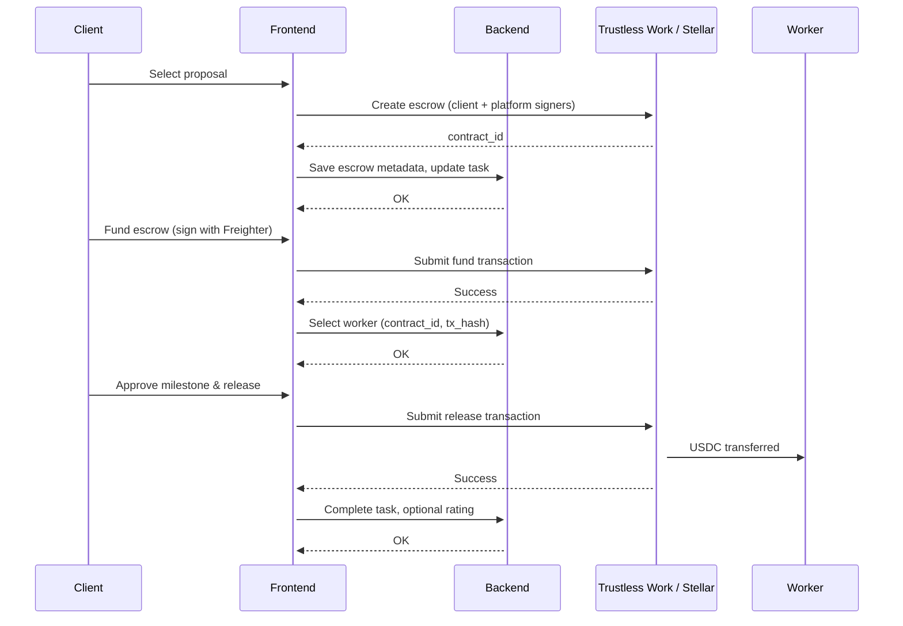
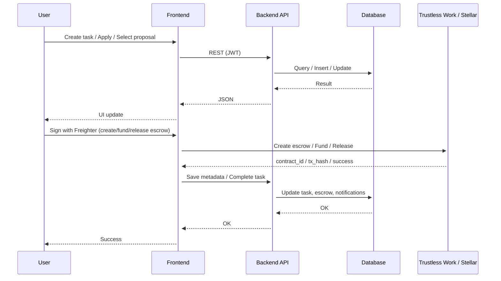

# ArcusX Technical Architecture

### Resumen ejecutivo (posicionamiento)

ArcusX deja de encuadrarse solo como un **marketplace genérico de startup** (listados, rating y “comprar servicio” sin más) para posicionarse como **infraestructura de ejecución de trabajos**: ciclo de tarea con trazabilidad, custodia on-chain y reglas claras de contratación. Todo vive en **un solo ecosistema**: la superficie **empresas (B2B)** es una **rama** del mismo producto (subdominio y flujos propios de organización), que **confluye con el marketplace** en publicación, postulación y escrow. Los usuarios se modelan como **una identidad** (`user_id` / Supabase Auth) con **membresías y roles** (persona natural, miembro u owner de cuenta empresa); más adelante **KYC** (público general) y **KYB** (empresa) actualizarán **niveles de confianza** sin duplicar cuentas. La evolución formal del backend apunta a **Supabase** (PostgreSQL, RLS, Realtime, Storage, **Edge Functions como APIs y webhooks**) como plano de datos y orquestación; **Trustless Work + Stellar** siguen siendo la capa de **custodia y liquidación** que la base de datos no sustituye.

### Overview

ArcusX is a decentralized freelancing platform that connects clients with workers through smart contract-based escrow on the Stellar blockchain. The platform uses Trustless Work to create 2-of-2 multisig escrow contracts, ensuring secure and transparent USDC payments. It provides a full workflow: task creation, proposals, worker selection, escrow funding, milestone approval and fund release, plus integrated XLM and USDC swap via Soroswap. The **landing page** includes a hero with a **task carousel** (infinite marquee loading tasks from the backend) and a **keyword search** ("Buscar tareas") that filters tasks client-side and hides the carousel while the user is searching. **Enterprise traffic** can use a separate landing surface (same codebase, host-based routing) while sharing marketplace rules where tasks meet supply and demand. Today, business operations are exposed mainly through a **PHP REST API** and a React front end; the **target architecture** consolidates application data and APIs on **Supabase** (see [Database](#3-database) and [Authentication](#6-authentication-and-user-management)) while preserving the escrow boundary above.

### Components

1. Frontend
2. Backend API
3. Database
4. Escrow and Blockchain Integration
5. Soroswap Integration
6. Authentication and User Management

---

## 1. Frontend

The frontend is responsible for rendering the user interface and coordinating user actions with the backend API and the Stellar network. It displays dashboards, task lists, proposals, escrow flows, messages, disputes, ratings, user profiles and the swap experience. Data is sourced from the backend via REST calls with JWT, and blockchain operations are performed by building and signing Stellar transactions in the browser via Freighter.

- **Technologies**: React 19, TypeScript, Vite, React Router, Axios, Supabase Auth (client), Stellar SDK, @creit.tech/stellar-wallets-kit (Freighter primary; additional Stellar wallets e.g. Albedo in scope)
- **Responsibilities**:
  - Render UI for **landing (hero with task carousel and search)**, dashboard, tasks, proposals, supervise task, disputes, ratings, profile, swap and admin.
  - Manage client-side state (auth, wallet, platform fee, notifications).
  - Call backend REST endpoints with JWT and handle responses.
  - Build and sign Stellar transactions (escrow create/fund/approve/release, swap) via Freighter.
  - Internationalization (i18n) for Spanish, English and Portuguese (live on the website).

### Key Processes

1. **Task and Proposal Flow**: Users create tasks with title, description, price, category, and difficulty; the frontend enforces daily and weekly limits before calling the backend. Workers apply with a message, portfolio URL, and wallet address; proposals are listed per task. When the client selects a proposal, the frontend coordinates with the backend to update task and application status, then drives the escrow creation and funding flow.
2. **Escrow Flow (Trustless Work)**: The frontend obtains task and proposal data (worker wallet, amount, platform fee) from the backend, then uses the Trustless Work integration to create the escrow contract, fund it with USDC, and later approve the milestone and release funds. Transaction building and signing are done in the browser; the backend only stores metadata and escrow identifiers.
  - **Escrow creation**:
    The service calls the Trustless Work API to create a single-release escrow with platform and client as signers and worker as beneficiary; the backend persists the returned contract ID and status.
    ```tsx
    const result = await createTrustlessEscrow({
      platformAddress: PLATFORM_WALLET,
      clientAddress: clientWallet,
      workerAddress: workerWallet,
      amount: workerAmount,
      platformFee: platformFee,
      tokenContractId: USDC_CONTRACT_ID,
    });
    if (result.success && result.contractId) {
      await saveEscrowToBackend(taskId, result.contractId, amount, platformFee);
    }

    ```
  - **Escrow funding**:
    The frontend builds the fund transaction (USDC, amount, trustline), the user signs with Freighter, and the transaction is submitted to the network; the backend is then updated with the transaction hash and escrow status.
    ```tsx
    const fundResult = await fundTrustlessEscrow(contractId, amountString, signWithFreighter);
    if (fundResult.success && fundResult.txHash) {
      await selectWorkerInBackend(taskId, applicantId, contractId, fundResult.txHash);
    }

    ```
  - **Milestone approval and release**:
    When the client approves the completed work, the frontend builds the release transaction; the client signs with Freighter; funds are transferred to the worker. The backend records task completion and optionally stores the release tx hash.
3. **Swap Flow (Soroswap)**: The user enters amount and direction (XLM y USDC) on the swap page. The frontend fetches a quote from the Soroswap API, displays expected output and slippage, builds the swap transaction when the user confirms, and submits the signed transaction to Stellar.
  - **Quote request**:
    Request a quote for the given pair and amount; display amount out and slippage tolerance.
    ```tsx
    const quote = await soroswapService.getQuote(
      fromToken,
      toToken,
      amountInStroops,
      slippageBps
    );
    setAmountOut(quote.amountOut);
    setPriceImpact(quote.priceImpact);

    ```
  - **Execute swap**:
    Build the swap transaction, prompt the user to sign with Freighter, and submit to the network.
    ```tsx
    const unsignedXdr = await soroswapService.buildSwapTransaction(quote, userAddress);
    const signedXdr = await signWithFreighter(unsignedXdr);
    const result = await soroswapService.submitTransaction(signedXdr);

    ```
4. **Session and Auth**: End users sign in with **Supabase OAuth** (e.g. Google, GitHub); the frontend syncs the session to the PHP backend (`sync_supabase_user`), which issues an **app JWT** for legacy REST calls. The frontend stores token and user in `localStorage` and sends `Authorization: Bearer` on API requests. **Admin** uses a separate login flow. There is **no** end-user email/password product flow in the current app (only OAuth).
  ```tsx
  // After Supabase OAuth + sync_supabase_user
  localStorage.setItem('token', response.token);
  localStorage.setItem('user', JSON.stringify(response.user));
  axios.defaults.headers.common['Authorization'] = `Bearer ${response.token}`;
  ```
5. **Landing and Hero (Task Carousel and Search)**:
  - **Hero layout**: The landing page hero shows a title, description, trust strip (stats: tasks available, active users, payments processed), and below that a **task carousel** with a **search** input.
  - **Task carousel**: Tasks are loaded from the backend via `GET /get_tasks.php`. The carousel uses an infinite CSS marquee: two duplicated blocks of task cards scroll horizontally (e.g. `translateX(0)` → `translateX(-50%)`), with animation paused on hover/focus so the user can interact. A vertical separator is shown after the last task in each block. Cards display title, category/difficulty, description (line-clamped), price and an "Aplicar" (Apply) link that leads to login or the apply-task flow.
  - **Search**: A search input is placed above/left of the carousel (e.g. "Buscar tareas" placeholder; i18n in ES/EN/PT). Search is **keyword-based**: the query is split into words and matched client-side against task title, description, category, and difficulty. When the user has typed something:
    - The **carousel is hidden** and a **results list** is shown (same task data filtered by keywords).
    - If there are no results, a short message and a "Ver todos" (or similar) link can be shown.
    - When the user clears the search, the carousel is shown again.
  - **Data**: The hero fetches tasks once (e.g. on mount); the carousel and the search results both use this data (carousel shows all or a subset; search filters it by keywords). No extra backend endpoint is required for search; the frontend filters the list returned by `get_tasks.php`.

---

## 2. Backend API

### Overview

The backend API provides REST endpoints for authentication, tasks, proposals, escrow metadata, messages, disputes, ratings, user profiles, notifications, and admin operations. It does not hold private keys; it stores task, application, and escrow metadata and coordinates with the frontend for on-chain operations. All protected endpoints validate a JWT issued after login or OAuth sync.

**Transition note:** The current production path is **flat PHP files + MySQL**. The **target** is to migrate domain logic and reads/writes gradually to **Supabase** (Postgres + RLS + Edge Functions for secrets, webhooks to Trustless Work, and versioned HTTP surfaces), reducing bespoke PHP over time while keeping escrow signing in the browser.

- **Technologies (current)**: PHP 7.4+, MySQL/MariaDB, JWT (Firebase JWT), Supabase client OAuth + sync
- **Technologies (target)**: Supabase Postgres, Row Level Security, Auth, Realtime, Storage, Edge Functions; optional CDN in front of static assets
- **Responsibilities**:
  - Validate JWT and authorize requests.
  - CRUD for users, tasks, applications, messages, disputes, ratings, notifications.
  - Persist escrow metadata (contract_id, status, amounts, platform fee) after frontend creates, funds, or releases escrows.
  - Serve platform fee and configuration to the frontend.
  - Admin: statistics, dispute resolution, release of dispute funds, user management.

### Endpoints

- **Auth**: POST /sync_supabase_user (OAuth user sync + JWT); wallet verify/register endpoints; **admin**: POST /admin_login (end-user email/password register/login for the marketplace were removed in favor of OAuth)
- **Tasks**: GET /get_tasks, POST /create_task, GET /get_task_details, GET /get_user_tasks, POST /cancel_task, POST /complete_task, GET /get_accepted_tasks, GET /task_stats, GET /get_stats
- **Proposals**: POST /apply_task, GET /get_task_proposals, POST /select_proposal
- **Escrow coordination**: POST /create_escrow (metadata), GET /get_escrow_status, POST /get_escrow_secret, POST /save_escrow_secret, POST /save_pending_transaction, POST /submit_complete_transaction, GET /get_pending_transaction
- **Messages**: GET /get_messages, POST /send_message
- **Disputes**: POST /create_dispute, GET /get_user_disputes, GET /get_dispute_chat, GET /get_dispute_timeline, GET /get_dispute_files, POST /admin_release_dispute_funds
- **Ratings**: POST /create_rating, GET /get_ratings, GET /get_user_rating_summary
- **Users**: GET /get_user_profile, GET /get_user_details, GET /get_freelancers, GET /get_user_public_stats, GET /get_user_earnings_summary, POST /update_user_profile, POST /update_user, POST /upload_avatar, POST /manage_portfolio
- **Admin**: POST /admin_login, POST /admin.php (stats, actions, dispute release, user management, fee config)
- **Notifications**: GET /get_notifications, POST /mark_notification_read
- **Platform**: GET /get_platform_fee, GET /get_completed_tasks_count, GET /check_user_limits, GET /get_user_limits, POST /check_cancellation_allowed, POST /mark_work_started

### Key Processes

1. **Authentication**: OAuth via Supabase, then `sync_supabase_user` creates/updates the user row and returns a JWT with `user_id`. Profile and wallet updates validate input and require JWT. Admin uses dedicated endpoints.
2. **Task and Proposal Lifecycle**: Create task with user limits and cooldown checks; list tasks with filters and pagination; get task details. Apply to task (create application); get proposals for a task; select proposal (backend updates task and application status; frontend performs escrow creation and funding).
3. **Escrow Coordination**: Endpoints save or retrieve escrow secret, get escrow status, save pending transaction XDR, and submit complete transaction (task completion). These support the frontend's Trustless Work flow without handling private keys.
4. **Platform Fee and Limits**: The platform fee is configurable in app config (currently **3%** on escrow release in the Trustless Work integration; always confirm `config/trustlessWork.ts` / backend fee source). The backend serves it to the frontend for escrow amount calculation. Task creation respects daily and weekly limits per user; limits are checked before creating a task.
  ```php
  $platformFee = getPlatformFeeFromConfig(); // e.g. 0.03 for 3%
  $escrowAmount = $workerAmount / (1 - $platformFee);
  $limitCheck = checkUserLimits($userId);
  if (!$limitCheck->canCreate) {
      return json_encode(['success' => false, 'message' => 'Daily or weekly limit reached']);
  }

  ```
5. **Disputes and Admin**: Create dispute; get dispute chat, timeline, and files. Admin can release dispute funds (backend validates admin and records the action; frontend or admin tool may trigger the on-chain distribution transaction).

---

## 3. Database

**Current state:** MySQL stores users, tasks, applications, messages, disputes, ratings, notifications, and escrow-related metadata (e.g. contract_id, escrow_status, escrow_amount, platform_fee). The database supports efficient querying for the Backend API and reporting.

**Target state:** **Supabase (PostgreSQL)** as the primary application database: relational model for tasks and execution state, **RLS** for multi-tenant and B2B isolation (`organization_id` / membership), **Realtime** for in-app updates where appropriate, **Storage** for evidence and attachments, and **Edge Functions** for operations that must not run in the client (webhooks, provider secrets). Migrations under `supabase/migrations/` introduce pieces of this model incrementally (e.g. messaging/notifications experiments); broader domain migration should follow **clear ownership per migration** so parallel initiatives (e.g. scoped vendor work) do not collide on the same tables without review.

- **Technologies (current)**: MySQL / MariaDB  
- **Technologies (target)**: PostgreSQL (Supabase), RLS policies, optional read replicas via Supabase tiering  
- **Responsibilities**:
  - Store and manage relational data for the platform (tasks, applications, org structure, audit fields).
  - Provide efficient query mechanisms for listing, filtering, and joining (tasks, proposals, user stats, disputes).
  - Enforce access at the row level for B2B (who can see or mutate which task under which org).

### Data Structures

1. **User (users)**: Stores user accounts, authentication linkage (Supabase), wallet, profile, and verification state.
  ```tsx
  interface UserRecord {
    id: number;
    username: string;
    email: string;
    password?: string; // hashed
    wallet_address: string | null;
    wallet_verified: boolean;
    avatar_url: string | null;
    bio: string | null;
    portfolio_url: string | null;
    public_profile: boolean;
    skills: string | null;
    supabase_user_id: string | null;
    verified: boolean;
    created_at: string;
    updated_at?: string;
  }

  ```
2. **Task (tasks)**: Stores task definition, status, accepted applicant, and escrow metadata.
  ```tsx
  interface TaskRecord {
    id: number;
    user_id: number;
    title: string;
    description: string;
    price: string;
    currency: string;
    category: string;
    difficulty: string;
    status: 'open' | 'in_progress' | 'completed' | 'disputed' | 'cancelled';
    accepted_applicant_id: number | null;
    escrow_id: string | null;
    escrow_status: string | null;
    escrow_amount: string | null;
    escrow_platform_fee: string | null;
    escrow_secret: string | null;
    escrow_created_at: string | null;
    pending_transaction_xdr: string | null;
    completed_date: string | null;
    worker_started_at: string | null;
    created_at: string;
  }

  ```
3. **Application (applications)**: Stores worker proposals for a task.
  ```tsx
  interface ApplicationRecord {
    id: number;
    task_id: number;
    applicant_id: number;
    message: string;
    portfolio_url: string | null;
    worker_wallet_address: string;
    status: 'pending' | 'accepted' | 'rejected';
    created_at: string;
  }

  ```
4. **Message (messages)**: Stores in-task messaging between client and worker.
  ```tsx
  interface MessageRecord {
    id: number;
    task_id: number;
    sender_id: number;
    receiver_id: number;
    content: string;
    created_at: string;
  }

  ```
5. **Dispute (disputes)**: Stores dispute metadata, status, and resolution.
  ```tsx
  interface DisputeRecord {
    id: number;
    task_id: number;
    creator_id: number;
    status: string;
    resolution: string | null;
    tx_hash: string | null;
    created_at: string;
    updated_at?: string;
  }

  ```
6. **Rating (ratings)**: Stores 1-5 star ratings and optional review.
  ```tsx
  interface RatingRecord {
    id: number;
    task_id: number;
    rater_id: number;
    rated_id: number;
    rating: number;
    review: string | null;
    created_at: string;
  }

  ```
7. **Notification (notifications)**: Stores in-app notifications for users.
  ```tsx
  interface NotificationRecord {
    id: number;
    user_id: number;
    type: string;
    read: boolean;
    payload: string | null; // JSON
    created_at: string;
  }

  ```

### Relationships

- Users to Tasks (one-to-many)
- Tasks to Applications (one-to-many)
- Tasks to Messages (one-to-many)
- Tasks to Disputes (one-to-one when disputed)
- Users to Ratings (given and received)
- Users to Notifications (one-to-many)

**B2B (to be modeled explicitly in Postgres):** Organizations ↔ members (many-to-many with roles); tasks optionally **owned by an organization** as well as a creating user; policies for who may publish, invite, or approve on behalf of the company. The marketplace remains the shared surface: visibility rules and escrow mechanics stay aligned whether the poster is an individual client or an org.

---

## 4. Escrow and Blockchain Integration

The escrow and payment flows are implemented using Trustless Work (single-release escrow contracts on Stellar/Soroban). The frontend creates the contract, funds it with USDC, and later approves the milestone and releases funds to the worker. Dispute resolution can trigger a separate distribution of escrow funds by an admin signer. The backend never holds private keys; it only stores contract IDs, status, and transaction hashes.

- **Technologies**: Stellar Network (Testnet / Mainnet), Trustless Work API & contracts, USDC on Stellar, Freighter (user signing)
- **Responsibilities**:
  - Create escrow contract (platform + client as signers; worker as beneficiary).
  - Fund escrow with USDC (amount = workerAmount / (1 - platformFee)); platform fee is retained on release.
  - Approve milestone and release funds to worker.
  - Support cancellation/refund and dispute-driven distribution where applicable.

### Components

1. **Trustless Work API**: External service that creates and manages 2-of-2 multisig escrow contracts on Soroban; the frontend calls it to create escrows and to build fund/release transactions.
2. **Frontend signer**: The user (client or admin) signs transactions in the browser with Freighter; no private keys are sent to the backend.
3. **Backend metadata**: The backend stores contract_id, escrow_status, escrow_amount, escrow_platform_fee, and optional tx hashes for each task.

### Create Escrow

The frontend obtains task and proposal data (worker wallet, amount, platform fee) from the backend. It calls the Trustless Work API to create a single-release escrow with platform and client as signers and worker as beneficiary. The backend persists the returned contract ID and updates the task and application status.

### Fund Escrow

The frontend builds the fund transaction (USDC, amount, trustline). The client signs with Freighter; the transaction is submitted to the network. The backend is then called to store the transaction hash and to mark the worker as selected (linking the task to the escrow contract).

### Approve and Release

When the client approves the completed work, the frontend builds the release transaction. The client (and platform if required) sign; funds are transferred to the worker. The backend records task completion and optionally the release transaction hash.

### Dispute Resolution

When a dispute is resolved, an admin (or designated wallet) signs the distribution transaction from the escrow contract. The backend records the resolution and may store the distribution tx hash. The frontend or an admin tool triggers the on-chain transaction.

### Workflow

1. **Escrow creation**:
  - The frontend calls Trustless Work to create the escrow contract with platform, client, and worker addresses and amount/fee.
  - The backend stores the contract ID and escrow metadata and updates the task and application.
2. **User interaction via frontend**:
  - The client connects Freighter and signs the create and fund transactions in the browser.
  - The frontend submits signed transactions to the network and updates the backend after each step.
3. **Escrow contract operations**:
  - **Fund**: Client funds the escrow with USDC (amount = workerAmount / (1 - platformFee)).
  - **Approve**: Client approves the milestone after the worker marks work complete.
  - **Release**: Client (and platform if required) sign the release; USDC is transferred to the worker.
  - **Dispute**: Admin signs a distribution transaction to split or assign funds according to the resolution.

### Front-End Facilitation

The front-end application provides a seamless experience by:

- **Wallet integration**: Facilitating Freighter connection and transaction signing without exposing private keys.
- **Escrow UI**: Guiding the client through: connect wallet, create contract, fund escrow, complete (redirect to supervise).
- **Supervise task**: Showing task status, chat, evidence, and the approve/release action for the client.
- **Notifications**: Alerting users about new proposals, messages, task updates, and dispute events.

### Practical Considerations

1. **Amounts and fees**: The escrow amount is always computed as workerAmount / (1 - platformFee) so that after the platform fee is deducted on release, the worker receives exactly workerAmount.
2. **Trustline**: The client must have a USDC trustline before funding; the UI can prompt or link to wallet setup.
3. **Cancellation and refund**: Cancellation before funding simply abandons the escrow. After funding, cancellation or refund flows may require a separate transaction (e.g. refund to client) supported by Trustless Work or custom logic.
4. **Dispute distribution**: The admin signer must hold the key that completes the 2-of-2 multisig for the distribution transaction; the backend only records the resolution and optionally the tx hash.

### Process Flow Diagram




### Future Expansions

This document describes the current escrow integration with Trustless Work. Future work may include support for multi-milestone escrows, additional assets beyond USDC, and tighter integration with Stellar ecosystem tools (e.g. native Soroban contracts for custom logic). The architecture keeps private keys off the backend and leaves all signing to the user's wallet, which we will maintain in any expansion.

---

## 5. Soroswap Integration

### Overview

The platform includes a native swap experience so users can convert XLM to USDC (or vice versa) without leaving ArcusX. This supports both clients (funding escrow) and workers (receiving payments in USDC). The Soroswap integration uses the Soroswap API for quotes and transaction building; the user signs with Freighter and the transaction is submitted to the Stellar network.

- **Technologies**: Soroswap API, Stellar SDK, Freighter (signing)
- **Responsibilities**:
  - Fetch swap quotes (amount in, amount out, route, slippage).
  - Build swap transaction compatible with Soroswap.
  - Submit signed transaction to Stellar and confirm execution.

### Key Processes:

1. **Quote**: The frontend calls the Soroswap API with from/to tokens and amount; the API returns expected amount out and metadata. The frontend displays the quote and slippage tolerance (e.g. 3%).
  ```tsx
  const quote = await soroswapService.getQuote(
    fromToken,
    toToken,
    amountInStroops,
    slippageBps
  );
  setAmountOut(quote.amountOut);
  setPriceImpact(quote.priceImpact);
  setNetworkFee(quote.networkFee);

  ```
2. **Execute**: The user confirms the swap; the frontend builds the transaction using the quote, the user signs with Freighter, and the transaction is submitted to the network. The UI shows success or error (e.g. no liquidity, slippage exceeded).
  ```tsx
  const unsignedXdr = await soroswapService.buildSwapTransaction(quote, userAddress);
  const signedXdr = await signWithFreighter(unsignedXdr);
  const result = await soroswapService.submitTransaction(signedXdr);
  if (result.success) {
    setTxHash(result.txHash);
  }

  ```

### Practical Considerations:

- **Liquidity**: In testnet or low-liquidity periods, the API may return "No Liquidity"; the UI handles this with a clear message and suggestion to retry or adjust amount.
- **Slippage**: A configurable slippage tolerance (default e.g. 3%) is applied to the quote to reduce the chance of failed transactions due to price movement.

---

## 6. Authentication and User Management

### Overview

End-user authentication is **Supabase OAuth-first** (Google, GitHub). The PHP backend **syncs** the Supabase identity and issues an **application JWT** for existing REST endpoints. Wallet verification ties the same user to Stellar for escrow. **Enterprise (B2B)** should reuse the **same auth user** and express “acts as company” via **organization membership and roles** in Postgres (not a second unrelated identity silo), so future **KYC** (natural person) and **KYB** (legal entity) attach verification levels to users and orgs without merging duplicate accounts later.

### Login and Registration

**OAuth (Google, GitHub)**: The user signs in via Supabase; the frontend receives a Supabase session. The backend endpoint `sync_supabase_user` creates or updates the user row from the Supabase identity and returns a JWT for API access.

**Admin**: Separate admin login (not the same OAuth flow as freelancers/clients).

**Email/password (marketplace end users)**: Not part of the current product flow; registration/login endpoints for generic email/password were removed in favor of OAuth-only for the main app.

### Wallet Verification

Users connect Freighter and submit their Stellar wallet address to the backend. The backend stores the address and can mark it as verified after a signed proof or after the wallet is used in a transaction (e.g. receiving payment). Protected endpoints may require a verified wallet for certain actions (e.g. applying to tasks).

### Integration with API

**JWT issuance**: After OAuth sync (`sync_supabase_user`) or admin login, the backend returns a JWT signed with a server-side secret. The payload includes at least user_id and expiration.

**JWT validation**: All protected endpoints read the Authorization Bearer token header, decode the JWT, and verify the signature and expiration. The user_id from the token is used for authorization (e.g. only the task owner can select a proposal).

```php
$headers = getallheaders();
$authHeader = $headers['Authorization'] ?? '';
$jwt = str_replace('Bearer ', '', $authHeader);
$decoded = JWT::decode($jwt, new Key($secret_key, 'HS256'));
$userId = $decoded->user_id;

```

### Benefits

- **Single identity**: One OAuth-backed user can later hold both freelancer activity and org memberships without duplicate logins.
- **Wallet linkage**: Wallet verification ties the user's identity to a Stellar address for payments and escrow.
- **Security**: Private keys never leave the user's wallet; servers store public addresses and metadata; secrets for providers live in Edge Functions or vault patterns on Supabase, not in the client.

### API surface (formal infrastructure)

- **PostgREST** (built into Supabase): secure CRUD where **RLS** encodes authorization.
- **Edge Functions**: HTTP endpoints for **webhooks** (e.g. Trustless Work callbacks), privileged checks, and **future public/partner APIs** with stable contracts.
- **Legacy REST (PHP)**: shrinks as domains move to Postgres + policies + functions.

---

## Roadmap

Aligned with the public landing roadmap and the strategic shift to **task-execution infrastructure** + **Supabase**, not a generic “Redis + random Node rewrite”.

**Tranche 1 · Completado (Q1 2026)**

- Escrow Trustless Work, USDC, disputas; flujo completo tarea → postulación → contrato → supervisión → liberación
- Freelancers públicos, tutoriales, Soroswap (XLM ↔ USDC), ratings
- Panel admin, responsive, SEO

**Tranche 2 · En curso (Q2 2026)**

- **Supabase**: Postgres, RLS, Auth; **Edge Functions** como APIs y webhooks (sync escrow/proveedores)
- **B2B**: empresas, roles, ciclo de ejecución integrado con el marketplace compartido
- **Pipeline**: hitos, evidencias, notificaciones en tiempo real, trazabilidad operativa
- Producto y growth: badges/rankings, referidos, suscripciones, bot FAQ, analytics admin; mobile y PWA
- **Parallel work**: iniciativas acotadas (p. ej. mensajería/notificaciones por migraciones Supabase con alcance contractual explícito) deben respetar prefijos/revisiones para no bloquear el núcleo B2B

**Tranche 3 · Próximo (Q3–Q4 2026)**

- Traducción automática de tareas (ES/EN)
- CDN, observabilidad, backups y políticas de datos sobre el **stack Supabase**
- Stellar **Mainnet** y auditoría de seguridad

**Visión 2026+**

- PWA y Realtime (Supabase) para colaboración en tareas y paneles empresa
- Multi-asset, indexer propio, batch transactions donde aplique
- **APIs públicas** y ecosistema de integraciones/partners sobre la misma base de datos

---

## State of the Platform

- **Environment**: Stellar Testnet (production-ready for Mainnet).
- **Live**: Escrow (Trustless Work), Soroswap swap, Freighter integration, admin panel, disputes, ratings, public freelancer profiles, i18n (Spanish, English, and Portuguese).

---

## Sequence Diagram

Below is a sequence diagram that illustrates the relationships and interactions between the Frontend, Backend API, Database, and Trustless Work / Stellar.




---

## Practical Considerations

1. **Escrow amounts**: The formula `workerAmount / (1 - platformFee)` ensures the worker receives exactly the agreed amount after the platform fee is deducted on release (fee today: **3%** in app config unless changed).
2. **Wallet and trustline**: Users must connect Freighter and have a USDC trustline before funding escrows; the UI guides or links to setup.
3. **Backend and keys**: The backend never stores or uses private keys; all Stellar transactions are built and signed in the frontend.
4. **Disputes**: Dispute resolution requires an admin (or designated) signer to complete the 2-of-2 distribution; the backend records the resolution and optionally the tx hash.
5. **Rate limits and abuse**: Task creation limits (daily/weekly) and cooldowns help prevent abuse; the backend enforces these before creating tasks.

---

## Future Expansions

The current architecture supports the full freelancing flow with escrow, swap, and admin tools. Future expansions may include: multi-milestone escrows, additional Stellar assets, native Soroban contracts for custom logic, an optional indexer for faster queries, and deeper integration with Stellar ecosystem products. **KYC/KYB** layers will attach to users and organizations for higher-trust publishing and payment thresholds. The separation of **frontend (signing)**, **data plane (Supabase + RLS)**, **Edge Functions (privileged APIs)**, and **blockchain (Trustless Work, Soroswap)** will be preserved to maintain security and clarity.

---

## Glossary

- **Escrow**: A contract that holds funds until conditions (e.g. milestone approval) are met; in ArcusX, implemented via Trustless Work 2-of-2 multisig.
- **Trustless Work**: Service and contracts for 2-of-2 multisig escrow on Stellar/Soroban; used for single-release escrows in ArcusX.
- **JWT**: JSON Web Token; used for API authentication after OAuth sync with the PHP API (interim) and/or Supabase session patterns as migration progresses.
- **USDC**: USD Coin on Stellar; the primary payment asset for tasks and escrows.
- **Soroswap**: AMM and API for swapping assets on Stellar (e.g. XLM and USDC); integrated in ArcusX for the in-app swap experience.
- **Freighter**: Stellar wallet extension used for signing transactions in the browser.
- **SCF**: Stellar Community Fund.
- **TVL**: Total Value Locked (used in DeFi contexts; not primary in ArcusX but relevant for swap/liquidity descriptions).
- **API**: Application Programming Interface; REST (PHP) today; PostgREST + Edge Functions as the formal surface on Supabase.
- **B2B / Enterprise branch**: Same ecosystem; orgs, roles, and policies distinct from pure C2C marketplace listing, converging on shared tasks and escrow.
- **KYC / KYB**: Know Your Customer / Know Your Business; future verification pipelines for individuals vs legal entities on top of the same identity model.

---

**Document version**: 1.2  
**Last updated**: May 2026

