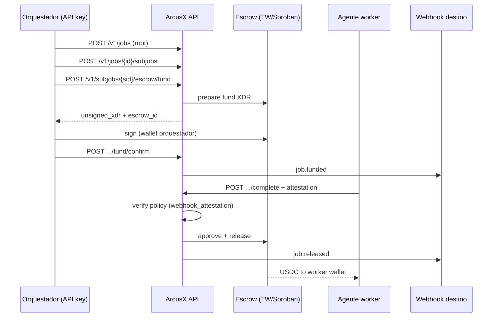

# Arquitectura — Plataforma de pagos agénticos

## 1. Capas

```
┌──────────────────────────────────────────────────────────────────┐
│  Consumidores                                                    │
│  · Frameworks agentic (LangGraph, CrewAI, AutoGen, custom)     │
│  · SaaS B2B · DAOs · Scripts · MCP clients                       │
└────────────────────────────┬─────────────────────────────────────┘
                             │ HTTPS (API key / OAuth M2M)
                             ▼
┌──────────────────────────────────────────────────────────────────┐
│  ArcusX Agentic API (nuevo)                                      │
│  · REST v1 · webhooks · idempotency · rate limits                │
│  · Job/subjob lifecycle · verification policies                  │
└────────────────────────────┬─────────────────────────────────────┘
                             │
         ┌───────────────────┼───────────────────┐
         ▼                   ▼                   ▼
┌─────────────────┐ ┌─────────────────┐ ┌─────────────────┐
│ Metadata / auth │ │ Escrow engine   │ │ Notifications   │
│ Supabase PG     │ │ escrow-native   │ │ webhooks, email │
│ + mirror MySQL  │ │ Edge + Stellar  │ │ (opcional)      │
└─────────────────┘ └─────────────────┘ └─────────────────┘
```

**Principio:** La UI del marketplace es **un cliente más** de la misma API (a largo plazo), no la fuente de verdad exclusiva.

---

## 2. Flujo referencia — agente paga a agente



---

## 3. Modelo de datos (borrador Postgres)

Prefijo `arcusx_` coherente con escrow-native.

### Organización y API

```sql
-- arcusx_organizations: quien paga (empresa, DAO, dev)
-- arcusx_api_keys: hash de key, scopes, rate_limit_tier
-- arcusx_webhook_endpoints: url, secret, events[]
```

### Jobs

```sql
-- arcusx_jobs
--   id uuid PK
--   organization_id
--   external_ref text          -- id del orquestador externo
--   title, description
--   payer_wallet G...
--   status: draft|open|in_progress|completed|cancelled
--   legacy_task_id bigint null -- bridge MySQL tasks.id

-- arcusx_subjobs
--   id uuid PK
--   job_id FK
--   parent_subjob_id null
--   executor_type: human|agent|service
--   executor_wallet G...
--   worker_amount numeric(20,7)
--   verification_policy jsonb
--   escrow_contract_id C... null
--   status: pending|funded|completed|released|disputed
```

### Bridge con MySQL (transición)

Durante Fase 1–2, `legacy_task_id` enlaza con `tasks` en PHP para no duplicar toda la lógica. Opciones:

| Estrategia | Pros | Contras |
|------------|------|---------|
| **A — API escribe MySQL vía PHP** | Rápido | Dos DBs, consistencia eventual |
| **B — Jobs solo en Supabase** | Limpio | Duplica marketplace hasta migración |
| **C — Sync trigger** | Unificación gradual | Complejidad ops |

**Fase 1 (transición):** **A** solo si el marketplace aún vive en PHP — **no** es el host de la API agéntica (ver D1 en [PLAN_MAESTRO.md](./PLAN_MAESTRO.md): **Edge `agentic-v1-*`**). **Fase 2+:** jobs/subjobs solo en Supabase; sync legacy opcional.

---

## 4. Integración con escrow-native

| Capacidad escrow-native | Uso agéntico |
|-------------------------|--------------|
| `escrow-quote` | Cotizar fund de subjob |
| `escrow-create-and-fund-*` | Fondear sin UI |
| `escrow-milestone-complete` | Worker marca completo |
| `escrow-approve-and-release-*` | Release manual o tras oráculo |
| `escrow-state` | Polling por integradores sin webhooks |
| `escrow-dispute` | Fallback disputa |

La **Agentic API** no reimplementa Stellar; **orquesta** estas funciones y añade:

- API keys y scopes
- Modelo job/subjob
- Webhooks
- Políticas de verificación

Mapa detallado en [API_SPEC_DRAFT.md](./API_SPEC_DRAFT.md).

---

## 5. Wallets y firma

| Modo | Quién firma | Caso |
|------|-------------|------|
| **Self-custody** | Wallet del pagador (G…) | DAO, dev con Freighter |
| **Server-assisted** | XDR devuelto; firma en servidor del integrador | Agentes con hot wallet controlada |
| **Custodial ArcusX** | ArcusX firma dentro de límites por org | Enterprise (Fase 4, alto compliance) |

**Fase 1–2:** solo self-custody + XDR unsigned (igual que escrow-native hoy).

---

## 6. MCP y herramientas para LLMs

Objetivo Fase 3–4: publicar tools documentadas para que un agente en Cursor/Claude invoque:

| Tool | Acción |
|------|--------|
| `arcusx_quote_escrow` | Cotización |
| `arcusx_fund_subjob` | Inicia fund |
| `arcusx_attest_completion` | Envía prueba de trabajo |
| `arcusx_get_job_state` | Estado |

Implementación: Edge Function `agentic-mcp-bridge` o servidor MCP standalone que llama REST v1.

---

## 7. Observabilidad

- `job_id` / `subjob_id` en todos los logs Edge
- Tabla `arcusx_api_request_log` (retención 30d)
- Métricas: fund latency, release latency, webhook failures
- Alertas: escrow funded &gt; 24h sin complete

---

## 8. Host API — recomendación provisional

| Opción | Veredicto |
|--------|-----------|
| **Edge `agentic-v1-*`** | ✅ Secretos TW, mismo proyecto Supabase que escrow |
| **PHP `/api/v1/`** | Útil como gateway temporal si Edge no desplegado |
| **Público sin auth** | ❌ Nunca |

**Ruta sugerida:** nuevas functions bajo `supabase/functions/agentic-v1-*` (o carpeta `docs/agentic-payments/prototype/` hasta promover), compartiendo `_shared` con escrow-native cuando se copie a producción.

---

*Contrato HTTP:* [API_SPEC_DRAFT.md](./API_SPEC_DRAFT.md)
