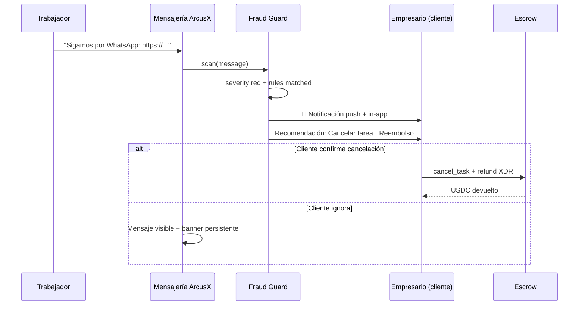

# ArcusX Guard — Detección de fraude en tiempo real

**Producto:** [ArcusX Guard](./ARCUSX_GUARD.md) · **Pilar:** Protection

**Problema:** el empresario elige trabajador; este intenta **sacar chat y pago fuera de ArcusX** (WhatsApp, links, PayPal). Pierde protección de escrow.

**Objetivo:** detectar en **&lt; 3 s**, **red flag** al empresario, recomendar **cancelar + reembolso**.

Disputas posteriores → [RESOLVE_AGENT.md](./RESOLVE_AGENT.md). Este módulo es **preventivo** (chat de tarea).

---

## 1. Principios de diseño

| Principio | Detalle |
|-----------|---------|
| **Tiempo real** | Scan al insertar mensaje (`arcusx_task_messages` o disputa chat) — target **&lt; 3 s** |
| **No censurar por defecto** | El mensaje se entrega; se **marca** y se alerta (evitar falsos positivos bloqueantes) |
| **Modo estricto (opt-in)** | Empresa puede activar “bloquear mensajes con link externo” |
| **Evidencia guardada** | Snapshot del mensaje + reglas disparadas → disputa si hace falta |
| **Reembolso** | Escrow aún no liberado → camino **cancel + refund** preparado |

---

## 2. Flujo (empresario + trabajador asignado)



---

## 3. Señales a detectar (v1 reglas — rápidas, sin LLM)

Implementación Fase 1: **regex + listas + heurísticas** en Edge (barato, determinista).

| Código | Patrón | Severidad |
|--------|--------|-----------|
| `EXT_LINK` | `https?://` que no sea dominio allowlist ArcusX | 🔴 alta |
| `WHATSAPP` | `wa.me`, `whatsapp.com`, “whatsapp”, “wasap” | 🔴 alta |
| `TELEGRAM` | `t.me`, `telegram.me`, “telegram” | 🔴 alta |
| `EMAIL_CONTACT` | email + “escríbeme”, “contactame” | 🟡 media |
| `PHONE_CONTACT` | teléfono + contexto contacto off-platform | 🟡 media |
| `OFF_PLATFORM_PAY` | paypal, binance, zelle, “pago fuera”, “sin comisión” | 🔴 alta |
| `BYPASS_ESCROW` | “pago directo”, “sin escrow”, “evitar fee” | 🔴 crítica |
| `SHORTENER` | bit.ly, tinyurl, etc. | 🟡 media |
| `DOC_PHISH` | “descarga aquí” + link externo archivo | 🔴 alta |

**Allowlist:** `arcusx.pro`, `stellar.expert`, Horizon, storage propio, GitHub/GitLab si política lo permite para entregables.

---

## 4. Fase 2 — Resolve Agent en mensajes

Para mensajes 🟡 o texto ambiguo:

- Llamada ligera al **mismo Resolve Agent** (JSON schema): `intent: move_off_platform | scam | legitimate_deliverable`
- Solo si confidence &gt; 0.9 y `move_off_platform` → red flag
- Timeout 2s → si falla, solo reglas v1

---

## 5. Qué recibe el empresario (red flag)

Notificación **inmediata** (Supabase Realtime + `arcusx_notifications`):

```json
{
  "type": "warning",
  "title": "Alerta de seguridad en tu tarea",
  "message": "El trabajador compartió un enlace externo para continuar fuera de ArcusX. Tu escrow sigue protegido si no pagas fuera de la plataforma.",
  "actions": [
    { "id": "cancel_refund", "label": "Cancelar y solicitar reembolso" },
    { "id": "dismiss", "label": "Entiendo el riesgo" },
    { "id": "report", "label": "Reportar fraude" }
  ],
  "task_id": 123,
  "fraud_event_id": "uuid"
}
```

**UI SuperviseTask / dashboard:**

- Banner rojo persistente hasta resolver
- Resumen: qué regla disparó (sin jerga técnica)
- CTA primario: **Cancelar tarea y recuperar fondos**

---

## 6. Reembolso — niveles de automatización

| Nivel | Cuándo | Comportamiento |
|-------|--------|----------------|
| **R0 (hoy)** | Escrow activo | Red flag + cliente cancela manual + firma refund TW en frontend |
| **R1** | 🔴 crítica + escrow `active` + sin trabajo iniciado | Edge prepara `unsigned_refund/cancel` XDR → cliente **1 clic** firma |
| **R2** | Empresa tier + política `auto_protect` | Tras red flag + 1h sin respuesta cliente, email recordatorio; **no** auto-refund sin confirmación (legal) |
| **R3** | Patrón crítico repetido del mismo worker | Freeze + disputa automática + cola Resolve Agent |

**“Reembolso automático” honesto:** on-chain siempre requiere transacción; lo automático es **preparar** cancel + XDR + con un clic (R1). Auto sin firma solo en **custodial** enterprise (Fase 4).

Condiciones para ofrecer R1:

- `escrow_status` ∈ `active`, `pending_funding` (si aplica)
- `worker_started_at` null o &lt; 5 min (fraude temprano)
- Severidad `BYPASS_ESCROW` o combo `EXT_LINK` + `OFF_PLATFORM_PAY`

---

## 7. Modelo de datos (Supabase)

```sql
-- arcusx_fraud_events
--   id uuid PK
--   task_id bigint
--   message_id bigint null
--   triggered_by_mysql_id bigint
--   severity: low | medium | high | critical
--   rules jsonb[]          -- ["EXT_LINK","WHATSAPP"]
--   ai_review jsonb null
--   client_notified_at timestamptz
--   client_action: null | dismissed | cancel_requested | reported
--   resolved_at timestamptz

-- arcusx_fraud_guard_config (per org o global)
--   block_external_links boolean default false
--   auto_prepare_refund boolean default true
```

**Hook:** trigger después de `INSERT` en `arcusx_task_messages` → Edge `fraud-guard-scan` (async, no bloquea insert).

---

## 8. Otros escenarios de agilidad (misma guardia)

| Escenario | Detección | Acción cliente |
|-----------|-----------|----------------|
| Link externo post-selección | v1 reglas | Red flag + cancel |
| Pedido de pago 100% upfront fuera | `OFF_PLATFORM_PAY` | Red flag crítica |
| Archivo .exe / macro en chat | MIME + extensión | Bloquear adjunto (fase archivos) |
| Mismo texto spam N tareas | rate por `sender_mysql_id` | Shadow flag worker |
| Cuenta nueva + link día 1 | reputación baja + reglas | Prioridad alta |
| Empresario pega link malicioso al worker | scan bidireccional | Aviso al worker |
| Phishing “actualiza tu wallet” | keywords + dominio | Crítica ambas partes |

---

## 9. Integración con stack actual y futuro

| Hoy | Futuro (full Supabase) |
|-----|-------------------------|
| Mensajes: migración `arcusx_task_messages` | Realtime + Edge `fraud-guard-scan` |
| Cancel: `cancel_task.php` + TW frontend | `escrow-cancel` + XDR prepare en Edge |
| Disputas: manual | Disputa auto si cliente reporta desde red flag |
| Notificaciones: parcial Supabase | `arcusx_notifications` type `warning` |

**Resolve Agent:** disputas iniciadas desde red flag llegan con `fraud_events` pre-cargado → IA + humano más rápido.

---

## 10. Roadmap

| Fase | Entregable |
|------|------------|
| **P0** | Doc + reglas v1 + mockups banner |
| **P1** | Edge scan reglas + notificación empresario + CTA cancel |
| **P2** | R1 prepare refund XDR + Realtime |
| **P3** | IA ligera en mensajes ambiguos |
| **P4** | Reputación worker + bloqueo repeat offender |

---

## 11. Moat vs Circle

Circle no monitorea **conversación de trabajo** ni protege al cliente de “sálvate por WhatsApp”. ArcusX sí — **tribunal + guardia** en un producto.

---

## 12. Tiers — Guard Standard vs Guard Pro

| Capacidad | Guard Standard | Guard Pro |
|-----------|----------------|-----------|
| Scan reglas v1 (WhatsApp, links, bypass) | ✅ | ✅ |
| Red flag + notificación empresario | ✅ | ✅ |
| IA en mensajes ambiguos | ❌ | ✅ |
| Prepare refund 1 clic (R1) | ❌ | ✅ |
| Resolve Agent en disputa desde red flag | ❌ | ✅ priorizado |

Detalle: **[PREMIUM.md](./PREMIUM.md)**

---

## 13. Métricas

- Tiempo detección → notificación (p95)
- % red flags → cancel en 24h
- Falsos positivos (dismiss rate)
- USDC salvado estimado (escrow no liberado off-platform)

---

*Producto:* [ARCUSX_GUARD.md](./ARCUSX_GUARD.md) · *Disputas:* [RESOLVE_AGENT.md](./RESOLVE_AGENT.md) · *Mensajes:* `supabase/migrations/20260513120000_arcusx_messages_notifications_schema.sql`
