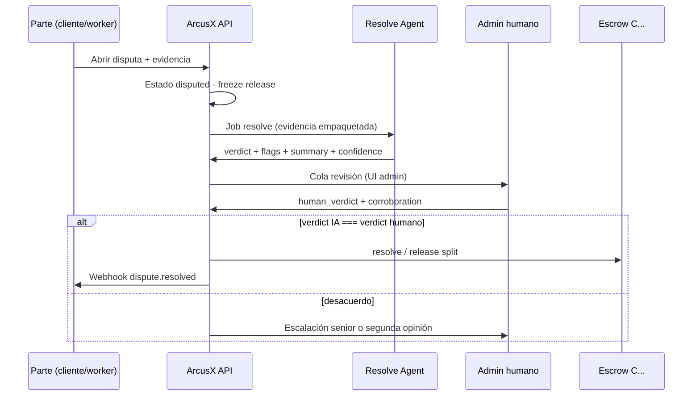

# ArcusX Guard — Resolve Agent (IA + humano)

**Producto:** [ArcusX Guard](./ARCUSX_GUARD.md) · **Pilar:** Protection (tribunal)

Agente de IA de ArcusX que **revisa primero** disputas y casos sensibles, marca **flags**, y un **admin humano corrobora** antes de liberar fondos on-chain.

**Regla de oro:** ningún release por disputa/arbitraje sin **acuerdo IA + humano** (o override humano documentado).

**Seguridad on-chain:** la IA **no firma** `resolve` ni mueve USDC — solo [SECURITY_MODEL del contrato](../../escrow-native/contracts/arcusx-escrow/SECURITY_MODEL.md).

---

## 1. Por qué este modelo

| Solo IA | Solo humano | **Híbrido ArcusX** |
|---------|-------------|---------------------|
| Rápido pero riesgoso | Confiable pero no escala | IA en segundos + humano valida |
| Alucinaciones = pérdida $ | Cola infinita | Flags guían al revisor |
| — | — | **Doble señal** antes de `resolve` on-chain |

Encaja con tu idea: el agente **no reemplaza** al humano — **prepara el juicio** y ambos deben alinearse para ejecutar.

---

## 2. Flujo (disputa / denuncia)



---

## 3. Estados en base de datos (borrador)

Tabla `arcusx_dispute_resolutions` (o columnas en `disputes`):

| Campo | Valores |
|-------|---------|
| `status` | `pending_ai` → `ai_reviewed` → `pending_human` → `dual_approved` → `on_chain_submitted` → `closed` |
| `ai_verdict` | `release_worker` \| `release_client` \| `split` \| `insufficient_evidence` \| `escalate` |
| `ai_confidence` | 0.0 – 1.0 |
| `ai_flags` | json array (ver §4) |
| `ai_summary` | texto para el admin (es/en) |
| `human_verdict` | mismo enum |
| `human_corroborates_ai` | boolean |
| `human_override_reason` | text si no coincide |
| `released_at` / `tx_hash` | tras dual OK |

---

## 4. Flags del Resolve Agent

El agente **siempre** emite flags (no solo veredicto):

| Flag | Significado | Efecto en cola |
|------|-------------|----------------|
| `evidence_complete` | Archivos, chat, hashes suficientes | Humano revisa rápido |
| `evidence_missing` | Falta prueba de una parte | No liberar hasta completar |
| `possible_fraud` | Patrón sospechoso | Prioridad alta + freeze |
| `policy_violation` | Fuera de términos del subjob | Nota en summary |
| `amount_high` | &gt; umbral USD | Humano obligatorio (siempre) |
| `ai_low_confidence` | &lt; 0.85 | Humano decide solo con ayuda |
| `recommend_auto_reject` | Evidencia clara contra una parte | Sugerencia fuerte |

**UI admin:** semáforo 🟢🟡🔴 derivado de flags + confidence.

---

## 5. Reglas de liberación (doble confirmación)

### Modo estándar — `dual_agree` (recomendado)

Libera on-chain **solo si**:

```
human_verdict === ai_verdict
AND ai_verdict NOT IN ('escalate', 'insufficient_evidence')
AND human_corroborates_ai === true
```

Si **no coinciden** → no release; estado `escalated` o segunda revisión humana.

### Modo override — solo humano puede desviarse

```
human_verdict definido
AND (human_verdict === ai_verdict OR human_override_reason obligatorio)
```

La IA **nunca** libera sola en disputas. El humano puede **corregir** a la IA con motivo auditado (entrenamiento futuro).

### Modo expedited (opcional, montos bajos)

Si `ai_confidence ≥ 0.92` y `amount &lt; $50` y flags sin `possible_fraud`:

- Un humano hace **confirmación en 1 clic** (“Corroboro IA”) sin re-leer todo.
- Sigue siendo dual, pero UX rápida.

---

## 6. Qué ingesta el Resolve Agent

Paquete **estructurado** (no solo chat libre):

| Fuente | Uso |
|--------|-----|
| Timeline disputa | Orden de eventos |
| Mensajes chat disputa | Contexto |
| Archivos adjuntos | Resumen + hash |
| Entregable subjob | `payload_hash`, URLs |
| CI / attestation logs | Si existieron |
| Historial partes | Releases previos, disputas pasadas |
| Términos subjob | `completion_condition`, monto |

**Implementación Fase 4:** Edge `resolve-agent-analyze` → LLM con prompt fijo + RAG sobre políticas ArcusX + salida JSON schema validado.

---

## 7. Salida JSON obligatoria del agente

```json
{
  "verdict": "release_worker",
  "confidence": 0.91,
  "flags": ["evidence_complete"],
  "summary_es": "El worker adjuntó repo y tests pasaron según log CI...",
  "cited_evidence": ["file_id_12", "chat_msg_45", "ci_run_abc"],
  "recommended_split": null
}
```

Si el JSON no valida → `status = pending_human` sin veredicto IA (fail-safe).

---

## 8. Fraud Guard → disputa rápida

Si [FRAUD_DETECTION](./FRAUD_DETECTION.md) disparó red flag y el cliente reporta:

- Resolve Agent recibe `fraud_events` + mensaje original
- Veredicto IA suele ser `release_client` (reembolso) con alta confidence
- Humano corrobora en cola prioritaria

---

## 9. También en liberación “feliz” (opcional)

Para subjobs **sin** disputa pero con política `hybrid_review`:

1. Integrator callback dice `completed`
2. Resolve Agent pasa rápido (¿anomalía? ¿fraude?)
3. Si flags vacíos y confidence alta → auto-release
4. Si `possible_fraud` o `ai_low_confidence` → cola humana antes de release

Así el mismo agente unifica **prevención** y **disputas**.

---

## 10. Entrenamiento y mejora

| Fase | Datos |
|------|-------|
| Cold start | Prompt + reglas + pocos shot examples |
| v1 | Disputas cerradas por humanos → fine-tune o eval set |
| v2 | Solo overrides humanos (donde IA falló) → peso alto |
| Métrica | % dual_agree sin override; tiempo medio resolución |

**Nunca** auto-entrenar con releases que el humano rechazó sin revisión.

---

## 11. Roadmap

| Fase | Entregable |
|------|------------|
| 3 | Cola humana pura + schema `ai_*` vacío |
| 4 | Resolve Agent en disputas + UI dual approve |
| 5 | Expedited + prevención en release feliz |
| 6 | Modelo propio / hosted con audit log |

---

## 12. Pitch (producto)

> *"ArcusX Guard Resolve: IA que investiga en segundos + humano que firma la sentencia — dual agree para mover USDC."*

Moat vs Circle: ellos no tienen ni la capa de disputa ni el dúo IA+humano especializado en **trabajo verificado**.

---

*Verificación:* [VERIFICATION.md](./VERIFICATION.md) · *Premium:* [PREMIUM.md](./PREMIUM.md) · *Escrow resolve:* [../../escrow-native/API.md](../../escrow-native/API.md)
