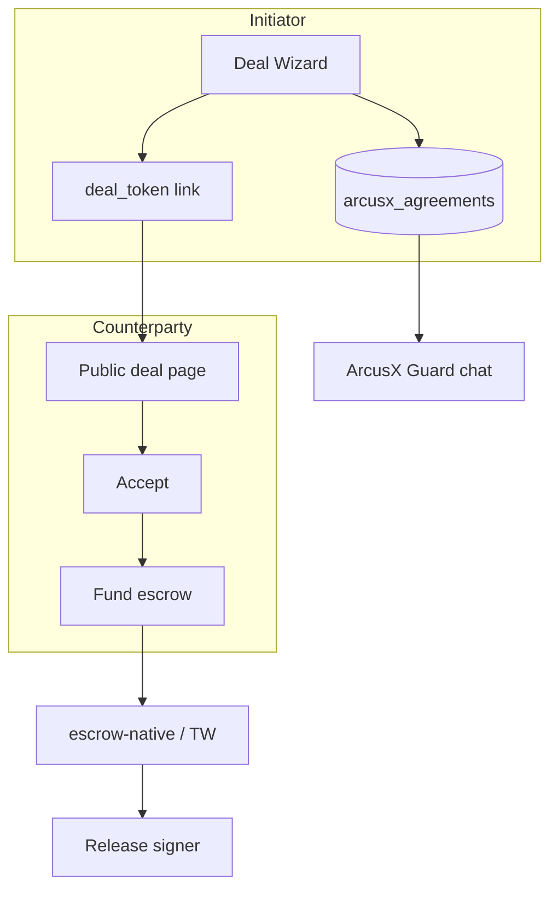

# Arquitectura — ArcusX Deals

Mismo motor escrow; modelo de datos nuevo para acuerdos privados y links.

---

## 1. Diagrama



---

## 2. Tablas Supabase (borrador)

### `arcusx_agreements`

| Columna | Tipo | Notas |
|---------|------|-------|
| `id` | uuid PK | |
| `deal_token` | text unique | URL pública |
| `template_id` | text | `rental_agreement`, etc. |
| `payment_mode` | `one_time` \| `milestone` |
| `title` | text | |
| `description` | text | |
| `initiator_user_id` | bigint | mysql link |
| `initiator_wallet` | text G… |
| `counterparty_wallet` | text G… nullable hasta accept |
| `release_signer_wallet` | text G… |
| `amount_usdc` | numeric | worker net |
| `fee_usdc` | numeric | platform |
| `client_total` | numeric | deposit |
| `status` | draft \| sent \| accepted \| funded \| active \| completed \| cancelled \| disputed |
| `escrow_contract_id` | text C… | |
| `legacy_task_id` | bigint null | bridge marketplace opcional |
| `expires_at` | timestamptz | |
| `created_at` | timestamptz | |

### `arcusx_agreement_milestones`

| Columna | Tipo |
|---------|------|
| `id` | uuid |
| `agreement_id` | uuid FK |
| `sort_order` | int |
| `title` | text |
| `amount_usdc` | numeric |
| `status` | pending \| funded \| completed \| released |

### `arcusx_agreement_events` (audit)

`event_type`, `payload`, `created_at` — para Guard y Resolve.

---

## 3. Mapeo a escrow-native

Ver **[CAPABILITY_MATRIX.md](../escrow-native/CAPABILITY_MATRIX.md)** — resumen:

| Deal action | Edge function | WASM v1 |
|-------------|---------------|---------|
| Quote | `escrow-quote` | N/A |
| Fund (one-time) | `escrow-create-and-fund-*` | ✅ `fund` |
| Milestone (varios hitos) | TW S1 o **N contratos** v1 | ❌ un solo hito on-chain |
| Release | `escrow-approve-and-release-*` | ✅ `approve` + `release` |
| Release signer ≠ fondeador | `initialize` roles | ✅ `release_signer` |
| Dispute | `escrow-dispute` + Guard | ✅ `dispute` + `resolve` |

`engagement_id` en `initialize` = `deal-{shortId}` (máx. 64 chars).

---

## 4. Rutas frontend (`arcusx/`)

| Ruta | Pantalla |
|------|----------|
| `/deals/new` | Wizard 5 pasos |
| `/deal/:token` | Vista pública + accept |
| `/deals/:id/workspace` | Chat + estado (≈ SuperviseTask) |

Feature flag: `VITE_DEALS_ENABLED`.

---

## 5. API futura (agentic)

```
POST /v1/agreements
  { template_id, payment_mode, parties, amount, milestones? }
→ { deal_token, deal_url }
```

Mismo schema que wizard — [../agentic-payments/API_SPEC_DRAFT.md](../agentic-payments/API_SPEC_DRAFT.md) extensión fase 5.

---

## 6. Guard

- Chat = `arcusx_task_messages` con `agreement_id` o tabla `arcusx_agreement_messages`
- Mismo `fraud-guard-scan`

---

## 7. Diferencia vs `tasks` MySQL

| | Task (marketplace) | Agreement (deal) |
|--|-------------------|------------------|
| Descubrimiento | Público | Link privado |
| Contraparte | Propuestas | Invitación |
| Plantilla | No | Sí |
| Escrow | Igual | Igual |

Opción transición: deal aceptado crea `tasks` row `source=deal` para no duplicar SuperviseTask — decisión en Fase 1.

---

*Plan:* [PLAN.md](./PLAN.md)
