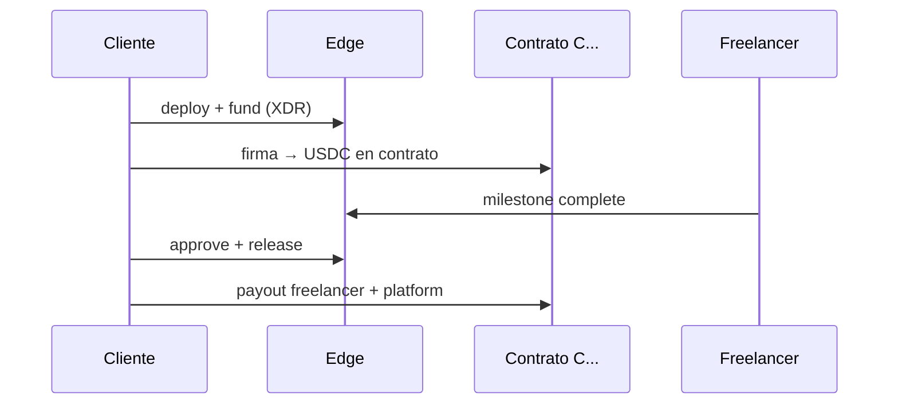

# Guía técnica — Escrow nativo ArcusX

Documento único de arquitectura, flujos, comisiones, red, seguridad e integración.

---

## 1. Arquitectura (Soroban `C…`)

**No** usamos cuentas `G…` + multisig por tarea. Cada engagement = **contrato Soroban** (`C…`), como Trustless Work.

| Fase | On-chain | Edge |
|------|----------|------|
| **S1** | Contrato TW vía API REST | `trustless-work-api.ts`, `soroban-escrow.ts` |
| **S2** | WASM propio | `contracts/arcusx-escrow/` → ver [CONTRATO.md](./CONTRATO.md) |

**Identificadores:** `escrow_public_key` = `contract_id` = `C…` (56 chars).  
**Provider BD:** `native_soroban` (nuevo) · `trustless_work` (frontend legacy).

---

## 2. Flujo UX (objetivo)

| Acción | TW hoy | Nativo v2 |
|--------|--------|-----------|
| Fondear | 2 firmas (deploy + fund) | 1–2 firmas (deploy opcional en mismo flujo) |
| Pagar freelancer | approve + release (2 firmas) | prepare → firmar approve + release |
| Freelancer | Marca complete | Igual + XDR `change-milestone-status` |

Estados BD: `pending_deploy` → `pending_funding` → `active` → `completed` | `disputed` | `cancelled`.

---

## 3. Comisiones

| Parte | BPS | Momento |
|-------|-----|---------|
| Cliente | 150 (1,5%) | Al fondear |
| Freelancer | 150 (1,5%) | Al liberar |
| **Total plataforma** | **300 (3%)** | — |

Ejemplo worker = 100 USDC:

| | Fase S1 (TW on-chain) | Fase S2 (WASM bilateral) |
|--|----------------------|---------------------------|
| Cliente deposita | ~103,09 (`worker/(1-0.03)`) | 101,50 |
| Freelancer recibe | 100,00 | 98,50 |
| Plataforma | ~3,09 | 3,00 |

Código: `_shared/fees.ts` — usar `tw_on_chain_quote` para firmar en S1, `fee_quote` para UI/objetivo S2.

---

## 4. Red, trustlines y entorno

| Variable | testnet | mainnet |
|----------|---------|---------|
| `VITE_STELLAR_NETWORK` | `testnet` | `mainnet` |
| `STELLAR_NETWORK` (Edge) | `testnet` | `mainnet` |
| `VITE_TRUSTLESS_WORK_BASE_URL` | `development` | `mainnet` |

**USDC issuer** (`trustline.address` en deploy — siempre `G…`):

| Red | Issuer |
|-----|--------|
| testnet | `GBBD47IF6LWK7P7MDEVSCWR7DPUWV3NY3DTQEVFL4NAT4AQH3ZLLFLA5` |
| mainnet | `GA5ZSEJYB37JRC5AVCIA5MOP4RHTM335X2KGX3IHOJAPP5RE34K4KZVN` |

Fuente única: [`shared/usdc-issuers.ts`](./shared/usdc-issuers.ts).

Cliente, freelancer y platform necesitan **trustline USDC** antes de fund/release. Edge valida en `preflight.ts`.

---

## 5. Seguridad

| Amenaza | Mitigación |
|---------|------------|
| IDOR | JWT + `arcusx_task_members` + wallet match |
| Doble release | `release_tx_hash` + idempotency |
| Montos manipulados | BD + validación body + saldo indexer |
| Red equivocada | `assertTrustlessWorkApiNetworkAlignment` |
| CORS / flood | `security.ts` allowlist + rate limit |
| Admin disputa | `ARCUSX_ADMIN_WALLETS` |

**Sin** `ARCUSX_PLATFORM_SECRET` para liberar Soroban — el cliente/admin firma XDR.

Secretos Edge: `TRUSTLESS_WORK_API_KEY`, `PLATFORM_WALLET`, `ADMIN_WALLET`, `SUPABASE_SERVICE_ROLE`.

---

## 6. Supabase

- **Migraciones:** `supabase/migrations/`
- **Edge:** `supabase/functions/escrow-*`
- **Shared:** `_shared/` (fees, trustline, soroban-escrow, auth, security, preflight)
- RLS + audit en migraciones `20260517130000_*` y `20260517140000_*`

Copiar a proyecto Supabase: ver `.env.example`.

---

## 7. Coexistencia con Trustless Work (app actual)

- Tareas existentes: `trustlessWorkEscrowService.ts` en `arcusx/` — **no modificar** hasta Fase 6.
- Nuevo código: solo `docs/escrow-native/client/` + integración vía `integration/escrowService.template.ts`.
- Detección: `client/provider.ts` (`C…` + `escrow_provider`).

---

## 8. Integración Fase 6 (arcusx)

1. Alias Vite `@escrow-native` → `docs/escrow-native/client`
2. Copiar `integration/escrowService.template.ts` → `arcusx/src/services/escrowService.ts`
3. `VITE_ESCROW_NATIVE_ENABLED` + flag BD
4. Reemplazar imports en componentes escrow
5. `useWallet.ts` alineado con `VITE_STELLAR_NETWORK`

---

## 9. Reglas de trabajo

**Permitido:** crear/editar solo bajo `docs/escrow-native/`.  
**Prohibido hasta Fase 6:** tocar `trustlessWorkEscrowService.ts`, PHP, `ProposalReview.tsx`, etc.

⛔ **Sin deploy** Supabase hasta checklist en verde — [CHECKLIST.md](./CHECKLIST.md).
