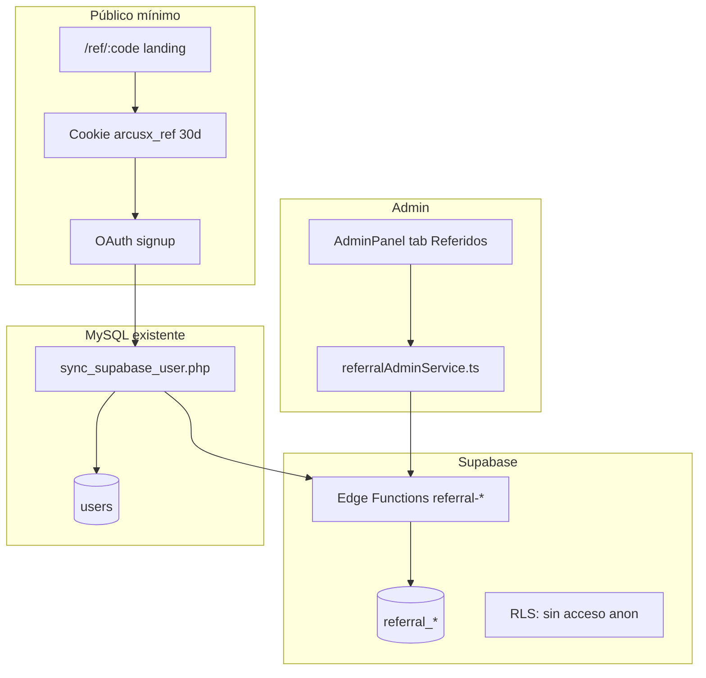

# Plan — Sistema de referidos privado (ArcusX)

**Versión:** 1.0 · Mayo 2026  
**Alcance:** Campaña privada de afiliados · Solo panel admin · Backend Supabase  
**Enfoque actual:** solo **registrar usuarios** atribuidos a cada afiliado. **Pagos manuales** fuera del sistema (tú decides cuándo pagar).

**Referencia económica (información):** 0,5 USDC / referido válido · tope orientativo 20 USDC/día — el panel muestra conteos, no ejecuta pagos.

> Implementación en repo: ver [README.md](./README.md). Anti-fraude: referidos `rejected` **no cuentan** + alertas al admin.

---

## 1. Objetivos

| Objetivo | Cómo |
|----------|------|
| Atribuir registros a un afiliado concreto | Código único + cookie/query `ref` |
| Saber cuánto pagar cada día | Agregación por `partner_id` + `fecha UTC` |
| Evitar farms / multi-cuenta / bots | OAuth + reglas automáticas + cola de revisión admin |
| No exponer el programa al público | Sin UI de referidor; tab **Referidos** solo en `/admin/dashboard` |
| Fuente de verdad en Supabase | Postgres + RLS + Edge Functions `referral-admin-*` |

---

## 2. Modelo de negocio (reglas fijas v1)

```
reward_per_signup     = 0.5 USDC
daily_cap_per_partner = 20.0 USDC   → máx 40 referidos pagables/día/partner
```

**Referido válido para pago** (recomendado — equilibrio simplicidad / fraude):

1. Registro **nuevo** vía OAuth (Google/GitHub) atribuido al código.
2. Usuario **no existía** antes en MySQL (`sync_supabase_user` creó fila nueva).
3. Pasa checks anti-abuso automáticos → estado `approved`.
4. *(Opcional fuerte)* Conectó wallet **o** completó al menos 1 acción real (ver §6).

**No cuenta para pago:**

- Email ya registrado (login de cuenta existente).
- Mismo `supabase_user_id` ya atribuido antes.
- Flags críticos sin resolver (`rejected` o `flagged` pendiente).
- Supera cap diario del partner (excedente → `deferred` al día siguiente o `cap_exceeded`).

**Pago al afiliado:** manual off-chain v1 (transferencia USDC / efectivo). El sistema **calcula deuda**; el admin marca lote como `paid` con nota/tx opcional.

---

## 3. Arquitectura



| Capa | Tecnología |
|------|------------|
| Captura `ref` | React route `/ref/:code` + `localStorage` + cookie |
| Atribución | Edge `referral-attribute-signup` (service role) llamada desde PHP o hook post-login |
| Admin CRUD / reportes | Edge `referral-admin-*` + JWT admin |
| Identidad | `auth.users` + `arcusx_user_link` (ya existe) |

**Por qué Supabase y no solo MySQL:** ya tienes `arcusx_user_link`, RLS, patrón admin en escrow (`arcusx_admin_users`). Los reportes diarios y flags encajan en Postgres sin tocar 65 endpoints PHP.

---

## 4. Esquema Postgres (migración única)

Prefijo tablas: `referral_` en `public`.

### 4.1 `referral_partners` — la persona dueña del link

| Columna | Tipo | Notas |
|---------|------|-------|
| `id` | `uuid` PK | |
| `display_name` | `text` NOT NULL | Nombre que ves en admin (“María López”) |
| `contact_email` | `text` | Opcional |
| `payout_wallet` | `text` | `G…` Stellar para pagos |
| `notes` | `text` | Interno |
| `is_active` | `boolean` DEFAULT true | |
| `created_by` | `uuid` FK `auth.users` | Admin Supabase que lo creó |
| `created_at` | `timestamptz` | |

### 4.2 `referral_codes` — códigos que tú generas

| Columna | Tipo | Notas |
|---------|------|-------|
| `id` | `uuid` PK | |
| `partner_id` | `uuid` FK | |
| `code` | `text` UNIQUE | Ej. `MARIA-MAYO`, normalizado UPPER |
| `label` | `text` | Etiqueta campaña (“Twitter LATAM”) |
| `is_active` | `boolean` | Desactivar sin borrar |
| `expires_at` | `timestamptz` NULL | |
| `max_signups` | `int` NULL | Tope total opcional |
| `created_at` | `timestamptz` | |

Índice: `(code)` where `is_active`.

### 4.3 `referral_signups` — un registro atribuido

| Columna | Tipo | Notas |
|---------|------|-------|
| `id` | `uuid` PK | |
| `code_id` | `uuid` FK | |
| `partner_id` | `uuid` FK | Desnormalizado para reportes |
| `supabase_user_id` | `uuid` UNIQUE | Un solo referido por usuario vida |
| `mysql_user_id` | `bigint` | Desde `arcusx_user_link` |
| `registered_at` | `timestamptz` | |
| `signup_date` | `date` | UTC, para agregados diarios |
| `signup_ip_hash` | `text` | SHA-256(IP + salt), no IP en claro en UI |
| `user_agent_hash` | `text` | |
| `oauth_provider` | `text` | `google` / `github` |
| `is_new_user` | `boolean` | false si email ya existía en MySQL |
| `status` | `text` CHECK | Ver enum abajo |
| `reward_usdc` | `numeric(10,4)` | Default 0.5 |
| `counts_toward_cap` | `boolean` | false si cap excedido ese día |
| `paid_at` | `timestamptz` NULL | |
| `payout_batch_id` | `uuid` NULL | |
| `review_note` | `text` | Admin |

**Enum `status`:**

| Valor | Significado |
|-------|-------------|
| `pending` | Registrado, checks en curso |
| `approved` | Cuenta para pago |
| `flagged` | Sospechoso, revisión manual |
| `rejected` | No paga (fraude / duplicado) |
| `cap_deferred` | Válido pero cap del día lleno |
| `paid` | Incluido en lote pagado |

### 4.4 `referral_flags` — anti-abuso

| Columna | Tipo |
|---------|------|
| `id` | `uuid` PK |
| `signup_id` | `uuid` FK |
| `flag_type` | `text` |
| `detail` | `jsonb` |
| `resolution` | `pending` \| `approved` \| `rejected` |
| `reviewed_by` | `uuid` |
| `reviewed_at` | `timestamptz` |

**Tipos de flag:**

| `flag_type` | Regla |
|-------------|-------|
| `duplicate_user` | Email o `supabase_user_id` ya atribuido |
| `existing_email` | `is_new_user = false` |
| `ip_cluster` | ≥3 signups misma IP hash en 24h en un código |
| `velocity_code` | >10 signups/hora en un código |
| `disposable_email` | Dominio en blocklist |
| `oauth_reused` | Mismo provider+subject ya usó otro código |
| `honeypot` | Código trampa activado |
| `manual` | Admin |

### 4.5 `referral_daily_totals` — vista materializada o tabla rollup

Actualizada por trigger o cron cada hora:

| Columna | Tipo |
|---------|------|
| `partner_id` | `uuid` |
| `stat_date` | `date` |
| `signups_total` | `int` |
| `approved_count` | `int` |
| `flagged_count` | `int` |
| `rejected_count` | `int` |
| `payable_count` | `int` | min(approved, 40) tras cap |
| `amount_due_usdc` | `numeric` | min(payable × 0.5, 20) |

### 4.6 `referral_payout_batches` — día de pago

| Columna | Tipo |
|---------|------|
| `id` | `uuid` PK |
| `partner_id` | `uuid` |
| `period_start` | `date` |
| `period_end` | `date` |
| `signup_ids` | `uuid[]` |
| `total_usdc` | `numeric` |
| `status` | `draft` \| `paid` |
| `payment_ref` | `text` | Tx hash o referencia bancaria |
| `paid_at` | `timestamptz` |
| `created_by` | `uuid` |

### 4.7 Config global (`referral_program_config` singleton)

| Clave | Default |
|-------|---------|
| `reward_usdc` | 0.5 |
| `daily_cap_usdc` | 20 |
| `require_wallet_for_approval` | false |
| `require_first_task_for_approval` | true (recomendado) |
| `approval_delay_hours` | 24 |

### RLS (obligatorio)

- **Todas** las tablas `referral_*`: `ENABLE ROW LEVEL SECURITY`.
- Políticas: **ningún** `SELECT/INSERT` para `anon` ni `authenticated` genérico.
- Lectura/escritura solo vía **service_role** en Edge Functions.
- Admin UI nunca usa `supabase.from('referral_*')` con anon key; siempre `functions.invoke`.

Reutilizar patrón de `docs/escrow-native/supabase/functions/_shared/admin-auth.ts` (`arcusx_admin_users` + lista `REFERRAL_ADMIN_USER_IDS`).

---

## 5. Edge Functions (Supabase)

| Function | Auth | Acción |
|----------|------|--------|
| `referral-resolve-code` | Pública (rate limit) | `GET ?code=` → válido + nombre partner (sin datos sensibles) |
| `referral-attribute-signup` | Service role (desde PHP) | Body: `code`, `supabase_user_id`, `mysql_user_id`, `is_new_user`, metadatos |
| `referral-admin-partners` | Admin | CRUD partners |
| `referral-admin-codes` | Admin | Crear/desactivar códigos |
| `referral-admin-signups` | Admin | Listar/filtrar signups, aprobar/rechazar flags |
| `referral-admin-daily-report` | Admin | Agregado por partner + rango fechas |
| `referral-admin-create-payout` | Admin | Generar batch + marcar `paid` |
| `referral-admin-stats` | Admin | KPIs campaña |

**Lógica cap diario** (en `referral-attribute-signup` o al aprobar):

```sql
-- Pseudocódigo
approved_today := COUNT(*) FROM referral_signups
  WHERE partner_id = $1 AND signup_date = CURRENT_DATE
    AND status = 'approved' AND counts_toward_cap = true;

IF approved_today >= 40 THEN
  NEW.status := 'cap_deferred';
  NEW.counts_toward_cap := false;
END IF;
```

---

## 6. Anti-abuso (capas)

| Capa | Implementación |
|------|----------------|
| **L1 Identidad** | Solo OAuth; rechazar `existing_email` |
| **L2 Unicidad** | UNIQUE(`supabase_user_id`) en `referral_signups` |
| **L3 IP / velocidad** | Hash IP + flags `ip_cluster`, `velocity_code` |
| **L4 Calidad** | *(Recomendado)* Aprobar solo si `first_task_completed` o wallet registrada (webhook/cron desde MySQL o mirror Supabase) |
| **L5 Retraso** | `approval_delay_hours = 24` antes de pasar a `approved` |
| **L6 Honeypot** | Códigos `TRAP-*` inactivos en marketing → cualquier signup = auto `rejected` + alerta |
| **L7 Manual** | Cola “Pendientes revisión” en admin |

**Multi-cuenta:** OAuth reduce bots; `device_fp` opcional en landing (FingerprintJS ligero) guardado como hash. Mismo hash en >2 cuentas/7d → `flagged`.

**No usar** `user_metadata` de Supabase para autorización (regla Supabase skill).

---

## 7. Flujo de captura del código

### 7.1 Landing `/ref/:code`

- Ruta en `arcusx/src/App.tsx`: componente `ReferralLanding.tsx`.
- Valida código vía `referral-resolve-code`.
- Guarda en `localStorage.setItem('arcusx_ref', code)` y cookie `arcusx_ref=code; Max-Age=2592000; Path=/; SameSite=Lax`.
- CTA → login OAuth normal.

### 7.2 Atribución en registro

**Opción A (recomendada):** extender `sync_supabase_user.php`:

```php
// Tras crear usuario nuevo ($isNewUser = true)
if (!empty($data['ref_code'])) {
  // POST a Supabase Edge con service key
  referral_attribute_signup([...]);
}
```

El frontend envía `ref_code` leído de cookie/localStorage en el body del sync.

**Opción B:** Edge Function invocada desde `authService.handleSupabaseCallback` en el cliente (menos fiable si el usuario cierra antes).

### 7.3 Activación por tarea (si `require_first_task_for_approval`)

- Trigger desde PHP cuando task pasa a `completed` (primer task del `mysql_user_id`), o
- Cron horario que consulta MySQL / `arcusx_tasks_landing_mirror` y actualiza signups `pending` → `approved`.

---

## 8. Panel admin (`arcusx`)

### 8.1 Nueva pestaña

En `AdminPanel.tsx`:

```ts
{ id: 'referrals', label: 'Referidos', icon: <FaUserPlus /> }
```

Componente: `ReferralManagement.tsx` (nuevo).

### 8.2 Pantallas

| Sección | Contenido |
|---------|-----------|
| **Afiliados** | Lista partners, crear/editar, wallet de pago |
| **Códigos** | Generar código + nombre afiliado + copiar link `https://arcusx.pro/ref/{code}` |
| **Registros por día** | Tabla: fecha × partner × total / aprobados / monto USDC |
| **Detalle signups** | Filtros: fecha, código, status; acciones aprobar/rechazar |
| **Cola flags** | Pendientes de revisión |
| **Pagos** | Crear lote por rango de fechas → export CSV → marcar pagado |

### 8.3 Servicio frontend

`arcusx/src/services/referralAdminService.ts`:

- Usa `supabase.functions.invoke` con JWT de sesión admin **o** token PHP si unificas auth (v1: añadir admins a `arcusx_admin_users` con su `supabase_user_id` tras login OAuth admin futuro; mientras tanto, Edge acepta header `X-Admin-Token` validado contra PHP `admin_login` — solo si no hay admin en Supabase aún).

**Recomendación:** migrar login admin a Supabase + fila en `arcusx_admin_users` (mismo patrón escrow).

### 8.4 Wireframe reporte diario

```
┌─────────────────────────────────────────────────────────────┐
│ Referidos · 10–16 May 2026                    [Export CSV]  │
├──────────────┬────────┬──────────┬──────────┬────────────────┤
│ Afiliado     │ Fecha  │ Registros│ Aprobados│ A pagar (USDC) │
├──────────────┼────────┼──────────┼──────────┼────────────────┤
│ María López  │ 15/05  │    12    │    10    │      5.00      │
│ María López  │ 16/05  │    45    │    40    │     20.00 ←cap │
│ Juan Pérez   │ 15/05  │     3    │     3    │      1.50      │
└──────────────┴────────┴──────────┴──────────┴────────────────┘
│ TOTAL período                              │     26.50      │
└─────────────────────────────────────────────────────────────┘
```

---

## 9. Integración con código existente

| Archivo | Cambio |
|---------|--------|
| `arcusx/src/App.tsx` | Ruta `/ref/:code` |
| `arcusx/src/services/authService.ts` | Pasar `ref_code` al sync |
| `backend_externo/sync_supabase_user.php` | Recibir `ref_code`, llamar Edge |
| `arcusx/src/components/AdminPanel.tsx` | Tab + lazy `ReferralManagement` |
| `REFERRAL_SYSTEM_SPEC.md` | Añadir banner “ver PLAN privado v1” |

**No tocar** en v1: `FeeManagement` (`referral_fee` en system_config es otra cosa — comisión plataforma, no este programa).

---

## 10. Fases de implementación

### Fase 1 — Base (3–4 días)

- [ ] Migración SQL en Supabase (`referral_*` + RLS + `referral_daily_totals`)
- [ ] Edge: `referral-resolve-code`, `referral-attribute-signup`
- [ ] Landing `/ref/:code` + persistencia cookie
- [ ] Hook en `sync_supabase_user.php`

### Fase 2 — Admin (2–3 días)

- [ ] Edge: `referral-admin-*` (partners, codes, report, signups)
- [ ] `ReferralManagement.tsx` + `referralAdminService.ts`
- [ ] Tab en `AdminPanel`

### Fase 3 — Anti-abuso (2 días)

- [ ] Flags automáticos + cola revisión
- [ ] Cap 20 USDC/día
- [ ] *(Opcional)* Aprobación tras primera tarea

### Fase 4 — Pagos (1 día)

- [ ] Batches + export CSV + marcar `paid`
- [ ] Auditoría `referral_audit_log`

### Fase 5 — QA

- [ ] Test: mismo email dos veces → 1 signup
- [ ] Test: 41 signups mismo día → 40 pagables + 1 deferred
- [ ] Test: código inválido / expirado
- [ ] Advisors Supabase MCP (`get_advisors` security)

---

## 11. Variables de entorno

```bash
# Supabase Edge
REFERRAL_IP_HASH_SALT=<random>
REFERRAL_ADMIN_USER_IDS=<uuid,...>  # opcional
REFERRAL_SERVICE_SECRET=<para PHP→Edge>

# PHP (sync)
SUPABASE_URL=
SUPABASE_SERVICE_ROLE_KEY=
```

---

## 12. Decisiones abiertas (confirmar contigo)

| # | Pregunta | Recomendación |
|---|----------|----------------|
| 1 | ¿Pago por **solo registro** o tras **primera tarea/wallet**? | Primera tarea o wallet — menos bots |
| 2 | ¿Excedente por cap se paga al día siguiente automático? | Sí, `cap_deferred` → reprocesar cron |
| 3 | ¿Un afiliado puede tener varios códigos activos? | Sí |
| 4 | ¿Auth admin vía PHP JWT o Supabase `arcusx_admin_users`? | Supabase (alineado escrow) |

---

## 13. SQL inicial (borrador migración)

Archivo propuesto: `supabase/migrations/YYYYMMDDHHMMSS_referral_program.sql`

Incluye: tablas §4, función `referral_refresh_daily_totals(partner_id, stat_date)`, trigger post-insert signup, políticas RLS deny-all para anon/authenticated.

*(No aplicar hasta OK del plan — usar MCP `apply_migration` cuando apruebes.)*

---

## 14. Métricas de éxito campaña

- Costo por registro válido ≤ 0,5 USDC
- Tasa `flagged` < 15%
- Tasa conversión registro → primera tarea > 25% (si usas gate de tarea)
- Cero pagos duplicados por `supabase_user_id`

---

*Documento de planificación. Implementación en repo tras tu confirmación de las decisiones §12.*
