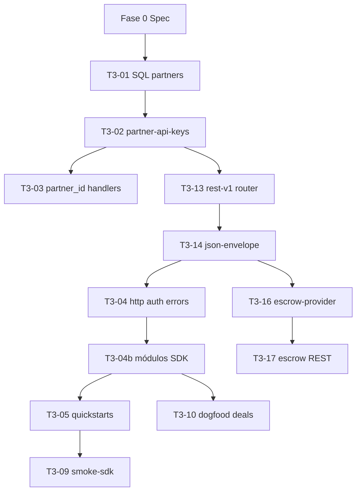

# ArcusX SDK — Checklist de ejecución (fuente operativa)

**Versión:** 1.0 · **2026-05-28**  
**Plan estratégico:** [`PLAN_MAESTRO.md`](./PLAN_MAESTRO.md) · **Sprint:** [`TRANCHE3_INFRA_SDK.md`](../sprints/TRANCHE3_INFRA_SDK.md)

Este documento es la **lista de trabajo ejecutable**. Cada ítem tiene ID, archivos, criterio de aceptación y dependencias. No empezar una tarea sin sus prerequisitos en verde.

---

## Estado global (2026-05-28)

| Área | % | Bloqueador |
|------|---|------------|
| Spec + contrato SDK (27 métodos) | 95% | — |
| Auditoría infra global | ✅ | `GLOBAL_INFRA_AUDIT.md` |
| Partner infra (SQL + Edge auth) | 0% | T3-01 |
| REST `/v1/` alias | 0% | T3-13 |
| `@arcusx/sdk` código | 15% | Scaffold solo |
| Quickstarts + smoke | 0% | SDK + keys sandbox |
| Dogfood frontend | 0% | SDK v0.1 |

**North star inmutable:** `arcusx.pro` = cliente #1. El SDK es cliente HTTP tipado sobre la misma Edge API — no un backend nuevo.

---

## Reglas de ejecución (no negociables)

1. **Nombres congelados:** namespaces `public`, `marketplace`, `private`, `deals`, `escrow`, `settlement` — no renombrar sin bump minor en `PLAN_MAESTRO.md`.
2. **Fee:** el SDK **nunca** calcula comisión. Consume `get_platform_fee` y `escrow/quote` (cuando exista). Ver [`FEE_MODEL.md`](./FEE_MODEL.md).
3. **Motor interno invisible:** cero SDKs de escrow de terceros en `examples/` ni en exports públicos del SDK.
4. **Compat:** `?action=` sigue funcionando; REST v1 es alias sobre handlers existentes.
5. **Un PR = un módulo o una migración** — no big-bang.
6. **DoD por tarea:** build verde + smoke manual documentado en el PR.
7. **Infra global:** ver [`GLOBAL_INFRA_AUDIT.md`](./GLOBAL_INFRA_AUDIT.md) — v0.1 ≠ global completo; v0.2+ cierra verificación y webhooks.

---

## Grafo de dependencias



---

## Fase 0 — Spec y contrato (cerrada)

| ID | Tarea | Archivos | DoD | Estado |
|----|-------|----------|-----|--------|
| F0-01 | Plan maestro v1.2+ | `docs/sdk/PLAN_MAESTRO.md` | Fases, 27 métodos, ICP, §17 infra global | ✅ |
| F0-02 | API reference congelada | `docs/sdk/API_REFERENCE.md` | 27 métodos + idempotency | ✅ |
| F0-03 | REST v1 mapa | `docs/sdk/REST_V1.md` | Paths + envelope + fee bilateral | ✅ |
| F0-04 | Partner auth spec | `docs/sdk/PARTNER_AUTH.md` | OAuth flow + keys | ✅ |
| F0-05 | Fee model SDK | `docs/sdk/FEE_MODEL.md` | UX bilateral + on-chain 4% | ✅ |
| F0-06 | OpenAPI borrador | `docs/sdk/openapi-v1.yaml` | Rutas P0 | ✅ |
| F0-07 | Checklist ejecución | `docs/sdk/CHECKLIST.md` | T3-01…T3-20 | ✅ |
| F0-08 | InstaAwards sync | `docs/sprints/instaawards-sdk/*.md` | W1–W3 | ✅ |
| F0-09 | TRANCHE3 sync | `docs/sprints/TRANCHE3_INFRA_SDK.md` | Backlog completo | ✅ |
| F0-10 | Auditoría infra global | `docs/sdk/GLOBAL_INFRA_AUDIT.md` | Gaps P0/P1/P2 | ✅ |
| F0-11 | ENDPOINTS ↔ SDK map | `docs/api/ENDPOINTS.md` | 27 métodos + idempotency | ✅ |
| F0-12 | Scaffold compila | `packages/arcusx-sdk/` | `npm run build` | ✅ |

**Fase 0 cerrada.** Siguiente: implementación Fase 1 (T3-01).

---

## Fase 1 — Partner infra (P0, semana 1)

### T3-01 — Migración SQL

| Campo | Valor |
|-------|-------|
| **Archivo** | `supabase/migrations/20260528140000_arcusx_partners.sql` |
| **Depende de** | F0-04 |
| **Crea** | `arcusx_partners`, `arcusx_partner_keys`, `arcusx_partner_audit_log` |
| **Altera** | `arcusx_tasks.partner_id`, `external_id`; `arcusx_agreements.partner_id`, `external_id` |
| **DoD** | `supabase db push` (o MCP) sin error; índices únicos `(partner_id, external_id)` |

### T3-02 — Validación API key en Edge

| Campo | Valor |
|-------|-------|
| **Archivos** | `supabase/functions/_shared/partner-api-keys.ts`, `partner-context.ts` |
| **Integrar en** | `arcusx-api/index.ts` o `handlers/router.ts` (antes del handler) |
| **DoD** | `curl -H x-arcusx-api-key: axk_test_…` → 401 sin key / 200 con key válida |
| **DoD** | `ctx.partnerId` disponible en handlers partner-first |
| **Rate limit** | 60/min sandbox, 600/min prod (in-memory o KV — documentar limitación MVP) |

### T3-03 — `partner_id` en create handlers

| Campo | Valor |
|-------|-------|
| **Archivos** | `handlers/tasks.ts` (`createTask`), `handlers/deals.ts` (`createDeal`) |
| **Body nuevo** | `external_id?: string` (opcional) |
| **DoD** | Tarea/deal creado con key tiene `partner_id` en BD |
| **DoD** | Marketplace sin key sigue funcionando (`partner_id` null) |
| **No confundir** | `referral_partners` ≠ `arcusx_partners` |

### T3-06 — Sandbox key (ops)

| Campo | Valor |
|-------|-------|
| **Fuera de git** | Key `axk_test_…` para revisor InstaAwards + piloto #1 |
| **DoD** | Documentada en runbook interno; rotación post-programa |

### T3-19 — Flujo OAuth integrador (P0 docs)

| Campo | Valor |
|-------|-------|
| **Archivos** | `PARTNER_AUTH.md`, `QUICKSTART.md` |
| **Flujo** | OAuth Google/GitHub → `sync_supabase_user` → JWT app → `bearerToken` en SDK |
| **DoD** | Integrador puede obtener JWT sin leer código `arcusx/src` |

### T3-20 — Idempotency en SDK (P0)

| Campo | Valor |
|-------|-------|
| **Archivo** | `packages/arcusx-sdk/src/http.ts` |
| **Header** | `Idempotency-Key` en POST (actions: `create_task`, `create_deal`, `apply_task`, `select_proposal`, `create_escrow`) |
| **Edge** | Ya soportado en `_shared/idempotency.ts` |
| **DoD** | Retry con misma key devuelve misma respuesta |

**Cierre Fase 1:** curl con key sandbox crea task; fila en `arcusx_tasks` con `partner_id`; sin regresión en arcusx.pro.

---

## Fase 2a — REST v1 alias (P0, semana 2)

### T3-13 — Router REST

| Campo | Valor |
|-------|-------|
| **Archivo** | `supabase/functions/arcusx-api/handlers/rest-v1.ts` |
| **Modificar** | `arcusx-api/index.ts` — detectar path `/v1/*` |
| **Mapa** | Ver `REST_V1.md` §3 — mismo handler que `ROUTES[action]` |
| **DoD** | `POST /v1/tasks` ≡ `?action=create_task` (mismo body, misma respuesta legacy por ahora) |

### T3-14 — Envelope JSON

| Campo | Valor |
|-------|-------|
| **Archivo** | `supabase/functions/_shared/json-envelope.ts` |
| **Shape** | `{ success, data, meta: { request_id, api_version: 'v1' } }` |
| **DoD** | Rutas `/v1/*` devuelven envelope; legacy `?action=` sin cambio (migración gradual) |
| **SDK** | `http.ts` normaliza ambos formatos |

### T3-15 — OpenAPI publicado

| Campo | Valor |
|-------|-------|
| **Archivo** | `docs/sdk/openapi-v1.yaml` |
| **DoD** | Rutas P0 + schemas Task/Deal/Error; sin mención TW |

**Cierre Fase 2a:** `curl GET /v1/config/platform-fee` + `POST /v1/tasks` con key + JWT.

---

## Fase 2b — SDK v0.1 (P0, semana 2–3)

### T3-04 — Core HTTP

| Archivo | Responsabilidad |
|---------|-----------------|
| `src/http.ts` | fetch, base path `/v1/`, query/body, envelope parse |
| `src/auth.ts` | Headers: `apikey`, `x-arcusx-api-key`, `Authorization` |
| `src/errors.ts` | `ArcusXApiError` con `status`, `code`, `requestId` |
| `src/rest/paths.ts` | Constantes de paths REST |
| `src/client.ts` | `ArcusXClient` + getters de módulos |

**Config obligatoria:**

```typescript
interface ArcusXClientConfig {
  baseUrl: string;           // …/functions/v1/arcusx-api
  apiKey?: string;
  bearerToken?: string;
  supabaseAnonKey?: string;
  network?: 'testnet' | 'mainnet';
  useLegacyActions?: boolean; // default false
  fetch?: typeof fetch;
}
```

### T3-04b — Módulos (27 métodos)

| Módulo | Archivo | Métodos | Verificación |
|--------|---------|---------|--------------|
| `public` | `modules/public.ts` | 3 | smoke sin JWT |
| `marketplace` | `modules/marketplace.ts` | 7 | create + get con JWT |
| `private` | `modules/private.ts` | 4 | list + finalize |
| `deals` | `modules/deals.ts` | 6 | create + getByToken |
| `escrow` | `modules/escrow.ts` | 5 | status + deal prepare |
| `settlement` | `modules/settlement.ts` | 2 | completeTask tx_hash |

**Reglas implementación:**

- `marketplace.create` body = `{ user_id, title, description, price, currency, difficulty, category, is_private_invite?, invited_user_id?, external_id? }`
- `apply` body = `{ taskId, message, walletAddress, applicantId? }`
- `deals.create` body = campos Edge (`template_id`, `amount_usdc`, wallets, `funder_role`, …)
- `settlement.completeTask` — **único** lugar para `complete_task` (no duplicar en marketplace)
- Tipos en `types.ts` alineados a respuestas Edge reales (snake_case en wire, camelCase opcional en SDK)

### T3-05 — Quickstarts

| Ejemplo | Flujo | Hasta dónde |
|---------|-------|-------------|
| `examples/sdk-node-marketplace/` | create → apply → select | Sin wallet (hasta escrow metadata) |
| `examples/sdk-node-private/` | create private → finalize | Documentar fund manual |
| `examples/sdk-node-deal/` | create → getByToken | Share token en stdout |

Cada ejemplo: `.env.example`, `package.json`, `index.ts`, README de 10 líneas.

### T3-08 — QUICKSTART.md

| Campo | Valor |
|-------|-------|
| **Archivo** | `docs/sdk/QUICKSTART.md` |
| **DoD** | Instalación, env vars, 3 flujos, fee en una línea, testnet label |

### T3-09 — Smoke SDK

| Campo | Valor |
|-------|-------|
| **Archivo** | `scripts/smoke-sdk.mjs` |
| **Prereq** | `ARCUSX_API_URL`, `SUPABASE_ANON_KEY`, opcional `ARCUSX_API_KEY` |
| **Tests** | `public.getPlatformFee`, `public.getMarketStats`, `public.getTasks` |
| **DoD** | exit 0 en CI local; JSON output por test |
| **Actualizar** | `scripts/smoke-edge-api.mjs` — `platform_fee` esperado `0.037` no `0.03` |

**Cierre Fase 2b:** clonar repo → `npm run build` en SDK → quickstart marketplace crea task en testnet.

---

## Fase 2c — Escrow REST, TW oculto (semana 3–4)

| ID | Tarea | Archivos | DoD |
|----|-------|----------|-----|
| T3-16 | Escrow provider @internal | `_shared/escrow-provider.ts` | Wrapper TW → respuesta ArcusX |
| T3-17 | Rutas quote/prepare/confirm | `rest-v1.ts` + handlers | `GET …/escrow/quote`, `POST …/fund/prepare` |
| T3-18 | SDK escrow extendido | `modules/escrow.ts` | `quote`, `prepareFund`, `confirmFund` |

**Cierre Fase 2c:** quickstart documenta fund sin import TW; partner ve solo “ArcusX Escrow”.

---

## Fase 3 — Dogfood + piloto (semana 4–8)

| ID | Tarea | Archivo frontend | DoD |
|----|-------|------------------|-----|
| T3-10 | Migrar deals | `arcusx/src/services/dealsService.ts` | 100% calls deals vía SDK |
| T3-11 | Migrar private offers | `arcusx/src/services/privateOffersService.ts` | 100% calls private vía SDK |
| T3-12 | Piloto B2B #1 | — | ≥1 release USDC con `partner_id` en BD |

**Candidatos piloto:** Gokei, Magnar, Freaktools, Stellar Chile, bootcamp cohorte cerrada.

**Cierre Fase 3:** ≥30% calls internas vía SDK; GMV partner ≥ $1K USDC testnet.

---

## Fases 4–6 (defer post-v0.1)

Ver `PLAN_MAESTRO.md` §9 y `INFRASTRUCTURE_ADAPTATION_PLAN.md`:

- **Fase 4:** Soroban detrás de mismo `escrow/*`
- **Fase 5:** Webhooks (`task.completed`, `deal.released`)
- **Fase 6:** Mainnet gate + provider switch

---

## Calendario InstaAwards (3 semanas)

| Semana | Entregable | IDs | Merge a `main` |
|--------|------------|-----|----------------|
| **W1** | Spec + scaffold | F0-* | `sdk/week-1-spec` |
| **W2** | SDK MVP + partner keys | T3-01…03, T3-04…05, T3-13…14 | `sdk/week-2-mvp` |
| **W3** | Docs + smoke + wallet ejemplo | T3-08, T3-09, T3-15 | `sdk/week-3-docs` |

**W2 mínimo para revisor:** `public.*` + `marketplace.create/get` + key validation + 1 quickstart.

**W3 mínimo para cierre track:** QUICKSTART + smoke exit 0 + README paquete + CHANGELOG.

---

## Matriz de verificación (27 métodos)

Usar esta tabla al implementar cada método en `modules/*.ts`:

| # | SDK | REST (default) | Legacy action | Auth | Implementado |
|---|-----|----------------|---------------|------|--------------|
| 1 | `public.getMarketStats` | GET `/v1/stats/market` | `get_landing_market_stats` | —/P | ☐ |
| 2 | `public.getPlatformFee` | GET `/v1/config/platform-fee` | `get_platform_fee` | —/P | ☐ |
| 3 | `public.getTasks` | GET `/v1/tasks` | `get_tasks` | —/P | ☐ |
| 4 | `marketplace.create` | POST `/v1/tasks` | `create_task` | P+U | ☐ |
| 5 | `marketplace.get` | GET `/v1/tasks/:id` | `get_task_details` | P+U | ☐ |
| 6 | `marketplace.listMine` | GET `/v1/tasks/mine` | `get_user_tasks` | U | ☐ |
| 7 | `marketplace.apply` | POST `/v1/tasks/:id/applications` | `apply_task` | U | ☐ |
| 8 | `marketplace.getProposals` | GET `/v1/tasks/:id/proposals` | `get_task_proposals` | U | ☐ |
| 9 | `marketplace.selectProposal` | POST `…/proposals/:pid/select` | `select_proposal` | U | ☐ |
| 10 | `marketplace.cancel` | POST `/v1/tasks/:id/cancel` | `cancel_task` | U | ☐ |
| 11 | `private.list` | GET `/v1/private-offers` | `get_private_offers` | U | ☐ |
| 12 | `private.finalize` | POST `…/private/finalize` | `finalize_private_offer` | P+U | ☐ |
| 13 | `private.accept` | POST `…/private/accept` | `accept_private_offer` | U | ☐ |
| 14 | `private.reject` | POST `…/private/reject` | `reject_private_offer` | U | ☐ |
| 15 | `deals.create` | POST `/v1/deals` | `create_deal` | P+U | ☐ |
| 16 | `deals.getByToken` | GET `/v1/deals/token/:token` | `get_deal_by_token` | —/U | ☐ |
| 17 | `deals.get` | GET `/v1/deals/:id` | `get_deal_details` | P+U | ☐ |
| 18 | `deals.list` | GET `/v1/deals` | `get_my_deals` | U | ☐ |
| 19 | `deals.accept` | POST `/v1/deals/:id/accept` | `accept_deal` | U | ☐ |
| 20 | `deals.complete` | POST `/v1/deals/:id/complete` | `complete_deal` | U | ☐ |
| 21 | `escrow.createForTask` | POST `/v1/tasks/:id/escrow` | `create_escrow` | U | ☐ |
| 22 | `escrow.status` | GET `/v1/tasks/:id/escrow` | `get_escrow_status` | U | ☐ |
| 23 | `escrow.markWorkStarted` | POST `…/escrow/work-started` | `mark_work_started` | U | ☐ |
| 24 | `escrow.prepareDealEscrow` | POST `/v1/deals/:id/escrow/prepare` | `prepare_deal_escrow` | U | ☐ |
| 25 | `escrow.finalizeDealEscrow` | POST `…/escrow/finalize` | `finalize_deal_escrow` | U | ☐ |
| 26 | `settlement.completeTask` | POST `…/release/confirm` * | `complete_task` | U | ☐ |
| 27 | `settlement.markDealReleased` | POST `…/release/confirm` | `mark_deal_released` | U | ☐ |

\* REST path de task release confirm — ver `REST_V1.md`; legacy sigue siendo `complete_task` directo hasta unificar.

---

## Riesgos activos

| Riesgo | Mitigación | Owner |
|--------|------------|-------|
| Spec drift W2 (`ax.tasks` vs `marketplace`) | CHECKLIST + API_REFERENCE como única fuente | Docs |
| `platform_fee` smoke en 0.03 | Actualizar smoke-edge-api a 0.037 | T3-09 |
| Partner key sin tabla | T3-01 antes de T3-02 | Edge |
| Escrow on-chain en browser | WalletAdapter + doc; Fase 2c para prepare | SDK |
| Dos semánticas fee (3% docs vs 4% bilateral) | `FEE_MODEL.md` + copy partner “+2% employer” | Docs |

---

## Próxima acción (orden estricto)

```
1. Cerrar F0 (fee en REST_V1, API_REFERENCE, InstaAwards W2 naming)
2. T3-01 migración partners (aplicar en Supabase testnet)
3. T3-02 partner-api-keys.ts
4. T3-04 http + auth + errors + public module
5. T3-13 rest-v1.ts (paralelo con 4 si hay 2 devs)
6. T3-04b resto módulos
7. T3-05 quickstart marketplace
8. T3-09 smoke-sdk.mjs
```

---

*Actualizar estado (✅/🟡/☐) al cerrar cada PR. Un PR = actualizar esta checklist.*
