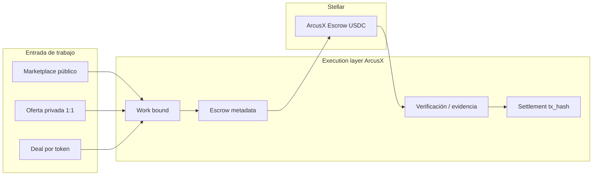

# ArcusX SDK — Plan maestro (Work Execution Layer)

> **Actualidad:** [`PLATFORM_OVERVIEW.md`](./PLATFORM_OVERVIEW.md) · fee [`FEE_MODEL.md`](./FEE_MODEL.md) (**2%**) · partner live [`PARTNER_ESCROW.md`](./PARTNER_ESCROW.md).  
> Este plan es **histórico**. No citar proveedores on-chain externos en material partner — solo **escrow ArcusX**.

**Versión:** 1.2 · **Fecha:** 2026-05-28  
**Audiencia:** equipo interno, integradores B2B, revisores InstaAwards  
**North star:** `arcusx.pro` es el **cliente #1**. El producto es **infra de ejecución de trabajo** — API + `@arcusx/sdk` — con settlement USDC no custodial en Stellar.

**Checklist ejecutable:** [`CHECKLIST.md`](./CHECKLIST.md) · **Fee model:** [`FEE_MODEL.md`](./FEE_MODEL.md)

---

## 1. Qué vendemos (una frase)

> **Postea trabajo ya acordado, bloquea USDC en escrow, verifica entrega, libera on-chain** — sin que el integrador construya lifecycle, disputas, fee quote ni persistencia de `tx_hash`.

No somos discovery (Upwork). Somos **execution + settlement** para quien ya tiene el match: agencias, bootcamps, comunidades Stellar, embeds B2B, el propio marketplace.

---

## 2. Lo que ya existe (no reinventar)

### Motor en producción (testnet)

```
Integrador / arcusx.pro
        │
        ▼
arcusx-api (?action=)  ──►  Postgres arcusx_*
        │                        │
        │                        ├── tasks (+ is_private_invite)
        │                        ├── agreements (deals)
        │                        ├── disputes, ratings, evidence
        │                        └── referrals, KYC, domain_events
        │
        ▼
Stellar + Trustless Work (firma en browser / wallet del usuario)
```

| Primitivo | Edge handlers | UI referencia |
|-----------|---------------|---------------|
| Marketplace público | `create_task`, `apply_task`, `select_proposal`, `create_escrow`, … | `CreateTask`, `ApplyTask`, `SuperviseTask` |
| Oferta privada 1:1 | `finalize_private_offer`, `accept_private_offer`, `reject_private_offer`, `get_private_offers` | `PrivateOfferEscrowPopup`, `CreateTask` (modo privado) |
| Deal por link | `create_deal`, `get_deal_by_token`, `accept_deal`, `prepare/finalize_deal_escrow`, `mark_deal_released` | `DealWizardPage`, `DealPublicPage`, `DealWorkspacePage` |

**Fee:** 3.7% ArcusX + 0.3% TW = **~4% del fondeo** on-chain. UX bilateral: empleador +2% visible, trabajador neto = fondeo − 4%. El SDK **nunca** recalcula — solo consume `get_platform_fee` / `escrow/quote`. Ver [`FEE_MODEL.md`](./FEE_MODEL.md).

**On-chain hoy:** Trustless Work en cliente (`trustlessWorkEscrowService.ts`). Edge valida `tx_hash` / `transaction_hash` en release. Soroban nativo vive en `docs/escrow-native/` — **fuera de v0.1 SDK**.

### Gap real (lo que falta para ser infra)

| Gap | Bloqueo |
|-----|---------|
| Sin `arcusx_partners` / API keys | No hay tenant B2B ni atribución GMV |
| Sin `partner_id` / `external_id` en tasks/deals | Integrador no mapea sus IDs |
| SDK = scaffold | No hay quickstart ni smoke |
| Módulo **private** ausente en spec anterior | 3er flujo no documentado en SDK |
| Auth solo JWT OAuth | Server partner no puede operar sin usuario delegado |
| Escrow prepare en browser TW | Integrador debe leer TW docs → **REST `escrow/*` + SDK ocultan TW** |
| Sin REST `/v1/` | Child panels y backends no integran con `?action=` |

---

## 3. Modelo mental: tres entradas, un settlement

Todos los flujos convergen en el mismo pipeline de ejecución:



*TW es implementación interna de ArcusX Escrow; el integrador no lo ve en REST/SDK/OpenAPI.*

### Tipos de entrada (`WorkEntry`)

| Valor | Cuándo lo usa el integrador | Identificador principal |
|-------|----------------------------|-------------------------|
| `marketplace` | Listing abierto, propuestas | `task_id` |
| `private` | Cliente invita a un freelancer conocido | `task_id` + `invited_user_id` |
| `deal` | Acuerdo comercial con link compartible | `agreement_id` / `share_token` |

El SDK expone **tres namespaces** (`marketplace`, `private`, `deals`) más **`escrow`** compartido y **`settlement`** para cierre on-chain.

---

## 4. Arquitectura del paquete `@arcusx/sdk`

### 4.1 Estructura de código (v0.1 → v0.2)

```
packages/arcusx-sdk/
  package.json              # @arcusx/sdk, ESM + CJS, v0.1.0
  tsconfig.json
  src/
    index.ts                # exports públicos
    client.ts               # ArcusXClient, request(), versioning
    auth.ts                 # headers: apiKey, bearer, supabaseAnonKey
    errors.ts               # ArcusXApiError
    types.ts                # WorkEntry, Task, Deal, EscrowStatus, FeeQuote, …
    http.ts                 # fetch wrapper; default base path /v1/
    rest/
      paths.ts              # map REST paths (SDK usa esto, no ?action=)
    modules/
      public.ts             # stats, platform fee
      marketplace.ts        # tasks públicas (alias tasks en v0.1)
      private.ts            # ofertas privadas 1:1
      deals.ts              # agreements / share token
      escrow.ts             # create, status, markWorkStarted, deal prepare/finalize
      settlement.ts         # complete_task, mark_deal_released (+ tx_hash)
    wallet/
      adapter.ts            # ArcusXWalletAdapter (Freighter, etc.)
    stellar/
      escrow-provider.ts    # @internal — TW hoy; Soroban mañana; no exportar en README partner
  README.md
```

**Regla de diseño:** el core SDK es **isomórfico** (Node + browser). La firma Stellar vive **fuera** del core, detrás de `WalletAdapter`.

### 4.2 API del cliente

```typescript
import { ArcusXClient } from '@arcusx/sdk';

const ax = new ArcusXClient({
  baseUrl: process.env.ARCUSX_API_URL!,      // …/functions/v1/arcusx-api  (SDK añade /v1)
  apiKey: process.env.ARCUSX_API_KEY!,
  supabaseAnonKey: process.env.SUPABASE_ANON!,
  bearerToken: userJwt,
  network: 'testnet',
  useLegacyActions: false,                     // default: REST v1; true solo compat interna
});

// Tres entradas
await ax.marketplace.create({ … });
await ax.private.finalize(taskId, { … });
await ax.deals.create({ template: 'coaching', … });

// Settlement compartido
await ax.escrow.status(taskId);
await ax.settlement.completeTask(taskId, { txHash });
await ax.settlement.markDealReleased(dealId, { txHash });
```

### 4.3 Módulos del cliente (getters)

```typescript
ax.public      // stats, fee, listado público
ax.marketplace // tasks públicas + create private invite
ax.private     // ciclo post-creación oferta 1:1
ax.deals       // agreements / share token
ax.escrow      // metadata + prepare (Fase 2c)
ax.settlement  // complete_task, mark_deal_released
```

### 4.4 Marca ArcusX, TW invisible (child panels)

| Capa visible | Capa oculta |
|--------------|-------------|
| REST `/v1/.../escrow/*` | Trustless Work API + contrato escrow |
| `ax.escrow.prepareFund()` | TW deploy/fund en `_shared/escrow-provider.ts` |
| “+2% empleador / neto trabajador” | 3.7% ArcusX + 0.3% protocolo (un solo quote) |
| OpenAPI / SDK types | Sin imports `@trustless-work/*` en ejemplos partner |

**Por qué cobramos:** el integrador no paga por “usar Stellar”. Paga por **infra lista** — REST, SDK, lifecycle, fee quote, `tx_hash`, disputas, `partner_id` — para embeber en child panels sin montar escrow ni leer docs de terceros.

Detalle rutas: [`REST_V1.md`](./REST_V1.md).

### 4.5 Límite SDK ↔ on-chain (v0.1)

| Responsabilidad | Quién |
|-----------------|-------|
| Lifecycle BD, permisos, fee quote | Edge + SDK (HTTP) |
| Deploy / fund / release | **SDK `escrow.prepare*` + WalletAdapter** — TW solo @internal |
| Persistir `tx_hash` post-firma | SDK → Edge (`complete_task`, `mark_deal_released`, …) |

Documentar explícitamente en QUICKSTART: *"ArcusX no custodia ni firma por el usuario."*

---

## 5. Superficie SDK v0.1 (contrato congelado)

Fuente de verdad detallada: [`API_REFERENCE.md`](./API_REFERENCE.md). Resumen por módulo:

### `client.public` — sin JWT

| Método | Edge action | Uso |
|--------|-------------|-----|
| `getMarketStats()` | `get_landing_market_stats` | Landing embed |
| `getPlatformFee()` | `get_platform_fee` | UI pricing |
| `getTasks(query?)` | `get_tasks` | Listado público |

### `client.marketplace` — JWT usuario + partner key

| Método | Edge action |
|--------|-------------|
| `create(input)` | `create_task` |
| `get(taskId)` | `get_task_details` |
| `listMine()` | `get_user_tasks` |
| `apply(taskId, body)` | `apply_task` |
| `getProposals(taskId)` | `get_task_proposals` |
| `selectProposal(taskId, proposalId)` | `select_proposal` |
| `cancel(taskId, opts?)` | `cancel_task` |

### `client.private` — JWT + partner key *(nuevo en spec)*

| Método | Edge action |
|--------|-------------|
| `list()` | `get_private_offers` |
| `finalize(taskId, body)` | `finalize_private_offer` |
| `accept(taskId)` | `accept_private_offer` |
| `reject(taskId, reason?)` | `reject_private_offer` |

**Nota:** `create_task` con `is_private_invite: true` + `invited_user_id` sigue en `marketplace.create()` — el namespace `private` cubre el **ciclo post-creación** (fondeo directo sin propuestas).

### `client.deals` — JWT + partner key

| Método | Edge action |
|--------|-------------|
| `create(input)` | `create_deal` |
| `getByToken(token)` | `get_deal_by_token` |
| `get(id)` | `get_deal_details` |
| `list()` | `get_my_deals` |
| `accept(id)` | `accept_deal` |
| `complete(id)` | `complete_deal` |

### `client.escrow` — compartido tasks + deals

| Método | Edge action | Flujo |
|--------|-------------|-------|
| `createForTask(taskId, proposalId)` | `create_escrow` | Marketplace |
| `status(taskId)` | `get_escrow_status` | Ambos |
| `markWorkStarted(taskId)` | `mark_work_started` | Marketplace |
| `prepareDealEscrow(dealId, body)` | `prepare_deal_escrow` | Deals |
| `finalizeDealEscrow(dealId, body)` | `finalize_deal_escrow` | Deals |

### `client.settlement` — cierre on-chain

| Método | Edge action | Requiere |
|--------|-------------|----------|
| `completeTask(taskId, { txHash, … })` | `complete_task` | Release TW |
| `markDealReleased(dealId, { txHash })` | `mark_deal_released` | Release TW |

**Total v0.1:** **27 métodos** HTTP (+ `WalletAdapter` interface).

### v0.2 (post-MVP, mismo trimestre si hay demanda)

| Módulo | Métodos | Edge |
|--------|---------|------|
| `evidence` | `uploadMilestone`, `getMilestone`, `uploadDeal`, `getDeal` | `upload_milestone_evidence`, `get_milestone_evidence`, `upload_deal_evidence`, `get_deal_evidence` |
| `disputes` | `create`, `list`, `getChat`, `getFiles`, `getTimeline` | `create_dispute`, `get_user_disputes`, `get_dispute_*` |
| `identity` | `registerWallet`, `verifyWallet` | `register_wallet`, `verify_wallet` |
| `ratings` | `create`, `summary` | `create_rating`, `get_user_rating_summary` |
| `marketplace` | `checkCancellationAllowed` | `check_cancellation_allowed` |

Mensajería (RPC Supabase directo) queda **out of band** en v0.1 — documentar en FAQ integrador.

---

## 6. Auth y multi-tenant

### Modo A — Embed con usuarios OAuth *(lanzamiento v0.1)*

1. Usuario final hace OAuth (Google/GitHub) → `sync_supabase_user` → JWT app.
2. Partner envía `x-arcusx-api-key` + `Authorization: Bearer <jwt>` + `apikey: <anon>`.
3. Edge asocia `partner_id` al recurso (`create_task`, `create_deal`).

**ICP:** agencia con su UI; usuarios existentes en ArcusX o redirect OAuth.

### Modo B — Server + mapping externo *(v0.2 / Fase 1b)*

1. Solo API key en server.
2. Body incluye `external_id`, `external_user_id`.
3. Edge resuelve shadow user o tabla `arcusx_partner_users`.

**Defer v0.1** salvo piloto enterprise que lo exija — diseñar columnas ya en Fase 1.

### Tablas SQL (Fase 1 — P0)

```sql
-- arcusx_partners
id uuid PK, name, slug unique, sandbox bool, webhook_url, platform_fee_override numeric,
contact_email, status, created_at

-- arcusx_partner_keys
id uuid PK, partner_id FK, key_hash, label, sandbox bool,
rate_limit_per_min int, created_at, revoked_at

-- arcusx_partner_audit_log
id, partner_id, action, resource_type, resource_id, ip, request_id, created_at

-- En recursos existentes
arcusx_tasks.partner_id, arcusx_tasks.external_id
arcusx_agreements.partner_id, arcusx_agreements.external_id
UNIQUE (partner_id, external_id) WHERE external_id IS NOT NULL
```

### Edge (Fase 1)

| Archivo | Rol |
|---------|-----|
| `_shared/partner-api-keys.ts` | SHA-256 lookup, rate limit, `ctx.partnerId` |
| `_shared/partner-context.ts` | Scoping lecturas por tenant |
| `router.ts` | Inyectar partner antes del handler |

**Rutas partner-first (opt-in MVP):**

| Action | API key | User JWT |
|--------|---------|----------|
| `get_landing_market_stats` | opcional | — |
| `get_platform_fee` | opcional | — |
| `get_tasks` | sí (filtro futuro) | — |
| `create_task` | sí | sí |
| `create_deal` | sí | sí |
| `get_task_details` | sí | sí |
| `get_deal_details` | sí | sí |
| `finalize_private_offer` | sí | sí |

Detalle: [`PARTNER_AUTH.md`](./PARTNER_AUTH.md).

---

## 7. WalletAdapter (contrato integrador)

```typescript
export interface WalletAdapter {
  getAddress(): Promise<string>;
  signTransaction(xdr: string): Promise<string>; // signed XDR o tx hash
  network: 'testnet' | 'mainnet';
}
```

| Fase | Qué provee ArcusX |
|------|-------------------|
| v0.1 | Interface + doc; ejemplo Freighter en `examples/sdk-react-freighter` |
| v0.2 | Helpers TW thin-wrapper en `stellar/trustless-work.ts` (browser) |
| Fase 3 infra | `escrow.prepareFund()` / `confirmFund()` en Edge — SDK orquesta pasos |

---

## 8. Ejemplos y DX

### Tres quickstarts (uno por flujo)

```
examples/
  sdk-node-marketplace/     # crear tarea → apply → select (sin wallet, hasta escrow metadata)
  sdk-node-private/         # create private → finalize_private_offer
  sdk-node-deal/            # create_deal → share token → accept
  sdk-react-freighter/      # (W3) fund + release con WalletAdapter
```

### Scripts

| Script | Propósito |
|--------|-----------|
| `scripts/smoke-sdk.mjs` | `public.*` + health; exit 0 en CI |
| `scripts/smoke-edge-api.mjs` | Ya existe — paridad acciones |

### Variables de entorno documentadas

```
ARCUSX_API_URL=https://<ref>.supabase.co/functions/v1/arcusx-api
ARCUSX_API_KEY=axk_test_…
SUPABASE_ANON_KEY=…
ARCUSX_USER_JWT=…   # opcional, flujos con usuario
```

### Respuesta HTTP uniforme (migración gradual)

```json
{
  "success": true,
  "data": { },
  "meta": { "request_id": "uuid", "api_version": "v1" }
}
```

Handlers legacy pueden devolver shape actual; SDK normaliza ambos en `http.ts`.

---

## 9. Fases de implementación

### Resumen

| Fase | Semanas | Entregable | DoD |
|------|---------|------------|-----|
| **0** Spec | 1 | Este plan + API_REFERENCE actualizado | Contrato congelado |
| **1** Partner infra | 2–3 | SQL + Edge auth + audit | curl con key crea task con `partner_id` |
| **2a** REST v1 alias | 1–2 | `rest-v1.ts` + envelope JSON | `POST /v1/tasks` = `create_task` |
| **2b** SDK v0.1 | 2–3 | 27 métodos REST + 3 quickstarts | `smoke-sdk.mjs` exit 0 |
| **2c** Escrow REST | 2 | `escrow/quote`, `fund/prepare` (TW oculto) | Partner fund sin docs TW |
| **3** Dogfood | 2 | 2+ servicios frontend usan SDK | ≥30% calls internal vía SDK |
| **4** Escrow unify | 3–5 | Soroban detrás de mismo `escrow/*` | Swap TW→Soroban sin breaking API |
| **5** Webhooks | 2 | `task.completed`, `deal.released` | Partner sandbox recibe POST |
| **6** Mainnet + Soroban | gate | Provider switch | Checklist escrow-native verde |

### Fase 0 — Spec (cerrada salvo fee copy)

- [x] Plan maestro (este doc)
- [x] `API_REFERENCE.md` con módulos marketplace/private/deals/escrow/settlement
- [x] `CHECKLIST.md` + `FEE_MODEL.md` + `openapi-v1.yaml` borrador
- [x] `QUICKSTART.md` borrador
- [x] `TRANCHE3` y `instaawards-sdk/PLAN.md` sincronizados
- [x] `GLOBAL_INFRA_AUDIT.md` — gaps infra global
- [x] Congelar nombres de métodos — no renombrar sin bump minor

### Fase 1 — Partner infra (P0, arrancar ya)

| ID | Tarea |
|----|-------|
| T3-01 | Migración `arcusx_partners`, `arcusx_partner_keys`, `arcusx_partner_audit_log` | `supabase/migrations/20260528140000_arcusx_partners.sql` |
| T3-02 | `_shared/partner-api-keys.ts` + rate limit |
| T3-03 | `partner_id` + `external_id` en tasks/agreements + handlers create |
| T3-06 | Generar `axk_test_…` sandbox (fuera de git) |
| T3-19 | Documentar flujo OAuth integrador (`sync_supabase_user` → JWT) | `PARTNER_AUTH.md`, `QUICKSTART.md` |
| T3-20 | `Idempotency-Key` en `http.ts` para POST idempotentes | `packages/arcusx-sdk/src/http.ts` |

**DoD:** Partner sandbox crea tarea; fila tiene `partner_id`; marketplace sin regresiones.

### Fase 2a — REST v1 (alias, P0)

| ID | Tarea |
|----|-------|
| T3-13 | `handlers/rest-v1.ts` — path dispatch → handlers existentes |
| T3-14 | `_shared/json-envelope.ts` — respuesta `{ success, data, meta }` |
| T3-15 | `docs/sdk/openapi-v1.yaml` + ejemplos curl |

**DoD:** `curl POST /v1/tasks` con key sandbox equivale a `?action=create_task`.

### Fase 2b — SDK v0.1

| ID | Tarea |
|----|-------|
| T3-04 | `http.ts`, `auth.ts`, `errors.ts`, módulos public + marketplace |
| T3-04b | Módulos `private`, `deals`, `escrow`, `settlement` |
| T3-05 | `examples/sdk-node-{marketplace,private,deal}` |
| T3-08 | `docs/sdk/QUICKSTART.md` + README paquete |
| T3-09 | `scripts/smoke-sdk.mjs` (paths `/v1/`) |

**DoD:** Clonar repo → `npm install` → quickstart crea recurso en testnet con key sandbox.

### Fase 2c — Escrow REST (TW oculto)

| ID | Tarea |
|----|-------|
| T3-16 | `_shared/escrow-provider.ts` — wrapper TW → respuestas ArcusX |
| T3-17 | `GET .../escrow/quote`, `POST .../fund/prepare`, `.../release/prepare` |
| T3-18 | SDK `escrow.quote/prepareFund/confirmFund` sin export TW |

**DoD:** quickstart fund+release sin import `@trustless-work/*`.

### Fase 3 — Dogfood + piloto

| ID | Tarea |
|----|-------|
| T3-10 | Migrar `dealsService.ts` → SDK (1er PR dogfood) |
| T3-11 | Migrar `privateOffersService.ts` → SDK |
| T3-12 | Piloto #1 con GMV `partner_id IS NOT NULL` |

**Candidatos piloto:** Gokei, Magnar, Freaktools, Stellar Chile/Discord, Alfred Pay (design partner), bootcamp con cohorte cerrada.

**DoD piloto:** ≥1 deal o task cerrado con release USDC atribuido al partner.

### Fases 4–6

Ver [`INFRASTRUCTURE_ADAPTATION_PLAN.md`](./INFRASTRUCTURE_ADAPTATION_PLAN.md) — no bloquean v0.1 ni InstaAwards W2–W3.

---

## 10. ICP integrador (quién usa el SDK)

| Perfil | Entrada típica | Valor |
|--------|----------------|-------|
| **Talent orchestrator** (agencia, bootcamp) | `private` o `marketplace` acotado | Settlement USDC sin construir escrow |
| **Comunidad / DAO** | `deals` (grants, bounties 1:1) | Link compartible + evidencia |
| **Fintech / payroll LATAM** | `private` + KYB | Cross-border microtask |
| **arcusx.pro** | Los 3 | Cliente referencia / dogfood |

**No priorizar en outbound:** discovery masivo, equipos >5, custodia, ML sin crypto.

---

## 11. Métricas de éxito (Tranche 3)

| Métrica | Hoy | Target T3 |
|---------|-----|-----------|
| Métodos SDK shipped | 0 | **27** |
| Partners con key activa | 0 | **3** |
| GMV `partner_id IS NOT NULL` | $0 | **≥$1K USDC** |
| % calls internas vía SDK | 0% | **≥30%** |
| Quickstarts ejecutables | 0 | **3** (marketplace, private, deal) |
| Tiempo integración piloto | — | **<2 días** con QUICKSTART |

---

## 12. Fuera de alcance v0.1

- Soroban native como default (misma API `escrow/*` cuando llegue)
- Webhooks
- Python / Go SDK
- Modo B server-only sin OAuth
- Mensajería / Realtime (RPC Supabase)
- Suscripciones / billing partner automatizado
- White-label hosting (dominio del panel es suyo; API es nuestra)

---

## 13. Riesgos y mitigación

| Riesgo | Mitigación |
|--------|------------|
| Integrador no quiere wallet/crypto | Documentar fricción; nicho crypto-first; Privy/on-ramp = track aparte |
| Romper frontend al extraer SDK | Dogfood servicio por servicio; smoke E2E testnet |
| Spec drift SDK ↔ Edge | `ENDPOINTS.md` + smoke; SDK generado desde lista de actions |
| TW dependency | `escrow-provider` @internal; API pública solo ArcusX Escrow |
| Confundir referidos con partners | Tablas distintas: `referral_partners` ≠ `arcusx_partners` |

---

## 14. Narrativa (investor / InstaAwards / forms)

**ES:** ArcusX es la capa de ejecución de trabajo en Stellar. Empaquetamos REST v1 + SDK TypeScript para child panels y agencias: tres entradas (público, privado, deal), escrow USDC con una sola fee ArcusX, sin que el integrador monte infra on-chain.

**EN:** ArcusX is the work execution layer on Stellar. REST v1 and TypeScript SDK let child panels embed conditional work + USDC escrow under their brand — we handle lifecycle and settlement; partners do not integrate third-party escrow docs.

---

## 15. Orden de trabajo (próximas 2 semanas)

```
Semana 1
  ├── Publicar este plan + API_REFERENCE v0.1
  ├── T3-01 migración partners
  ├── T3-02 partner-api-keys.ts
  └── SDK: http + auth + errors + public + marketplace

Semana 2
  ├── T3-13 REST v1 alias + envelope JSON
  ├── T3-03 partner_id en create handlers
  ├── SDK: private + deals + escrow + settlement (paths /v1/)
  ├── T3-05 tres quickstarts Node
  └── smoke-sdk.mjs + QUICKSTART.md

Semana 3
  ├── T3-16 escrow-provider (TW oculto)
  ├── T3-17 escrow/quote + fund/prepare REST
  └── openapi-v1.yaml
```

Paralelo: identificar piloto #1 y emitir key sandbox.

---

## 16. Referencias cruzadas

| Doc | Contenido |
|-----|-----------|
| [`REST_V1.md`](./REST_V1.md) | REST v1 + TW oculto + child panels |
| [`API_REFERENCE.md`](./API_REFERENCE.md) | Métodos SDK ↔ REST / actions |
| [`PARTNER_AUTH.md`](./PARTNER_AUTH.md) | Keys y límites |
| [`INFRASTRUCTURE_ADAPTATION_PLAN.md`](./INFRASTRUCTURE_ADAPTATION_PLAN.md) | Fases técnicas largas |
| [`CHECKLIST.md`](./CHECKLIST.md) | **Lista de trabajo ejecutable** — IDs, DoD, dependencias |
| [`FEE_MODEL.md`](./FEE_MODEL.md) | Comisión bilateral + reglas SDK |
| [`QUICKSTART.md`](./QUICKSTART.md) | Guía integrador |
| [`openapi-v1.yaml`](./openapi-v1.yaml) | OpenAPI borrador |
| [`GLOBAL_INFRA_AUDIT.md`](./GLOBAL_INFRA_AUDIT.md) | Auditoría camino a infra global |
| [`REVENUE_STACK.md`](./REVENUE_STACK.md) | Take rate por tier |
| [`ENDPOINTS.md`](../api/ENDPOINTS.md) | Lista completa Edge |
| [`TRANCHE3_INFRA_SDK.md`](../sprints/TRANCHE3_INFRA_SDK.md) | DoD trimestre |

---

## 17. Camino a infra global

Ver auditoría completa: [`GLOBAL_INFRA_AUDIT.md`](./GLOBAL_INFRA_AUDIT.md).

| Etapa | Producto | DoD global |
|-------|----------|------------|
| **v0.1** (Tranche 3) | SDK 27 métodos + partners + REST | Primer integrador cierra escrow sin fork UI |
| **v0.2** | Evidence, disputas, wallet, webhooks | Verificación + eventos para automatización |
| **v1** | Agentic API (`/v1/jobs`) + Modo B M2M | DAOs, payroll, agentes IA |
| **v2** | Soroban default + mainnet + multi-milestone | Settlement propio, escala GMV |

**Tesis:** El marketplace es cliente #1. La infra global no requiere discovery — requiere **execution + settlement + verificación** empaquetados.

---

*Documento vivo — al cerrar cada fase, actualizar checklist y `CHANGELOG.md`.*
