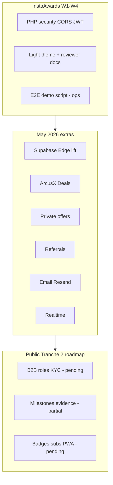

# ArcusX — Work outside the InstaAwards plan (May 2026)

**For:** Notion / stakeholders / reviewers  
**Supabase project:** `atgsesbstjleabesclzs`  
**Last updated:** 2026-05-31

---

## 1. What was in the original plan

| Window | Planned scope | Docs |
|--------|---------------|------|
| **InstaAwards — Weeks 1–4** | PHP security, CORS/JWT, wallet, light theme, Bearer on critical API, reviewer pack (ENDPOINTS, E2E script), demo/pilot/metrics | `docs/sprints/week-01` … `week-04`, `instaawards-week3/4` |
| **PLAN_MES1_REVISORES** | Same core: hardening, light theme on a fixed file list, i18n in 5 components, responsive, cleanup — **no** full backend rewrite | `PLAN_MES1_REVISORES.md` |
| **Public roadmap — Tranche 2** | Supabase, B2B, pipeline, growth — **vision**, not InstaAwards breakdown | `ARQUITECTURA_Y_ROADMAP_ARCUSX.md`, Hero i18n |

**Important:** InstaAwards was scoped to **testnet + reviewer confidence** on the **PHP stack + frontend**. It did **not** include migrating the marketplace to Edge, Deals, private offers, a full referral program, or transactional email.

---

## 2. Executive summary of extras

| # | Initiative | Type | Repo status | In InstaAwards plan? |
|---|------------|------|-------------|----------------------|
| A | **Backend lift → Supabase** | Infra / architecture | ~75% code; prod cutover pending | **No** — Tranche 2, separate track |
| B | **ArcusX Deals** (agreements + payment link) | Product | MVP in app + Edge + DB | **No** |
| C | **ArcusX Private offers** | Product | In codebase | **No** |
| D | **Referral program** | Growth / ops | Edge + admin + frontend | **No** (generic Tranche 2 mention only) |
| E | **Email notifications (Resend)** | Infra / UX | Edge + queue + per-event policy | **No** |
| F | **Realtime** (notif + task messages) | Pipeline | Hooks + publication migration | **No** (Tranche 2 “vision” only) |
| G | **Escrow reconcile + idempotency + events** | Ops / traceability | Partial | **No** |
| H | **“Hire” flow from freelancers** | Marketplace UX | Phase 0 done | Partial (Week 2 “hire”) |
| I | **Task messaging via Supabase RPC** | Infra | RPC + RLS | Parallel, not InstaAwards |
| J | **Unified 3% platform fee** | Product / finance | Code + docs aligned | Cross-cutting fix |
| K | **2026+ planning packs** | Docs only | No prod | **No** — strategy |

---

## 3. Detail by initiative

### A. Backend elevation (PHP → Supabase)

**Why it’s “extra”:** InstaAwards assumed hardened **`backend_externo/` + MySQL**. Postgres + Edge migration is the **Tranche 2 backbone**, run in parallel with the reviewer close.

**What was built**

| Piece | Description |
|-------|-------------|
| `arcusx_*` schema | Users, tasks, applications, disputes, ratings, config, admin logs |
| MySQL → Postgres import | `scripts/import-mysql-dump-supabase.mjs` |
| RLS + RPCs | Messages, notification inbox, landing stats, OAuth user link |
| **`arcusx-api`** | Edge router replacing ~40 PHP marketplace endpoints |
| **`arcusx-admin`** | Admin panel via Edge (stats, users, tasks, disputes, config, notify) |
| Frontend cutover | `arcusxApi.ts` — with `VITE_SUPABASE_URL` and without `VITE_USE_PHP_API`, traffic goes to Edge |
| Parity matrix | `docs/supabase/PARITY_MATRIX.md` |
| Close-out plan | `docs/supabase/BACKEND_COMPLETION_PLAN.md`, `CUTOVER_CHECKLIST.md`, `FULL_MIGRATION.md` |
| Deploy scripts | `bundle-edge-fn.mjs`, `deploy-management-multipart.mjs`, `smoke-edge-api.mjs` |

**Recent Edge versions (reference):** `arcusx-api` v25–26, `arcusx-admin` v12–13, plus satellite functions (see § G, E).

**Operational pending**

- Prod build without `VITE_USE_PHP_API`
- E2E smoke on testnet via Edge
- Disable or 410 PHP marketplace after rollback window
- Refresh `BACKEND_DEPLOY_STATUS.md` (dates/versions)

**Notion-friendly links**

- `docs/supabase/FULL_MIGRATION.md`
- `docs/supabase/BACKEND_DEPLOY_STATUS.md`
- `docs/supabase/CUTOVER_CHECKLIST.md`

---

### B. ArcusX Deals (modular agreements)

**What it is:** **Template-based** contracts (rental, P2P car sale, coaching, freelance, etc.) + **payment link** (`/deal/:token`). Same USDC escrow engine as the marketplace; different UX (no public apply flow).

**Why it’s extra:** Not in weeks 1–4 or InstaAwards checklist. Own plan under `docs/agreement-deals/` and `ARCUSX_AGREEMENTS_PLAN.md`.

**Done in repo**

| Layer | Deliverable |
|-------|-------------|
| Product docs | `PRODUCT_SPEC`, `ARCHITECTURE`, `TEMPLATES_CATALOG`, `VISION_FIT`, `PLAN`, `CHECKLIST` |
| DB | `arcusx_agreements` — migration `20260531120000_arcusx_agreements.sql` |
| Edge | Handlers in `arcusx-api/handlers/deals.ts`: create, token, accept, fund escrow, release, list |
| Frontend | `DealPublicPage`, Deals panel in dashboard, `dealEscrow.ts`, `VITE_DEALS_ENABLED` |
| Events | `arcusx_agreement_events` + `logDomainEvent` on deal creation |
| Notifications | In-app (+ selective email: invite, funded, release to beneficiary) |

**Pending / Deals roadmap**

- Full per-template wizard (Phase 1 checklist still partial in doc)
- Guard in agreement chat
- Product interviews + rental legal disclaimer
- Native Soroban escrow integration (future — `docs/escrow-native/`)

**Links**

- `docs/agreement-deals/README.md`
- `ARCUSX_AGREEMENTS_PLAN.md`

---

### C. ArcusX Private offers

**What it is:** Client invites **one specific freelancer**; restricted task (`is_private_invite`), required payout wallet (`private_payout_wallet`), escrow flow without open competition.

**Why it’s extra:** Not in InstaAwards; B2B/direct-hire product line separate from the open marketplace.

**Done in repo**

| Layer | Deliverable |
|-------|-------------|
| DB | `is_private_invite`, `invited_user_id` — migration `20260530140000_...` |
| DB | `private_payout_wallet` on users — `20260530160000_private_payout_wallet.sql` |
| Edge | `create_task` validates invitee; `apply_task` restricts applicant; `finalizePrivateOffer` activates funded escrow |
| Frontend | **Offers** tab in dashboard, payout wallet banner, `CreateTask` with hire context, `privateOffersService` |
| Navbar | Direct link to `?tab=private-offers` |
| Notifications | Invite on create; funded private offer to invitee (in-app + email on key events) |

**Related extra:** complements **Hire** flow from freelancer list (§ H).

**Links**

- `docs/plans/freelancer-hire-flow-improvement.md` (Phase 0 + evolving private offers)

---

### D. Referral program (ambassadors)

**What it is:** Attribution by code/link, anti-fraud, admin panel, **no automatic payout** (manual supervision).

**Why it’s extra:** Tranche 2 mentions referrals generically; the **full system** (4 Edge functions + migrations + UI) was a separate initiative.

**Done in repo**

| Piece | Detail |
|-------|--------|
| Migrations | `referral_program`, visits, pending attributions, rate hits |
| Edge | `referral-resolve-code`, `referral-bind-pending`, `referral-attribute-signup`, `referral-admin` |
| PHP bridge | `referral_bind.php`, `referral_supabase.php`, `admin_referral_actions.php` (coexistence) |
| Frontend | `ReferralLanding`, `ReferralBootstrap`, `ReferralManagement`, capture on register/OAuth |
| Secrets | `REFERRAL_*`, `ARCUSX_JWT_SECRET` aligned PHP ↔ Edge |
| Scripts | `set-referral-edge-secrets.sh`, bundles in `supabase/.deploy/referral-*.json` |

**Links**

- `docs/referrals/README.md`
- `docs/referrals/PLAN_SISTEMA_REFERIDOS.md`

---

### E. Email notifications (Resend)

**What it is:** Queue `arcusx_email_outbox`, worker `arcusx-email-worker`, HTML templates (es-CL), policy of **email only for high-value events** (e.g. “Your payment was released”, proposals, delivery notices).

**Why it’s extra:** InstaAwards / Week 4 = in-app + Realtime; email was out of scope. cPanel SMTP failed from Edge → **Resend** + `arcusx.pro` domain.

**Done in repo**

| Piece | Detail |
|-------|--------|
| Migration | `20260531150000_email_notifications_outbox.sql` |
| Shared | `email-templates.ts`, `email-send.ts`, `resend-send.ts`, `email-outbox.ts` |
| Integration | `insertArcusxNotification(..., email: true/false)` in `arcusx-api` / admin handlers |
| Ratings | No separate rating email; stars included in **payment released** email when a rating exists |
| Docs | `EMAIL_SETUP.md`, `EMAIL_NOTIFICATIONS.md`, `EMAIL_LOGO_CPANEL.md`, `CRON_SECRET.md` |
| cPanel cron | Template `scripts/cpanel-cron-edge.example.sh` for worker + reconcile |

**Prod secrets:** `RESEND_API_KEY`, `EMAIL_FROM`, `ARCUSX_CRON_SECRET`

---

### F. Realtime (notifications + task messages)

**What it is:** Postgres subscription via Supabase Realtime on dashboard bell and supervision chat.

**Done**

- Publication migration (`20260531140000_backend_completion.sql`)
- `useNotificationsRealtime`, `useTaskMessagesRealtime`
- Wired in `dashboard.tsx`, `SuperviseTask.tsx`
- RPC `arcusx_send_task_message` + notification to recipient

**Pending:** Realtime on **dispute** chat; reduce leftover polling.

---

### G. Operational robustness (post-migration)

| Piece | Status | Notes |
|-------|--------|-------|
| `arcusx_escrow_sync_log` + **`arcusx-escrow-reconcile`** | Code + deploy | TW does not send webhooks; cPanel cron not yet active |
| `arcusx_idempotency_keys` | Active in router | Critical POSTs with `Idempotency-Key` |
| `arcusx_domain_events` | Partial | `deal.created`, `escrow.funded`; missing complete/dispute/cancel |
| Storage buckets | avatars/task-files migration | Avatar upload on Edge; milestone evidence **not** |
| Upload avatar / portfolio | Implemented on Edge | Previously documented as 501 — updated in code |

**Provider webhooks:** `arcusx-webhook-ingress` — **not implemented** (design in agentic-payments).

---

### H. “Hire” freelancer flow

**What it is:** From freelancer card/profile → create task with context → apply with `?ref=hire` or direct **private offer**.

**Status:** Phase 0 quick wins shipped (`hire_*` query, state in `CreateTask`, banners).

**Doc:** `docs/plans/freelancer-hire-flow-improvement.md`

---

### I. Messaging and notifications on Supabase (before Edge API)

Migrations `20260513*` — `arcusx_task_messages`, `arcusx_notifications`, inbox RPC, dismissals. Foundation for Realtime and deprecating PHP `get_notifications` / `send_message`.

---

### J. 3% platform fee (cross-cutting alignment)

Documentation and code alignment: **3%** fee paid by the client (replacing scattered 0.5%, 1%, 1.5% references). Key files: `config/trustlessWork.ts`, `commission.ts`, PHP defaults, i18n copy, InstaAwards narrative.

**Not a dedicated sprint** — consistency pass during May 2026.

---

### K. Strategic planning (no production implementation)

Documentation only — useful for Notion “technical roadmap”; **do not** count as InstaAwards delivery:

| Folder / file | Topic |
|---------------|-------|
| `docs/agentic-payments/` + `ARCUSX_AGENTIC_PAYMENTS_PLAN.md` | Agentic payments, partner APIs |
| `docs/agentic-payments/arcusx-guard/` + `ARCUSX_GUARD_PLAN.md` | Protective AI, disputes |
| `docs/escrow-native/` + `ARCUSX_ESCROW_NATIVO_PLAN.md` | Soroban WASM, TW switch |
| `arcusx/docs/PLAN_CUENTA_EMPRESA_KYC.md` | Company account, KYB, roles |
| `ARCUSX_VISION_INFRAESTRUCTURA.md`, `ARCUSX_BRAND_IDENTITY.md` | Brand and vision |
| `docs/strategy/business-model-subscription-certix-analysis.md` | Subscriptions + CertiX (future) |
| `docs/PLANNING_AUDIT.md` | Plan alignment audit |

---

## 4. Map: InstaAwards vs extras vs Tranche 2



---

## 5. Edge Functions inventory (extras + migrated core)

| Function | Role | vs InstaAwards |
|----------|------|----------------|
| `arcusx-api` | Marketplace + deals + escrow API | **Extra** (migration) |
| `arcusx-admin` | Admin panel API | **Extra** |
| `arcusx-email-worker` | Email queue | **Extra** |
| `arcusx-escrow-reconcile` | Escrow state sync | **Extra** |
| `referral-*` (×4) | Referral program | **Extra** |
| `referral-admin` | Referral admin | **Extra** |

---

## 6. Stakeholder / Notion copy-paste

**InstaAwards (weeks 1–4):** We delivered a more secure testnet marketplace (JWT, CORS, wallet, light theme, SDF reviewer documentation) and demo/pilot preparation.

**Outside the InstaAwards contract, in the same period we advanced:**

1. **Supabase backend** — Postgres, RLS, Edge APIs replacing PHP (cutover in progress).
2. **ArcusX Deals** — agreements with payment links and templates (MVP in code).
3. **Private offers** — direct hire of one freelancer with escrow.
4. **Referrals** — attribution, admin, and dedicated Edge functions.
5. **Transactional email** — Resend, focused on “you got paid” and events that require returning to the app.
6. **Realtime** — notifications and task messages without refresh.

**Honest next Tranche 2 focus:** close prod cutover, escrow cron, evidence/milestones, company KYC account; badges/subscriptions/mobile remain on the roadmap, not in production code.

---

## 7. Quick references (paths)

```
docs/sprints/EXTRAS_OUTSIDE_INSTAAWARDS_PLAN.md   ← this file
docs/sprints/week-03-changelog-and-architecture.md
docs/sprints/week-04-changelog-and-architecture.md
docs/supabase/BACKEND_COMPLETION_PLAN.md
docs/agreement-deals/
docs/referrals/
docs/supabase/EMAIL_NOTIFICATIONS.md
PLAN_MES1_REVISORES.md
ARQUITECTURA_Y_ROADMAP_ARCUSX.md
```

---

## 8. Maintaining this doc

Update when:

- **Prod cutover** closes (date + Edge version).
- Deals Phase 1 checklist moves to “complete”.
- Reconcile cron / webhook ingress goes live.
- Company KYC implementation starts (move from § K to a new product section).

---

*Inventory document — does not replace sprint changelogs or the InstaAwards contract.*
