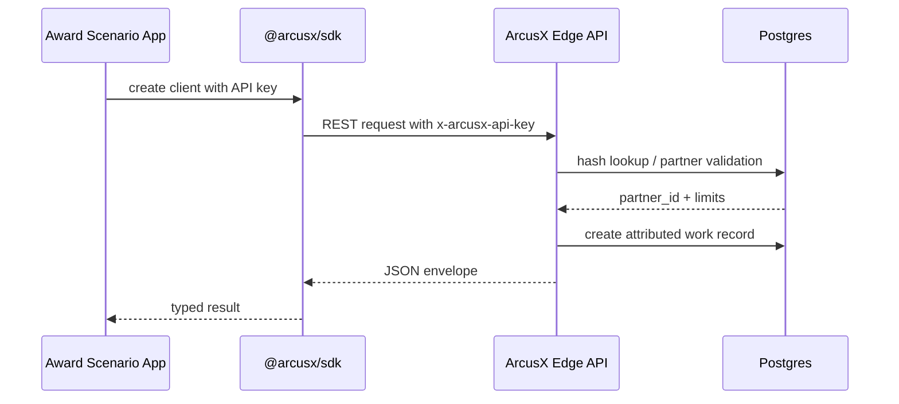
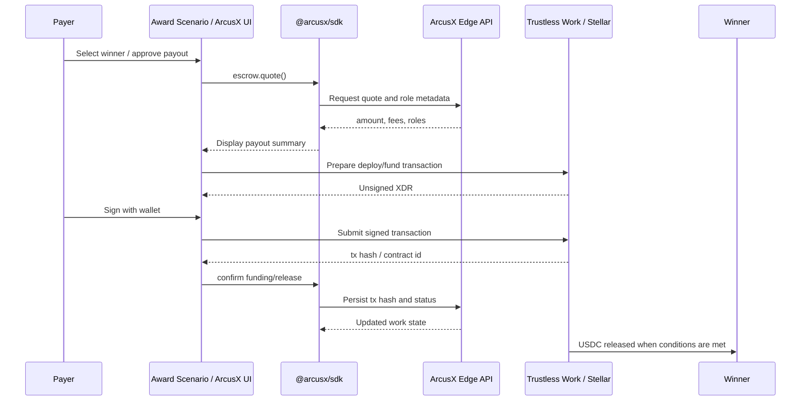

# ArcusX SOW 2 Architecture — SDK-First Work Execution Layer

## Overview

SOW 2 turns ArcusX from a marketplace-only product into an integration layer that external applications can use through `@arcusx/sdk`. The SDF award-style scenario is the reviewer-facing validation flow for this sprint: it exercises campaign/award creation, submissions, evidence, winner selection, escrow quote, escrow funding, and payout release through ArcusX APIs and Stellar Testnet USDC escrow.

This architecture keeps the main ArcusX marketplace independent from the SDK, while adding a reusable SDK layer for external integrations. The goal is not to launch mainnet during this SOW. The goal is to prove that an external application can use ArcusX as a programmable work execution and settlement layer.

The completion target is 100% coverage of the agreed SDK surface for this SOW: public, marketplace, private offers, deals, escrow, evidence, ratings, webhooks, examples, and smoke verification. Future platform tracks such as agent-to-agent payments, Python SDK, native Soroban escrow, and mainnet launch remain outside this month.

### Components

1. SDF award-style validation scenario
2. ArcusX TypeScript SDK
3. Edge REST API
4. Partner authentication and attribution
5. Database and domain records
6. Escrow and Stellar integration
7. Reviewer tooling and smoke tests

---

## 1. SDF Award-Style Validation Scenario

The SDF award-style flow acts as a reviewer-facing validation scenario for the ArcusX SDK. It does not imply that SDF/InstaAward is a partner, associated product, or customer of ArcusX. Instead of calling internal APIs directly, the scenario should use `@arcusx/sdk` to model award workflows as work execution flows.

- **Technologies:** TypeScript, `@arcusx/sdk`, Node examples, optional Vite playground
- **Responsibilities:**
  - Create award/campaign records mapped to ArcusX work objects.
  - Accept submissions with evidence metadata.
  - Select a winner or assignee.
  - Quote payout and escrow costs.
  - Trigger Testnet escrow preparation/funding.
  - Confirm completion or evidence approval.
  - Release USDC payout through the existing Trustless Work flow.

### Key Processes

1. **Award creation:** An integrator creates an award/campaign using SDK modules instead of raw HTTP. The record carries `partner_id` or API key attribution.
2. **Submission and evidence:** A participant submits proof, media, metadata, or a completion artifact. The SDK stores or links it through ArcusX evidence APIs.
3. **Winner selection:** The integrator selects the winner, which creates a payout-ready state.
4. **Payout preparation:** The SDK calculates escrow amounts, platform fee, Trustless Work protocol fee, and required signer/receiver roles.
5. **Escrow settlement:** The payer funds a Testnet USDC escrow and later releases funds after the award conditions are met.

---

## 2. ArcusX TypeScript SDK

The SDK is the public integration surface. It should hide ArcusX internal route details, normalize errors, support idempotency, and provide typed modules for common workflows.

- **Technologies:** TypeScript, ESM/CJS package, REST `/v1`, Node examples
- **Responsibilities:**
  - Provide a stable `ArcusXClient`.
  - Handle API key/JWT auth headers.
  - Normalize JSON envelopes and errors.
  - Expose typed modules for public data, marketplace, private offers, deals, escrow, evidence, ratings, and webhooks.
  - Provide examples that prove real usage.

### SDK Modules in Scope

| Module | Purpose |
| --- | --- |
| `public` | Public stats, listings, metadata, and unauthenticated reads. |
| `marketplace` | Task/work creation, applications, proposal selection, and supervision metadata. |
| `private` | Private offer creation, finalization, accept/reject, and status reads. |
| `deals` | Direct deal creation, acceptance, funding status, release, and dispute metadata. |
| `escrow` | Quote, prepare deploy, confirm deploy, prepare fund, confirm fund, prepare release, confirm release. |
| `evidence` | Upload or register proof attached to work, awards, or deals. |
| `ratings` | Post-completion rating flow. |
| `webhooks` | Callback registration and verification helpers where stable. |

### Practical SDK Requirements

- Do not expose Trustless Work API keys to integrators.
- Support `Idempotency-Key` for write operations.
- Return typed errors with HTTP status and response body.
- Keep wallet signing explicit; SDK prepares flows, but user wallets sign Stellar transactions.
- Provide examples with expected output and failure modes.

---

## 3. Edge REST API

The Edge API is the backend surface behind the SDK. It should expose stable REST routes while preserving existing ArcusX business logic.

- **Technologies:** Supabase Edge Functions, TypeScript, Postgres, REST `/v1`
- **Responsibilities:**
  - Authenticate partners and users.
  - Enforce authorization and limits.
  - Persist work/deal/private offer metadata.
  - Store escrow contract IDs, tx hashes, status, fees, evidence, ratings, and audit events.
  - Hide provider-specific Trustless Work details where possible.

### API Responsibilities

| API area | Responsibility |
| --- | --- |
| Auth | Validate partner API keys and user JWT where required. |
| Work objects | Create/list/update tasks, deals, private offers, and award-style work records. |
| Evidence | Attach artifacts and metadata to the work lifecycle. |
| Escrow provider | Prepare unsigned XDR, validate roles, confirm signed tx hashes, and sync state. |
| Settlement | Mark release/refund/completion only after chain confirmation or trusted tx hash. |
| Observability | Audit partner actions and idempotency decisions. |

---

## 4. Partner Authentication and Attribution

Partner auth allows ArcusX to know which integration created each work object and to apply limits, billing, attribution, and future revenue share.

- **Technologies:** Partner API keys, hashed key storage, Supabase RLS/service-role checks
- **Responsibilities:**
  - Issue sandbox keys for reviewer and pilot integrations.
  - Hash and validate partner keys server-side.
  - Attach `partner_id` to created records.
  - Support idempotency and audit logs.
  - Reject invalid or inactive keys with JSON errors.

### Flow



---

## 5. Database and Domain Records

The database remains the source of truth for ArcusX business state, while Stellar remains the source of truth for funds.

- **Technologies:** Supabase Postgres
- **Responsibilities:**
  - Store partner records and API key hashes.
  - Store tasks, deals, private offers, applications, evidence, disputes, ratings, and notifications.
  - Store escrow metadata: contract ID, tx hashes, status, amount, platform fee, trustline, and network.

### Key Records

| Domain | Example records |
| --- | --- |
| Partner | Partner profile, key hash, tier, status, usage limits. |
| Work | Task/deal/private offer/award-style record, creator, assignee, partner attribution. |
| Evidence | Submission files, external URLs, approval payloads, timestamps. |
| Escrow | Contract ID, deploy/fund/release tx hash, fee, status, network. |
| Rating | Rater, rated user, score, optional review. |
| Audit | Idempotency key, partner request, domain event, result. |

---

## 6. Escrow and Stellar Integration

Escrow remains the settlement layer for conditional payouts. During SOW 2, all required verification happens on Stellar Testnet using Trustless Work single-release USDC escrow.

- **Technologies:** Stellar Testnet, Trustless Work API/SDK, Freighter or compatible Stellar wallet, USDC issuer per network
- **Responsibilities:**
  - Quote total deposit and beneficiary net amount.
  - Prepare escrow deploy/fund/release transactions.
  - Validate roles: payer/funder, approver/release signer, receiver/beneficiary.
  - Submit signed XDR and store tx hashes.
  - Avoid excessive indexer polling.

### Escrow Flow



### Operational Rules

- Single-release escrow only.
- USDC only for committed SOW 2 flows.
- Testnet verification only.
- Trustless Work API keys must not be committed.
- Indexer reads must be bounded and event/action driven, not render-loop driven.
- Mainnet smoke can be documented separately but is not required for completion.

---

## 7. Reviewer Tooling

The reviewer should not need to inspect private context to understand the outcome. The sprint should produce scripts and docs that can be executed or followed independently.

### Required Artifacts

| Artifact | Purpose |
| --- | --- |
| `SOW2_DELIVERY_PLAN.md` | What will be delivered and how it is verified. |
| `SOW2_ARCHITECTURE.md` | How the SDK, API, award scenario, and escrow pieces fit together. |
| `docs/sdk/QUICKSTART.md` | How to install and use `@arcusx/sdk`. |
| `docs/sdk/API_REFERENCE.md` | Supported SDK and REST operations. |
| SDK examples | Marketplace/private/deals/escrow and award-style integration examples. |
| `examples/sdk-playground` | Visual/manual SDK exploration. |
| `scripts/smoke-sdk.mjs` | Machine-checkable verification path. |

---

## 8. Boundaries and Risks

| Risk | Mitigation |
| --- | --- |
| SDK docs and code drift again | Week 1 reconciliation and final Week 4 reviewer checklist. |
| Trustless Work indexer rate limits | Stable hooks, bounded polling, explicit refresh, and no render-triggered loops. |
| Integrator expects mainnet | State clearly that SOW 2 is Testnet and mainnet-ready checklist only. |
| Escrow signing expectations unclear | Document wallet signer roles and unsigned XDR flow. |
| Award scenario scope expands into a full product | Keep it as a validation scenario and demo, not a standalone app launch or partner relationship. |
| Agent-to-agent payment scope creeps in | Keep job/subjob settlement out of SOW 2; revisit as a future expansion. |
| Secrets leak in examples | Use `.env.example`, sandbox key instructions, and no committed real secrets. |

---

## 9. State of the Platform for SOW 2

- **Environment:** Stellar Testnet for required verification.
- **Escrow provider:** Trustless Work single-release escrow.
- **Asset:** USDC on Stellar.
- **Primary SDK:** `@arcusx/sdk` TypeScript package.
- **Backend:** Supabase Edge API and Postgres.
- **Demo flow:** SDF award-style validation scenario.
- **Mainnet:** Not a required deliverable; document readiness only.

---

## 10. High-Level Architecture Diagram

```mermaid
flowchart LR
    A[SDF Award Scenario] --> B[@arcusx/sdk]
    C[SDK Node Examples] --> B
    D[SDK Playground] --> B
    B --> E[ArcusX Edge REST API]
    E --> F[Partner Auth / Idempotency]
    E --> G[Postgres Domain Data]
    E --> H[Evidence / Ratings / Audit]
    B --> I[Wallet Signer]
    I --> J[Trustless Work / Stellar Testnet]
    J --> K[USDC Escrow Settlement]
    E --> L[Reviewer Smoke Scripts]
```

---

## 11. Future Expansions

Future work after SOW 2 may include:

- Controlled mainnet pilot with very small USDC amounts.
- Python SDK.
- Native Soroban escrow track.
- Multi-milestone escrow.
- Public partner dashboard.
- Agent-to-agent payments and job/subjob settlement.
- Expanded webhook registry and delivery retries.
- Usage billing and partner tiers.

These are intentionally separated from the SOW 2 completion criteria so the sprint remains focused and verifiable.

---

**Version:** 0.2  
**Last updated:** July 2026
