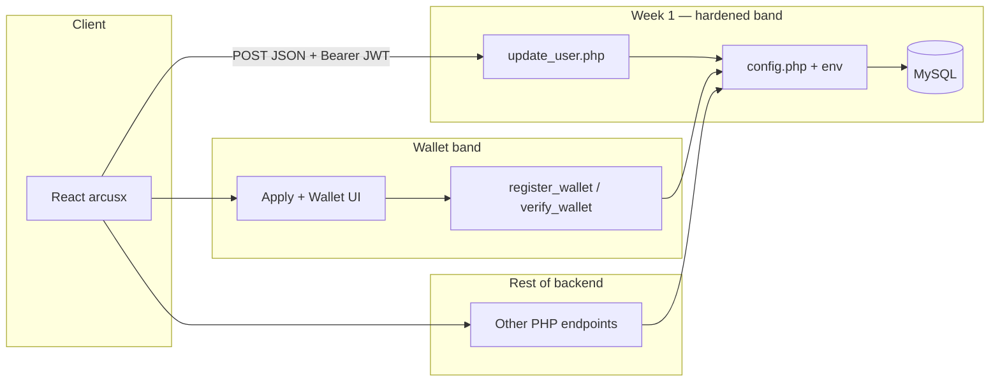

# ArcusX — Week 01 changelog & architecture

**Sprint:** Week 1 close (production-readiness track)  
**Scope:** User-data security boundaries, secrets outside source control, removal of visibly broken user-facing UX paths, and wallet flow wired to existing PHP `verify_wallet` / `register_wallet` APIs.

**Review note:** Listed paths are verification hooks. This document does not replace penetration testing or a third-party security audit.

---

## Changelog

### Security

- **`backend_externo/update_user.php`:** Profile updates require `Authorization: Bearer <JWT>`; missing or invalid token → JSON **401**.
- **`backend_externo/update_user.php`:** JWT claim `decoded->data->id` must match JSON body `id`; mismatch → JSON **403** (cannot modify another user’s profile).
- **`backend_externo/update_user.php`:** All MySQL access on this route uses **`$conn->prepare()`** and **`bind_param`** (no string-concatenated SQL for user-controlled fields on this endpoint).

### Backend — Configuration & secrets

- **`backend_externo/config.php`:** **`ARCUSX_DB_PASSWORD`** read via **`getenv()`**; missing or empty → **500** with an operations-oriented response (does not expose internal details to clients).
- **`backend_externo/config.php`:** **`ARCUSX_JWT_SECRET`** read the same way; consumed by routes that sign or verify JWT after `require_once 'config.php'` (e.g. **`admin_login.php`**).
- **`backend_externo/.htaccess`:** Optional **`mod_env`** `SetEnv` template for Apache / cPanel-style hosting; production values live on the server only, not in the repository.

```text
Client / admin panel
       │  POST + Bearer (where applicable)
       ▼
  update_user.php  ──┐
  admin_login.php  ──┼──► require_once config.php
  …other endpoints──┘           │
                               ├► getenv('ARCUSX_DB_PASSWORD') → mysqli
                               └► getenv('ARCUSX_JWT_SECRET')   → verify/sign JWT
```

### Frontend

- **`arcusx/src/components/EvidenceUpload.tsx`:** Renders a **no-op** (`null`) so milestone evidence upload does not trigger failing requests until a backend exists.

### Wallet (UI ↔ PHP)

- **Endpoints:** **`register_wallet.php`**, **`verify_wallet.php`** (existing PHP).
- **Task application flow:** On open, UI may query whether the authenticated user has a **stored Stellar wallet** and **prefill** the wallet field when the backend returns one.
- **Fallback:** User may **type** a payout address when no wallet is registered server-side.
- **Connected address:** Control to **inject** the currently connected wallet address from the Stellar Wallets Kit into the apply form.
- **Multi-provider connect:** Connection path expanded beyond a single wallet brand where applicable (kit wiring + UI/CSS).
- **Representative surfaces:** `ApplyTask.tsx`, wallet hooks/popup/styles tied to the PHP endpoints above.

### Product context (auth)

- End-user authentication is **OAuth-only** via **Supabase**; legacy consumer **`login.php` / `register.php`** are not in-tree; app JWT issuance flows through **`sync_supabase_user.php`**. Week 1 hardening here targets **`update_user`**, **`config`**, wallet/profile touchpoints as listed above.

---

## Verification matrix

| Weekly claim | Where to verify in-repo |
|--------------|---------------------------|
| JWT-gated profile edits | `update_user.php`: token extraction; **401** / **403** |
| Prepared statements on that route | `update_user.php`: `prepare` on SELECT, email check, UPDATE |
| Secrets not in source | `config.php`: `getenv` only; `.htaccess` — `SetEnv` template |
| Stable `EvidenceUpload` | `EvidenceUpload.tsx`: no-op export |
| Wallet flow integrated | Apply flow + `register_wallet.php` / `verify_wallet.php` usage; wallet popup / `useWallet` updates |
| OAuth context | No legacy consumer `register.php`; see `sync_supabase_user.php` + `config` |

| # | Definition of done | Expected observable outcome |
|---|-------------------|-----------------------------|
| 1 | Profile edits bound to JWT identity | No valid token → no edit; valid token for **another** user id → forbidden |
| 2 | Prepared statements on the hardened path | No concatenated SQL for user-controlled fields on that endpoint |
| 3 | DB password & JWT secret not in repo | Loaded from server environment in production |
| 4 | `EvidenceUpload` does not surface 404-class failures | Stable degraded UX; no failing calls from this component on the normal path |
| 5 | Wallet flow tied to backend | `verify_wallet` / `register_wallet` reflected in real UI (apply + multi-provider connect), not orphan endpoints |

---

## Architecture (context)

Week 1 does not replace the overall product layering; it hardens **HTTP → PHP → MySQL** for identity-bound profile edits and documents **secrets + wallet UI** alongside other PHP routes.



**Auth:** End-user sign-in is **Supabase OAuth**; **`sync_supabase_user.php`** issues the app **JWT** used by many PHP endpoints. This sprint focuses on routes that **mutate sensitive user fields** (`update_user`) and **wallet register/verify** used for on-chain settlement paths.

---

## Related versioning

Monorepo tags and consolidated history: [`CHANGELOG.md`](../../CHANGELOG.md).

---

*Technical review artifact. Last checked against the branch merged to `main`.*
