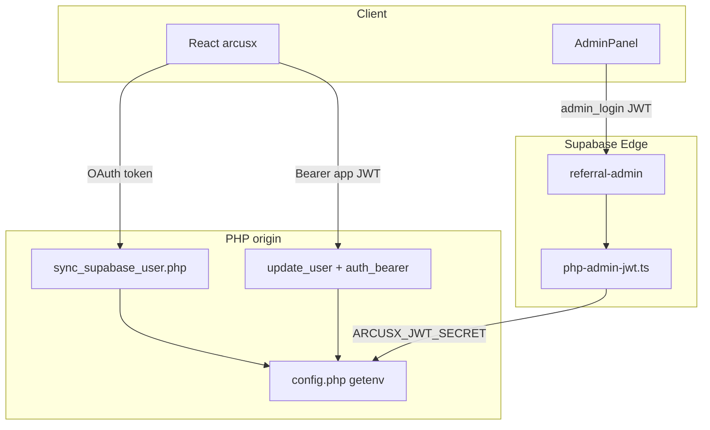

# ArcusX — Week 02 changelog & architecture

**Sprint:** Week 2 close (hardened API, CORS, JWT, wallet)  
**Committed scope:** (1) single CORS allowlist across the API, (2) consistent JSON responses, (3) secrets and JWT at the edge (origin + Edge where applicable), (4) extend the wallet surface in the product.

**Review note:** Listed paths are verification hooks in-repo. This document does not replace penetration testing or a third-party security audit.

**Operational checklist:** [`week-02-plan-and-checklist.md`](./week-02-plan-and-checklist.md)

---

## Executive summary

| Commitment | Repo status | Quick check |
|------------|-------------|-------------|
| Single CORS allowlist | **Done** | `rg Access-Control backend_externo` → only `cors.php` and `admin_common.php` |
| Consistent API responses | **Done** (nuances) | `auth_bearer.php` + JWT on ~30 endpoints; admin via `admin_common.php` |
| Secrets & JWT at the edge | **Done** (ops) | `config.php` + `getenv`; `SetEnv` template in `.htaccess` / `.env.example`; Edge `referral-admin` validates PHP JWT |
| Extend the wallet surface | **Done** | `EditProfile` + `register_wallet` / `verify_wallet` + multi-provider kit + auto-register on connect |

---

## Changelog

### 1. Single CORS allowlist across the API

- **`backend_externo/cors.php`:** Base list (localhost `5173`/`5174`, `127.0.0.1`, `arcusx.pro`, `empresas.arcusx.pro` http/https). No `*`. Optional extension **`ARCUSX_CORS_EXTRA_ORIGINS`** (comma-separated).
- **Helpers:** `arcusx_cors_handle_preflight`, `arcusx_cors_apply`, `arcusx_cors_origin_for_request`.
- **Adoption:** All browser-facing PHP endpoints under `backend_externo/` use `require_once cors.php` + preflight/apply (incl. `sync_supabase_user.php`, escrow, disputes, `admin_login.php`, wallet, tasks).
- **Admin panel:** `admin_common.php` delegates `getAllowedOrigin()` → `arcusx_cors_origin_for_request()` (same allowlist as the public API).

```text
Browser Origin
      │
      ▼
  cors.php ──► arcusx_cors_origin_allowed?
      │              │ yes → echo exact Origin
      │              │ no  → fallback https://arcusx.pro (browser blocks if mismatch)
      ▼
  PHP endpoint
```

### 2. Consistent API responses

- **`backend_externo/auth_bearer.php`:** `arcusx_bearer_token`, `arcusx_jwt_user_id`, `arcusx_json_exit` (401 with `success` + `error: invalid_or_missing_token`), `arcusx_require_user_id` (helper ready; gradual endpoint adoption).
- **~30 authenticated user routes** use `auth_bearer.php` instead of duplicating `JWT::decode` (profile, disputes, escrow, ratings, portfolio, wallet, etc.).
- **`update_user.php`:** **401** without token; **403** when body `id` does not match JWT claim; prepared statements (Week 1 heritage, aligned with Week 2).
- **Documented exceptions:**
  - **Admin:** JWT and responses in `admin_common.php` (panel flow, not `auth_bearer`).
  - **`get_platform_fee.php`:** public, no JWT.
  - **`confirm_escrow_signature.php`:** **410 Gone** (deprecated route).
  - Some wallet/dispute endpoints still return 401 with a Spanish `message` instead of `arcusx_json_exit` — same HTTP code, slightly different body shape (optional post-S2 cleanup).

### 3. Secrets & JWT at the edge

**PHP origin (app JWT sign/verify):**

- **`config.php`:** `ARCUSX_DB_PASSWORD` and `ARCUSX_JWT_SECRET` only via **`getenv()`**; missing values → operations-oriented error without leaking secrets.
- **`backend_externo/.htaccess`:** **`SetEnv`** template for Apache/cPanel (`mod_env`); real values on the server only.
- **`backend_externo/.env.example`:** documents variables without values (incl. Supabase for OAuth sync and PHP referral helpers).

**Supabase edge (admin / referrals):**

- **`supabase/functions/_shared/php-admin-jwt.ts`:** validates JWT from `admin_login.php` using the same **`ARCUSX_JWT_SECRET`** in **Edge Secrets** (never `VITE_*`).
- **`referral-admin`:** `verify_jwt: false` at gateway; authorization inside the function via `requirePhpAdminJwt`.



**Operations:** Cloudflare/WAF does not replace storing `ARCUSX_JWT_SECRET` on the PHP origin or in Edge Secrets. Rotating the secret invalidates admin sessions and app tokens until re-login.

### 4. Extend the wallet surface

- **PHP:** `register_wallet.php`, `verify_wallet.php` — unified CORS, `display_errors` off, JWT required.
- **Profile:** `EditProfile.tsx` — loads `verifyWallet`, manual register or “fill from connected wallet”, i18n **`edit.wallet.*`** (ES / EN / PT).
- **Connect:** `useWallet.ts` — Freighter + xBull (`StellarWalletsKit`); network from `VITE_STELLAR_NETWORK`; **`authService.registerWallet`** on connect (best-effort).
- **Apply flow:** `ApplyTask.tsx` — `verifyWallet` on open; prefill / paste connected address (Week 1 continuity).

---

## Verification matrix

| # | Definition of done | Where to verify |
|---|-------------------|-----------------|
| 1 | Single CORS allowlist on API | `cors.php`; `rg Access-Control backend_externo` |
| 2 | Centralized user JWT | `auth_bearer.php`; grep `require_once.*auth_bearer` under `backend_externo/` |
| 3 | Secrets not in source | `config.php` + `.env.example`; `SetEnv` on server |
| 4 | Wallet visible in product | `EditProfile.tsx`, `authService.registerWallet` / `verifyWallet`, `useWallet.ts` |
| 5 | Admin CORS aligned | `admin_common.php` → `arcusx_cors_origin_for_request` |
| 6 | Admin JWT on Edge (referrals) | `php-admin-jwt.ts`, `referral-admin/index.ts` |

### Manual smoke (pre-delivery)

| Test | Expected origin |
|------|-----------------|
| OPTIONS | `localhost:5173` → `register_wallet.php`, `update_user.php` |
| GET wallet | Logged-in app → `verify_wallet.php` → `{ success, has_wallet }` |
| Profile | `EditProfile` registers valid `G…` (56 chars) |
| OAuth sync | POST `sync_supabase_user.php` from app (requires `ARCUSX_SUPABASE_*` on PHP) |
| Admin + referrals | Admin login → referrals tab → Edge with same `ARCUSX_JWT_SECRET` |

---

## Out of scope for Week 2 (known)

- **`apply_task.php`:** secured in Week 3 — see [`week-03-changelog-and-architecture.md`](./week-03-changelog-and-architecture.md).
- **`arcusx_require_user_id()`:** defined but not widely used yet; endpoints call `arcusx_jwt_user_id()` + manual 401.
- **Orphan PHP without `cors.php`:** e.g. standalone `get_stats.php` — the panel uses `admin.php` → `admin_actions` with CORS from `admin_common`.
- **Referrals / OAuth (post-S2):** `referral_bind.php`, Edge `referral-*`, Supabase verification in `sync_supabase_user.php` — see `docs/referrals/`; extends JWT-at-edge but was not part of the original Week 2 quadrant.

---

## Production deployment checklist

1. Deploy updated PHP (`cors.php`, `auth_bearer.php`, touched endpoints, `sync_supabase_user.php` if OAuth).
2. Confirm **`SetEnv`** (or host env vars): `ARCUSX_JWT_SECRET`, `ARCUSX_DB_PASSWORD`, optional `ARCUSX_CORS_EXTRA_ORIGINS`, `ARCUSX_SUPABASE_URL` + `ARCUSX_SUPABASE_ANON_KEY` for OAuth.
3. Edge Secrets: **`ARCUSX_JWT_SECRET`** must match PHP for `referral-admin`.
4. Frontend: `npm run build` in `arcusx/` and publish `dist/` (profile wallet + admin if applicable).
5. Purge CDN if hashed assets return 404.

---

## Related versioning

Consolidated history: [`CHANGELOG.md`](../../CHANGELOG.md) — entry **2026-05-15 — Week 2**.

---

*Sprint close artifact. Last verified in-repo: May 2026.*
