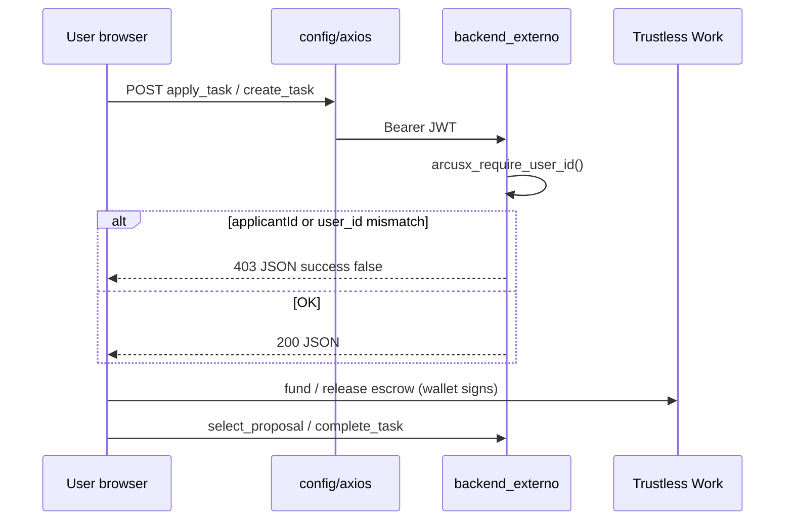

# ArcusX — Week 03 changelog & architecture

**Sprint:** Week 3 close (API polish, light theme, reviewer docs)  
**Committed scope:** (1) JWT-bound critical write routes + JSON helpers, (2) frontend Bearer on task/escrow flows, (3) light theme with readable contrast on auth + dashboard, (4) Hero stats + reviewer documentation, (5) InstaAwards alignment (pilot checklist).

**Builds on Week 2:** CORS allowlist, `auth_bearer.php`, wallet in profile, referrals + `SetEnv` on **production server** (not in git).

**Operational checklist:** [`week-03-plan-and-checklist.md`](./week-03-plan-and-checklist.md)

---

## Executive summary

| Commitment | Repo status | Quick check |
|------------|-------------|-------------|
| API error contract (critical writes) | **Done** | `apply_task.php`, `create_task.php`, `select_proposal.php`, escrow/dispute/cancel paths use `arcusx_require_user_id()` |
| Frontend Bearer | **Done** | `grep config/axios arcusx/src` → Apply, Create, Proposal, Supervise, dashboard, privateOffers, cancelTask |
| Hero public stats | **Done** | `Hero.tsx` + `get_landing_market_stats.php`; README § Hero stats |
| Light theme | **Done** | `light-theme-global.css`, `dashboard-light.css`, `auth-surfaces-light.css` imported in `main.tsx` |
| Reviewer docs | **Done** | `docs/api/ENDPOINTS.md`, `docs/demo/E2E_TESTNET.md` |
| InstaAwards / mainnet prep | **Done (doc)** | `docs/sprints/instaawards-week3.md` |

---

## Changelog

### 1. API — critical routes + JSON helpers

**`backend_externo/auth_bearer.php`**

- `arcusx_json_success($extra, $httpCode)` — uniform 200 JSON with `success: true`.
- `arcusx_json_error($httpCode, $message, $error)` — uniform errors; **401** uses `error: invalid_or_missing_token` via `arcusx_require_user_id()`.

**JWT required + identity checks**

| Endpoint | Week 3 change |
|----------|----------------|
| `apply_task.php` | Rewrite: `arcusx_require_user_id()`; `applicantId` must match JWT (**403**); prepared statements; `arcusx_json_exit` on errors |
| `create_task.php` | JWT; body `user_id` must match token |
| `select_proposal.php` | `arcusx_require_user_id()` (task owner flow) |
| `complete_task.php` | `arcusx_require_user_id()` |
| `cancel_task.php` | `arcusx_require_user_id()` |
| `create_dispute.php` | `arcusx_require_user_id()` |
| `create_escrow.php` | `arcusx_require_user_id()` |
| `verify_wallet.php` / `register_wallet.php` | `arcusx_require_user_id()` (Week 2 base, Week 3 aligned) |

**Public stats (no JWT)**

| Endpoint | Week 3 change |
|----------|----------------|
| `get_landing_market_stats.php` | `arcusx_json_success` / `arcusx_json_error`; **GET** only |

**Nuances (honest scope):**

- ~30 routes still use `auth_bearer.php` from Week 2; not every `exit` in every PHP file was migrated to `arcusx_json_error` — only **critical write paths** listed above + landing stats.
- Interior validation in some files may still `echo json_encode` with the same `success` / `message` shape — acceptable for Week 3 close.

### 2. Frontend — Bearer via `config/axios`

**`arcusx/src/config/axios.ts`** attaches `Authorization: Bearer` from `localStorage.token`.

| Module | Notes |
|--------|--------|
| `ApplyTask.tsx` | apply + task details |
| `CreateTask.tsx` | create task + limits |
| `ProposalReview.tsx` | proposals, select, escrow create |
| `SuperviseTask.tsx` | complete, dispute |
| `dashboard.tsx` | tasks, earnings, accepted |
| `privateOffersService.ts` | private offers |
| `cancelTaskService.ts` | cancel + check allowed |

**Still plain `axios` / `fetch` (by design):** `Hero.tsx` (public), `authService.ts` (OAuth sync), `profileService.ts`, `ratingService.ts`, `disputeService.ts` (Bearer via manual headers or public reads).

### 3. Light theme

**New CSS (imported from `main.tsx` / `dashboard.tsx`)**

| File | Role |
|------|------|
| `css/auth-surfaces-light.css` | Login, Register, Admin login/panel, support chat |
| `css/dashboard-light.css` | Dashboard cards, filters, tasks, wallet tab |
| `css/light-theme-global.css` | Wallet button, language selector, filter `<select>`, back buttons, proposal “Seleccionar”, pagination |
| `css/ProtectedRoute.css` | Loading route without dark gradient |

**Fixes**

- **Wallet:** dark text on light background (overrides `color: white !important` from dark theme).
- **Filters:** `background-color` instead of `background` shorthand so dropdown arrow does not tile.
- **Language button:** removed green dashboard gradient; uses theme variables.
- **Back buttons:** scoped `Register.css` / `Login.css` `.back-button` under containers; global light overrides — fixes invisible “Volver” on ProposalReview.
- **Popup / ConfirmDialog:** light container, title, message, cancel + info (blue) buttons.

### 4. Documentation & InstaAwards

| Document | Purpose |
|----------|---------|
| [`docs/api/ENDPOINTS.md`](../api/ENDPOINTS.md) | Routes used by frontend; public vs JWT; stability labels |
| [`docs/demo/E2E_TESTNET.md`](../demo/E2E_TESTNET.md) | 8–12 min testnet demo script (optional recording) |
| [`docs/sprints/instaawards-week3.md`](./instaawards-week3.md) | Design-partner pilot, SQL metrics, mainnet checklist |
| [`README.md`](../../README.md) | Local dev, Hero stats source, links to reviewer docs |

---

## Architecture (Week 3 slice)

**Theme:** `data-theme="light|dark"` on `<html>` (`ThemeContext`); layered CSS overrides — no runtime CSS-in-JS theme engine.

---

## Secrets & production `.htaccess` (important)

Week 3 does **not** remove server configuration.

| Location | What |
|----------|------|
| **Production server** | `backend_externo/.htaccess` with **`SetEnv`** (`ARCUSX_JWT_SECRET`, `ARCUSX_DB_PASSWORD`, Supabase vars, referral-related config) — **required** for PHP + OAuth + referrals on shared hosting |
| **Git** | `backend_externo/.env.example` only — **no real secrets** |
| **Local** | Copy server `SetEnv` or use host panel; do not commit real `.htaccess` if it contains secrets |

Referrals (Week 2+) need the same `ARCUSX_JWT_SECRET` on PHP origin and Supabase Edge Secrets — unchanged in Week 3.

---

## Verification matrix

| # | Definition of done | Where to verify |
|---|-------------------|-----------------|
| 1 | Apply with JWT | POST `apply_task.php` with Bearer; wrong `applicantId` → **403** |
| 2 | Create with JWT | POST `create_task.php`; `user_id` ≠ JWT → **403** |
| 3 | Bearer on UI flows | Network tab: `Authorization` on apply/create/proposal/supervise |
| 4 | Light theme readable | Dashboard: wallet text, filters (one chevron), back on `/proposals/:id` |
| 5 | Hero stats | `/` shows numbers; fallback `get_landing_market_stats.php` |
| 6 | Build | `cd arcusx && npm run build` |

### Manual smoke (pre-delivery)

| Test | Expected |
|------|----------|
| Light + dark toggle | Contrast OK on dashboard header (wallet, ES, notifications) |
| Select proposal | Client selects freelancer → escrow flow starts |
| Cancel task | Bearer sent; no 401 when logged in |
| Prod secrets | App + referrals work with server `.htaccess` `SetEnv` (not from git) |

---

## Production deployment checklist

1. Deploy **PHP** from `backend_externo/` (touched endpoints + `auth_bearer.php`).
2. **Keep** production `.htaccess` with `SetEnv` on the server — do not replace with repo copy if repo has placeholders only.
3. Confirm Edge **`ARCUSX_JWT_SECRET`** still matches PHP (referrals admin).
4. Frontend: `cd arcusx && npm run build` → publish `dist/`.
5. Hard refresh / purge CDN for new CSS bundles (`light-theme-global`, `dashboard-light`, `auth-surfaces-light`).

**Do not commit:** `arcusx/.env`, server `.htaccess` with real `SetEnv` values.

---

## Out of scope (post–Week 3, optional)

- Migrating every PHP `exit` to `arcusx_json_error` (read-only GETs, admin bulk actions).
- Migrating all services to `config/axios` (profile, ratings, disputes use `fetch` with manual Bearer).
- E2E **video** recording (script is ready).
- Live InstaAwards design-partner task (checklist in `instaawards-week3.md`).
- Full light-theme pass on every page (e.g. every `SuperviseTask` subsection, `SwapPage`) — core paths done.

---

## Related versioning

Consolidated history: [`CHANGELOG.md`](../../CHANGELOG.md) — entry **2026-05-18 — Week 3**.

---

*Sprint close artifact. Last verified in-repo: 2026-05-18.*
