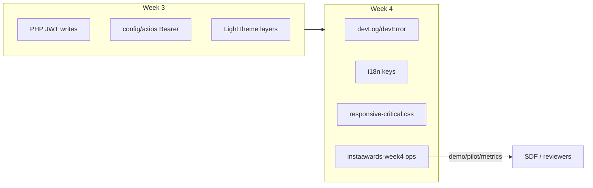

# ArcusX — Week 04 changelog & architecture

**Sprint:** Week 4 close (InstaAwards / reviewer month — engineering finisher)  
**Committed scope (repo):** (1) Week 2 testing debt closed in code, (2) i18n gaps in 5 reviewer-facing components, (3) `console.*` → dev logger on escrow paths, (4) responsive pass on critical money flows, (5) light-theme **verification** doc (implementation largely Week 3 + 2026-05-28 follow-up).

**Operational scope (not in git):** E2E recording, design-partner pilot, metrics SQL snapshot, mainnet checklist dates — tracked in [`instaawards-week4.md`](./instaawards-week4.md).

**Builds on:** [`week-03-changelog-and-architecture.md`](./week-03-changelog-and-architecture.md) (API Bearer, light theme, reviewer docs).

**Checklists:** [`week-04-plan-and-checklist.md`](./week-04-plan-and-checklist.md) · Technical detail: [`week-04-technical-close.md`](./week-04-technical-close.md)

---

## Executive summary

| Commitment | Repo status | Quick check |
|------------|-------------|-------------|
| Week 2 bugs (utilities, EvidenceUpload, check_disputes copy) | **Done** | No `create_test_dispute.php` in tree; `EvidenceUpload.tsx` returns `null` |
| i18n — 5 components | **Done** | `proposals.error.*`, `proposals.success.contractActivated`, `profile.schema.*` in `translations.ts` |
| Console → dev logger | **Done** | `devError` in `utils/logger.ts`; `ProposalReview`, `CompleteTaskPopup`, `trustlessWorkEscrowService` |
| Responsive 320–768px (critical) | **Done** | `responsive-critical.css` in `main.tsx`; chart min-width in `dashboard.css` |
| Light theme 8 surfaces | **Done (verify)** | [`week-04-light-theme-gaps.md`](./week-04-light-theme-gaps.md) |
| E2E demo recorded | **Ops** | Link in `instaawards-week4.md` §1 |
| Pilot + metrics | **Ops** | Tables in `instaawards-week4.md` §2–3 |
| Mainnet flip | **Out of scope** | Honest checklist only — no production mainnet claim |

**Engineering:** closed in repo (rows 6–10 in plan checklist ☑).  
**InstaAwards sprint:** closed when ops rows 1–5 and 11 in [`week-04-plan-and-checklist.md`](./week-04-plan-and-checklist.md) are ☑.

---

## Changelog

### 1. Week 2 testing / security (closure)

| Item | Resolution |
|------|------------|
| Utility PHP scripts (`create_test_dispute`, resets) | **Absent** from `backend_externo/` — no public test URLs |
| `update_user.php` JWT | Week 2: token `id` must match body |
| `EvidenceUpload` 404 | Component **no-op**; not routed |
| `check_disputes.php` | Admin helper message **without** reference to test scripts |

### 2. i18n — five components

| Component | Week 4 change |
|-----------|----------------|
| `ProtectedRoute` | Already `t('auth.verifying')` |
| `ProposalReview` | Escrow errors/success → `proposals.error.*`, `proposals.success.contractActivated` (ES/EN/PT) |
| `SuperviseTask` | Already majority `t()` |
| `CompleteTaskPopup` | Steps already `t()` |
| `UserProfile` | SEO schema + meta + avatar `alt` → `profile.schema.*`, `profile.meta.*`, `profile.avatar.alt` |

**Still partial (backlog):** admin panel dense UI, every `console.*` in repo, SwapPage copy edge cases.

### 3. Console only in development

| File | Change |
|------|--------|
| `arcusx/src/utils/logger.ts` | `devLog`, `devWarn`, **`devError`** (no-op in production build) |
| `trustlessWorkEscrowService.ts` | `console.*` → `devLog` / `devWarn` / `devError` |
| `ProposalReview.tsx` | `console.error` → `devError` |
| `CompleteTaskPopup.tsx` | `console.error` → `devError` |
| `dashboard.tsx` | Sensitive paths already gated with `import.meta.env.DEV` |

### 4. Responsive (critical paths)

| File | Role |
|------|------|
| `css/responsive-critical.css` | `overflow-x` guard, touch targets ≥44px, modal width on small viewports |
| `dashboard.css` | `.placeholder-chart` `min-width: 280px` at ≤480px |

**Deferred:** full dashboard table audit at 320px, SwapPage exhaustive pass — see [`PLAN_MES1_REVISORES.md`](../../PLAN_MES1_REVISORES.md).

### 5. Light theme — verification (not a full rewrite)

Week 4 **did not** re-implement light mode; it **confirmed** Week 3 layers + per-page CSS on the PLAN_MES1 file list.

| Surface | CSS |
|---------|-----|
| Hero, EditProfile, SuperviseTask, ProposalReview, UserProfile, ApplyTask, CreateTask, WalletConnectPopup | Per-file `[data-theme="light"]` — see [`week-04-light-theme-gaps.md`](./week-04-light-theme-gaps.md) |
| Global layers | `light-theme-global`, `dashboard-light`, `auth-surfaces-light`, `light-theme-remaining`, `light-theme-contrast` |

**Known gaps:** SwapPage, some admin subsections, residual inline styles — documented, non-blocking for testnet E2E.

### 6. Cleanup

See [`week-04-cleanup-exceptions.md`](./week-04-cleanup-exceptions.md).

---

## Architecture (Week 4 slice)

No new backend contract. Week 4 is **frontend hygiene + QA docs** on top of Week 3 API/theme stack.

---

## Verification matrix

| # | Definition of done | Where to verify |
|---|-------------------|-----------------|
| 1 | No test utility PHP in repo | `ls backend_externo/*test*` → empty |
| 2 | ProposalReview errors use `t()` | Search `proposals.error` in `ProposalReview.tsx` |
| 3 | No raw `console.error` in 3 escrow files | `rg console\\. arcusx/src/components/ProposalReview.tsx` etc. |
| 4 | Responsive CSS loaded | `main.tsx` imports `responsive-critical.css` |
| 5 | Light smoke | Routes in `week-04-light-theme-gaps.md` § Smoke |
| 6 | Build | `cd arcusx && npm run build` |
| 7 | E2E script still valid | Walk `docs/demo/E2E_TESTNET.md` on testnet |

---

## Production deployment checklist

1. `cd arcusx && npm run build` → publish `dist/` (includes new CSS + i18n bundles).
2. PHP: upload only if `check_disputes.php` or other touched files changed on server.
3. **Keep** production `.htaccess` `SetEnv` (JWT, DB, Supabase, referrals).
4. Hard refresh / CDN purge for CSS.

**Do not commit:** `arcusx/.env`, server secrets.

---

## Out of scope (Week 4)

- Mainnet network switch (checklist only in `instaawards-week4.md`).
- Migrating all PHP to `arcusx_json_error`.
- Full admin i18n.
- Agentic payments / Soroban native escrow in production.
- Notion reviewer pack (team ops).

**Post–Week 4 engineering (repo, separate sprint doc):** Supabase `arcusx-api` cutover, email notifications (Resend), referrals Edge — track in root [`CHANGELOG.md`](../../CHANGELOG.md) when that sprint closes; not part of InstaAwards Week 4 definition of done.

---

## Related versioning

- [`CHANGELOG.md`](../../CHANGELOG.md) — **2026-05-28** Semana 4 (cierre técnico).
- Week 3: [`week-03-changelog-and-architecture.md`](./week-03-changelog-and-architecture.md).
- InstaAwards: [`instaawards-week3.md`](./instaawards-week3.md) → [`instaawards-week4.md`](./instaawards-week4.md).

---

*Sprint close artifact. Engineering repo close: 2026-05-28. InstaAwards ops close: when `instaawards-week4.md` demo/pilot/metrics are filled.*
