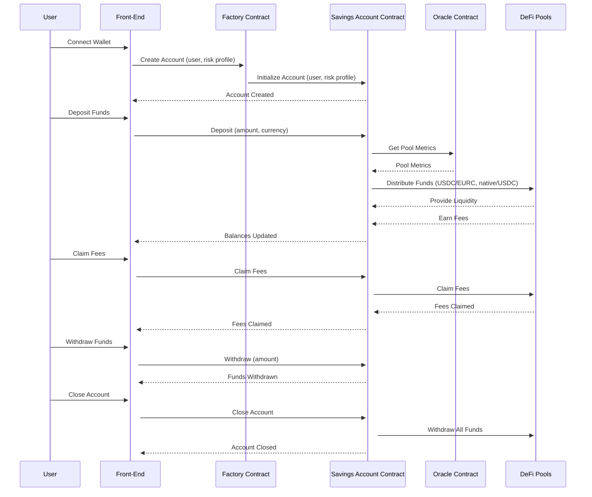
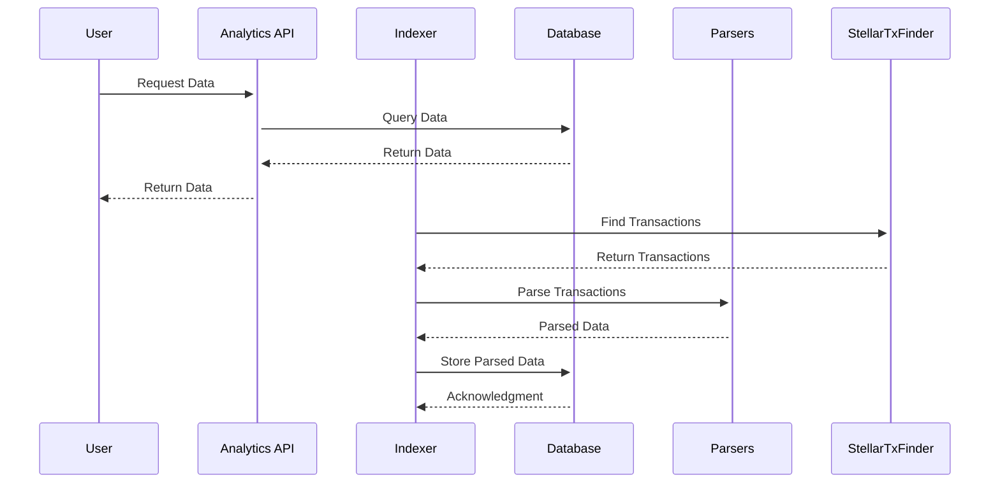

# Technical Architecture

### Hoops Finance Technical Architecture

### Overview

Hoops Finance is a DeFi analytics platform that indexes Soroban Liquidity Pools from leading ecosystem protocols. It provides comprehensive risk analysis and performance metrics for liquidity pools, allowing investors to make informed, risk-adjusted investments. The platform offers an analytics API for data retrieval and integration.

### Components

1. **Indexer**
2. **Database**
3. Sentiment Analysis
4. **Analytics API**
5. **Smart Contracts**
6. **Smart Savings Accounts Management System**

## 1. Indexer

The indexer is responsible for monitoring and parsing relevant transactions from the Stellar ledger. It identifies transactions involving specific addresses, such as token contracts, pair contracts, and user addresses. The data is sourced from Stellar Expert and Google Big Query using the Stellar Development Foundation's Hubble dataset.

- **Technologies**: TypeScript, MongoDB
- **Responsibilities**:
    - Identify and monitor relevant addresses.
    - Find and parse relevant transactions.
    - Extract operations, contracts, functions, and associated events and effects.
    - Store parsed data in MongoDB.

**Key Processes**:

1. **Address Identification**:
Identify relevant addresses related to token contracts, pair contracts, and user addresses. This is the initial step to filter out unnecessary transactions.
2. **Transaction Retrieval**:
Retrieve transactions involving the identified addresses from Stellar Expert and Google Big Query using the Hubble dataset.
3. **Transaction Parsing**:
Parse each transaction to extract operations, invoked contracts, functions called, and events emitted. This is done using several specialized parsers.
    - **EventParser**:
    Parses Soroban contract events emitted by transactions.
        
        ```tsx
        const events = humanizeEvents(xdrEvents);
        const parsedEvents = events.map(event => {
          const protocol = EventParser.getProtocolFromTopic(event.topics[0]);
          return protocol === 'soroswap' ? SoroswapEvents.parse(event) : TokenEvents.parse(event);
        });
        
        ```
        
    - **TransactionMeta**:
    Responsible for parsing transaction metadata objects to capture fees, events, and return values.
        
        ```tsx
        const parsedEvents = EventParser.parse(sorobanMeta.events());
        const feeInfo = this.extractFeeInfo(sorobanMeta.ext().v1());
        const parsedMeta = { ...feeInfo, events: parsedEvents };
        
        ```
        
    - **TransactionResults**:
    Parses transaction results to determine the outcome of contract invocations.
        
        ```tsx
        const operationResults = parsedTransaction.operationResults.map(result => ({
          opType: result.opType,
          opResultCode: result.opResultCode,
          value: result.value,
        }));
        
        ```
        
    - **TransactionParser**:
    Parses entire transactions to extract all relevant data, including operations, contracts, and functions.
        
        ```tsx
        const parsedTransaction = {
          source: tx.source,
          isFeeBump: tx.isFeeBump,
          operations: tx.operations.map(op => parseOperation(op)),
        };
        
        ```
        
    - **DeFiIndexer**:
    Indexes all pools and contracts associated with a protocol by processing liquidity pairs and calculating their USD values.
        
        ```tsx
        const pairs = await this.getPairsFromFactory(factoryContract);
        const pairDetails = await Promise.all(pairs.map(pairAddress => this.getPairDetails(pairAddress)));
        
        ```
        

## 2. Database

MongoDB stores the indexed data, including details about liquidity pools, tokens, swaps, and other relevant metrics. The database supports efficient querying for the analytics API.

- **Technologies**: MongoDB
- **Responsibilities**:
    - Store and manage indexed data.
    - Provide efficient query mechanisms for data retrieval.

**Data Structures**:

1. **PairDetails**:
Stores information about each liquidity pair, including reserves, total value locked (TVL), and USD valuations.
    
    ```tsx
    export interface PairDetails extends Document {
      _id: string;
      token0: string;
      token1: string;
      reserve0: number;
      reserve1: number;
      t0usd: string;
      t1usd: string;
      lptSupply: number;
      lpHolders?: string[];
      protocol: any;
      tvl: number;
      lastUpdated: Date;
    }
    
    ```
    
2. **TokenDetails**:
Contains details about individual tokens, such as symbol, name, decimals, and price.
    
    ```tsx
    export interface TokenDetails extends Document {
      _id: string;
      symbol: string;
      name: string;
      decimals: number;
      price: number;
      pairs: TokenPairPrice[];
      lastUpdated: Date;
      supply?: number;
      deployedby?: string;
      issuer?: string;
    }
    
    ```
    
3. **EventDetails**:
Captures events related to DeFi operations, including contract interactions and transaction metadata.
    
    ```tsx
    export interface EventDetails extends Document {
      contractAddress: string;
      type: string;
      action: string;
      event: any;
      rawtopics: string[];
      rawdata: any;
      transaction: string;
      timestamp: number;
      ledger: number;
      addresses?: string[];
    }
    
    ```
    
4. **SwapDetails**:
Records swap transactions, including the amounts swapped and participating tokens.
    
    ```tsx
    export interface SwapDetails extends Document {
      pair: string;
      token0: string;
      token1: string;
      amount0in: number;
      amount1in: number;
      amount0out: number;
      amount1out: number;
      to: string;
      swappedby: string;
      swappedvia: string;
      transaction: string;
      timestamp: number;
    }
    
    ```
    
5. **LiquidityDetails**:
Stores liquidity events, tracking additions and removals of liquidity to pools.
    
    ```tsx
    export interface LiquidityDetails extends Document {
      pair: string;
      action: string;
      token0: string;
      amount0: number;
      token1: string;
      amount1: number;
      lptokens: number;
      to: string;
      source: string;
      transaction: string;
      timestamp: number;
    }
    
    ```
    

## 3. Sentiment Analysis

### Overview

Sentiment analysis is a crucial component of the Hoops Finance platform, designed to enhance our risk assessment models by incorporating public perception data. This feature leverages a fine-tuned DistilBERT sentiment analysis model to analyze social media content and gauge the overall sentiment towards different protocols. By integrating sentiment analysis, we provide more comprehensive and accurate risk scores, aiding users in making informed investment decisions.

### Model Selection and Training:

DistilBERT Model: We selected the DistilBERT model for its efficiency and performance in natural language processing tasks. DistilBERT is a distilled version of the BERT model, optimized to retain the capabilities of the original model while being lighter and faster.
Data Sources: The sentiment analysis model was fine-tuned using a diverse dataset composed of open data from social media platforms such as Reddit, Telegram, and Twitter. Additionally, general pre-labeled sentiment data was incorporated to enhance the model’s robustness and accuracy.
Fine-Tuning Process: The model was fine-tuned to detect and interpret sentiments expressed in social media posts, discussions, and comments related to various DeFi protocols. The training process involved supervised learning techniques, using labeled datasets to teach the model to distinguish between positive, negative, and neutral sentiments.

### Data Ingestion and Processing:

**Data Collection**: Our platform continuously collects data from multiple social media sources through APIs and web scraping techniques. This data includes posts, comments, and discussions mentioning specific DeFi protocols.
**Preprocessing**: The collected data undergoes preprocessing to remove noise, such as irrelevant content, stop words, and special characters. This step ensures that the input to the sentiment analysis model is clean and relevant.
**Sentiment Analysis Execution**: The preprocessed text data is fed into the fine-tuned DistilBERT model, which analyzes the sentiment and assigns a sentiment score to each piece of content. The sentiment scores range from highly negative to highly positive, with neutral sentiments in the middle.

### Integration with Risk Scores:

**Sentiment Aggregation**: The individual sentiment scores are aggregated to provide an overall sentiment score for each protocol. This aggregation considers the volume and intensity of sentiments expressed across different social media platforms.
**Risk Score Enhancement**: The aggregated sentiment scores are integrated into our risk assessment models. Positive public perception can indicate lower risk and higher confidence in a protocol, while negative sentiments can signal potential issues or higher risk.
**Real-Time Updates:** The sentiment analysis feature operates in real-time, continuously updating the sentiment scores as new data is collected. This ensures that our risk scores reflect the latest public perceptions and market trends.
Benefits:

**Comprehensive Insights:** By incorporating sentiment analysis, Hoops Finance provides users with deeper insights into the public perception of various protocols. This added layer of analysis complements traditional financial metrics and technical indicators.
**Informed Decision-Making:** Users can make more informed investment decisions by considering both the quantitative data and qualitative sentiments. This holistic approach enhances the overall effectiveness of our risk scores.
**Market Awareness:** The sentiment analysis feature keeps users aware of the latest trends and shifts in public opinion, enabling them to respond quickly to changes in the market sentiment.

## 4. Analytics API

### Overview

The analytics API provides endpoints for retrieving data about liquidity pools, including utilization, total value locked (TVL), swap volumes, fees, APR, and risk scores.

- **Technologies**: Express, TypeScript
- **Responsibilities**:
    - Expose RESTful endpoints for data retrieval.
    - Perform calculations for metrics such as TVL, volume, and risk scores.

### **Endpoints**:

- **/getstatistics**: Retrieves statistics for all liquidity pools with TVL greater than zero.
- **/getpairdetails**: Provides detailed information about a specific liquidity pair.
- **/gettokendetails**: Returns data for a specific token, including price and pairs it is involved in.
- **/geteventhistory**: Fetches historical events related to a specific contract or token.

### **Key Calculations**:

1. **Volume Calculation**:
Calculate the total volume of swaps for a given liquidity pair over a specified period.
    
    ```tsx
    const swaps = await swapsCollection.find({ pair: pairId, timestamp: { $gt: startTime } }).toArray();
    const totalVolume = swaps.reduce((sum, swap) => sum + swap.amount0in + swap.amount1in, 0);
    ```
    
2. **Fee Calculation**:
Calculate the fees generated from the swap volume.
    
    ```tsx
    const fees = 0.003 * volume;
    ```
    
3. **Utilization Calculation**:
Determine the utilization rate of a liquidity pool based on the swap volume and total liquidity.
    
    ```tsx
    const utilization = (volume / pair.tvl) * 100;
    ```
    
4. **APR Calculation**:
Calculate the Annual Percentage Rate (APR) based on the fees generated and total value locked (TVL).
    
    ```tsx
    const annualVolume = (totalVolume * (365 * 24 * 60 * 60)) / timeDiff;
    const annualFees = await calculateFees(annualVolume);
    const apr = (annualFees / pair.tvl) * 100;
    ```
    
5. **Risk and Ranking Scores**:
Calculate risk and ranking scores using normalized metrics.
    
    ```tsx
    const riskScore = 100 - (tvl * 0.35 + numSwaps * 0.25 + numLiquidityEvents * 0.2 + liquidityDistribution * 0.15 + age * 0.05);
    const rankingScore = 100 - (tvl * 0.5 + numSwaps * 0.5);
    ```
    

## 5. Smart Contracts

The smart contracts on Soroban handle the logic for liquidity pools, swaps, and other DeFi operations. These contracts are written in Rust and deployed on the Stellar network.

- **Technologies**: Rust, Soroban
- **Responsibilities**:
    - Manage liquidity pools and swaps.
    - Enforce business logic for DeFi operations.
    - Interact with the indexer for event generation and handling.

This document focuses on the Soroban smart contracts that enable users to deposit funds and automatically distribute them to various DeFi protocols based on their risk profiles. Our protocol uses an off-chain indexer to monitor and calculate metrics from different DeFi protocols, which are then stored and updated in an oracle contract on Soroban. Users interact through a factory contract, which creates and manages their custom savings account contracts.

### Components

1. **Oracle Contract**: Stores and updates metrics and scores for DeFi pools, and lists all tracked pools.
2. **Factory Contract**: Creates and manages savings account contracts for users.
3. **Account Contract**: Manages user deposits, risk profiles, interactions with DeFi protocols, and more.

### Oracle Contract

The oracle contract is our on-chain database, storing and updating metrics and scores calculated by our off-chain indexer. It’s the go-to source for the factory and account contracts to make informed decisions based on the latest data.

### Interface:

```rust
impl Oracle {
    pub fn update_pool_metrics(env: Env, pool_id: BytesN<32>, apr: i128, tvl: i128, liquidity_distribution: i128, risk_score: i128) {
        let metrics = (apr, tvl, liquidity_distribution, risk_score);
        env.storage().persistent().set(&pool_id, &metrics);
    }

    pub fn get_pool_metrics(env: Env, pool_id: BytesN<32>) -> (i128, i128, i128, i128) {
        env.storage().persistent().get(&pool_id).unwrap_or((0, 0, 0, 0))
    }

    pub fn list_tracked_pools(env: Env) -> Vec<BytesN<32>> {
        let mut pools = Vec::new(&env);
        for key in env.storage().persistent().keys() {
            pools.push_back(key);
        }
        pools
    }
}
```

### Factory Contract

The factory contract is the mastermind behind creating and managing savings account contracts for users. It initializes new account contracts with the user's risk profile and facilitates deposits.

### Interface:

```rust
impl Factory {
    pub fn create_savings_account(env: Env, user: Address, risk_profile: u32) -> Address {
        let account_contract_id = env.deployer().deploy_contract(BytesN::from_array(&env, &[0; 32]), Vec::new());
        env.invoke_contract(&account_contract_id, &Symbol::new(env, "initialize"), (user, risk_profile).into_val(&env));
        account_contract_id
    }
}
```

### Account Contract

The account contract is where the magic happens. It handles user deposits, sets risk profiles, and interacts with DeFi protocols based on the user's preferences. It will also rebalance funds, manage liquidity tokens, and more.

### Risk Profile

A user's risk profile is represented as a number, typically ranging from 1 to 100, where a higher number indicates a higher risk tolerance. This profile determines how funds are distributed among various DeFi pools, with riskier pools potentially offering higher returns.

### Interface:

```rust
impl SavingsAccount {
    pub fn initialize(env: Env, user: Address, risk_profile: u32) {
        env.storage().instance().set(&user, &risk_profile);
    }

    pub fn deposit(env: Env, amount: i128, currency: BytesN<32>) {
        let user: Address = env.invoker().into();
        user.require_auth();
        let risk_profile: u32 = env.storage().instance().get(&user).unwrap();
        // Use risk profile to determine how to distribute funds
    }

    pub fn distribute(env: Env, pools: Vec<Address>, ratios: Vec<u32>) {
        let user: Address = env.invoker().into();
        user.require_auth();
        // Implement distribution logic here
    }

    pub fn rebalance(env: Env) {
        let user: Address = env.invoker().into();
        user.require_auth();
        let risk_profile: u32 = env.storage().instance().get(&user).unwrap();
        // Rebalance logic using risk profile and oracle data
    }

    pub fn withdraw(env: Env, amount: i128) {
        let user: Address = env.invoker().into();
        user.require_auth();
        // Implement withdrawal logic here
    }

    pub fn claim_fees(env: Env) {
        let user: Address = env.invoker().into();
        user.require_auth();
        // Implement fee claiming logic here
    }

    pub fn get_balances(env: Env) -> Map<Address, i128> {
        let user: Address = env.invoker().into();
        user.require_auth();
        let balances = Map::<Address, i128>::new(&env);
        balances
    }

    pub fn update_owner(env: Env, new_owner: Address) {
        let current_owner: Address = env.invoker().into();
        current_owner.require_auth();
        env.storage().instance().set(&"owner", &new_owner);
    }

    pub fn close_account(env: Env) {
        let user: Address = env.invoker().into();
        user.require_auth();
        // Implement close account logic here
    }
}
```

### Workflow

1. **Oracle Contract Operations**:
    - The oracle contract receives updates from the off-chain indexer about DeFi protocol metrics.
    - Metrics include APR, TVL, liquidity distribution, and risk scores for various pools.
    - The oracle contract provides these metrics to other contracts on request and lists all tracked pools.
2. **User Interaction via Factory Contract**:
    - Users interact with the factory contract to create a new savings account.
    - The factory contract initializes a savings account contract with the user's risk profile and initial owner data.
    - Front-end interfaces facilitate wallet connections and transaction creation, providing a user-friendly experience for interacting with the factory contract.
3. **Savings Account Contract Operations**:
    - **Deposits**: Users deposit funds into their savings account contract. The contract handles multiple currencies and converts them based on the risk profile.
    - **Distribution**: Funds are distributed to various DeFi pools based on the user's risk profile and ratios provided.
    - **Rebalancing**: The account contract periodically rebalances the portfolio using updated metrics from the oracle.
    - **Withdrawals**: Users can withdraw a portion of their funds at any time.
    - **Fee Claims**: Users can claim fees earned from liquidity pools and choose to reinvest or withdraw them.
    - **Balance Inquiry**: Users can check the balances held by their account.
    - **Owner Update**: Users can update the owner of their savings account contract.
    - **Account Closure**: Users can close their account, withdrawing all funds and terminating the contract.

### Front-End Facilitation

The front-end application will provide a seamless user experience by:

- **Wallet Integration**: Facilitating wallet connections for secure and easy transactions.
- **User Interface**: Displaying user balances, risk profiles, and metrics from the oracle contract.
- **Interaction Management**: Guiding users through creating accounts, depositing funds, and managing their investments.
- **Notification System**: Alerting users about important events, such as rebalancing actions or fee claims.

### Custom Authentication Methods

We might need to implement custom authentication methods to ensure secure and authorized interactions with the smart contracts. This could include multi-signature requirements, time-based restrictions, and other advanced security measures.

### Further Research and Development

While this document outlines the core functionality and interfaces of the Soroban smart contracts, further research is required to refine and optimize various aspects, including:

- **Custom Authentication Methods**: Exploring advanced security measures and implementing them as needed.
- **Optimization**: Ensuring efficient and scalable contract operations.
- **User Experience**: Enhancing the front-end application for a better user experience.

### Process Flow Diagram

Let's visualize the process with a detailed flow diagram. Here's an example of the savings account choosing two pairs: USDC/EURC and native/USDC.



### Practical Considerations

1. **Deposits and Withdrawals**:
    - The `deposit` function must support multiple currencies and handle conversions based on the user's risk profile.
    - The `withdraw` function allows users to withdraw a portion of their funds while keeping the rest invested.
2. **Distribution and Rebalancing**:
    - The `distribute` function allocates funds to different pools based on predefined ratios.
    - The `rebalance` function adjusts allocations periodically to maintain the desired risk exposure.
3. **Fee Management**:
    - The `claim_fees` function lets users claim fees from their liquidity pool investments.
    - Users can choose to reinvest claimed fees or withdraw them.
4. **Balance Inquiry**:
    - The `get_balances` function provides a snapshot of the current balances held by the account across different pools and tokens.
5. **Owner Management**:
    - The `update_owner` function allows the current owner to transfer ownership of the account contract to another address.
6. **Account Closure**:
    - The `close_account` function enables users to close their account, withdraw all funds, and terminate the contract.

### Future Expansions

This is a minimum viable implementation that we envision for the protocol. Our aim is to provide a robust and secure platform for automated DeFi fund distribution. However, this is just the beginning. We plan to expand on this DeFi protocol in the future after we complete our MVP. Future updates may include integrating more complex financial instruments, additional authentication methods, and enhancing user experience based on feedback.

By considering these aspects, we can ensure that the savings account contract provides comprehensive and flexible functionality to meet user needs. This architecture leverages Soroban smart contracts to create a sophisticated system for automated DeFi fund distribution, ensuring informed and optimized fund allocation according to user-defined risk profiles.

## 6. Savings Accounts Management System

This system allows users to create savings accounts with predefined risk profiles. Based on the risk scores, it groups assets and provides liquidity to pairs that fit the user's risk tolerance.

- **Technologies**: Soroban Smart Contracts
- **Responsibilities**:
    - Enable users to create and manage savings accounts.
    - Automatically manage liquidity based on risk profiles.
    - Interact with the analytics API to retrieve risk scores and other metrics.

**Process**:

1. **Creating a Savings Account**:
Users can create a savings account by specifying their risk tolerance and depositing assets such as

USDC.

```tsx
const createSavingsAccount = (userId, riskTolerance, assets) => {
  // Logic to create account and set risk profile
};
```

1. **Managing Liquidity**:
The system automatically provides liquidity to pairs that match the user's risk tolerance.
    
    ```tsx
    const manageLiquidity = (accountId, assets) => {
      const suitablePairs = getSuitablePairs(riskTolerance);
      provideLiquidity(suitablePairs, assets);
    };
    ```
    

### Adding More Protocols

To support additional DeFi protocols, the architecture needs to be adaptable. The following steps ensure seamless integration of new protocols:

1. **Define Common Data Structures**:
Establish common data structures for key metrics such as TVL, swap volume, fees, and events to standardize data across protocols.
2. **Modular Indexers**:
Implement modular indexers for new protocols, each conforming to the defined common data structures. This approach ensures data consistency and comparability.
3. **Event Normalization**:
Normalize events from different protocols using a unified event parser that can handle protocol-specific parsing logic.

By adhering to these principles, Hoops Finance can efficiently expand its coverage to include more DeFi protocols, providing users with comprehensive and comparable analytics across the ecosystem.

### Sequence Diagram

Below is a sequence diagram that illustrates the relationships and interactions between the Indexer, Database, API, and Parser components.



### Glossary

- **DeFi**: Decentralized Finance
- **TVL**: Total Value Locked
- **APR**: Annual Percentage Rate
- **API**: Application Programming Interface
- **AMM**: Automated Market Maker
- **Soroban**: A smart contract platform built on the Stellar network